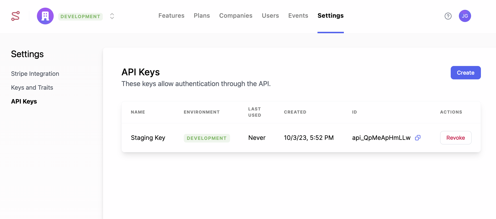
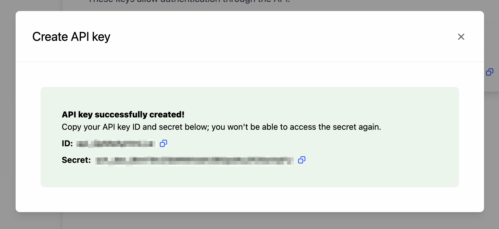
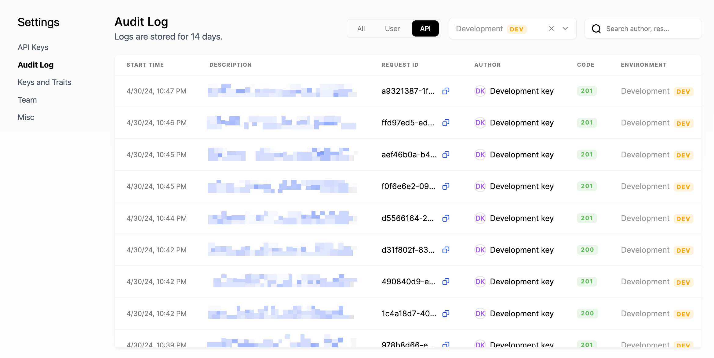
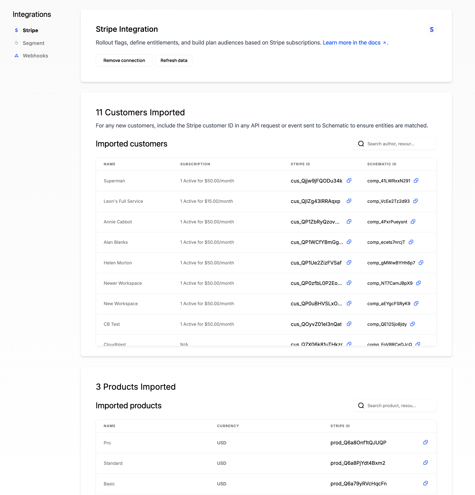
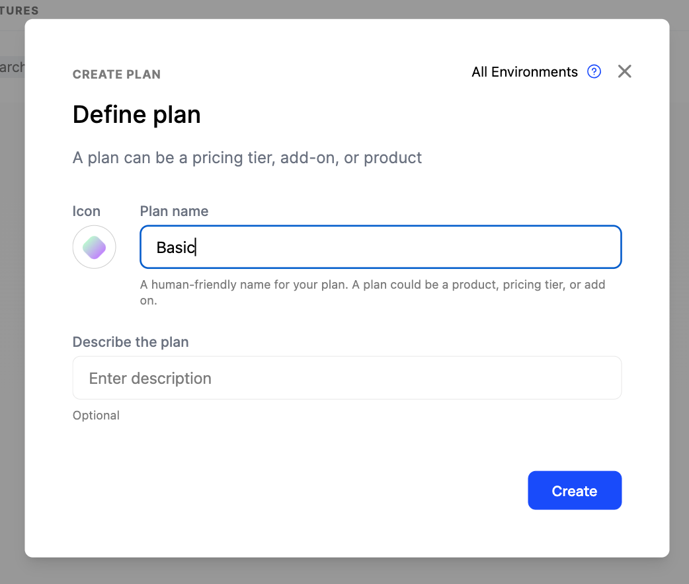
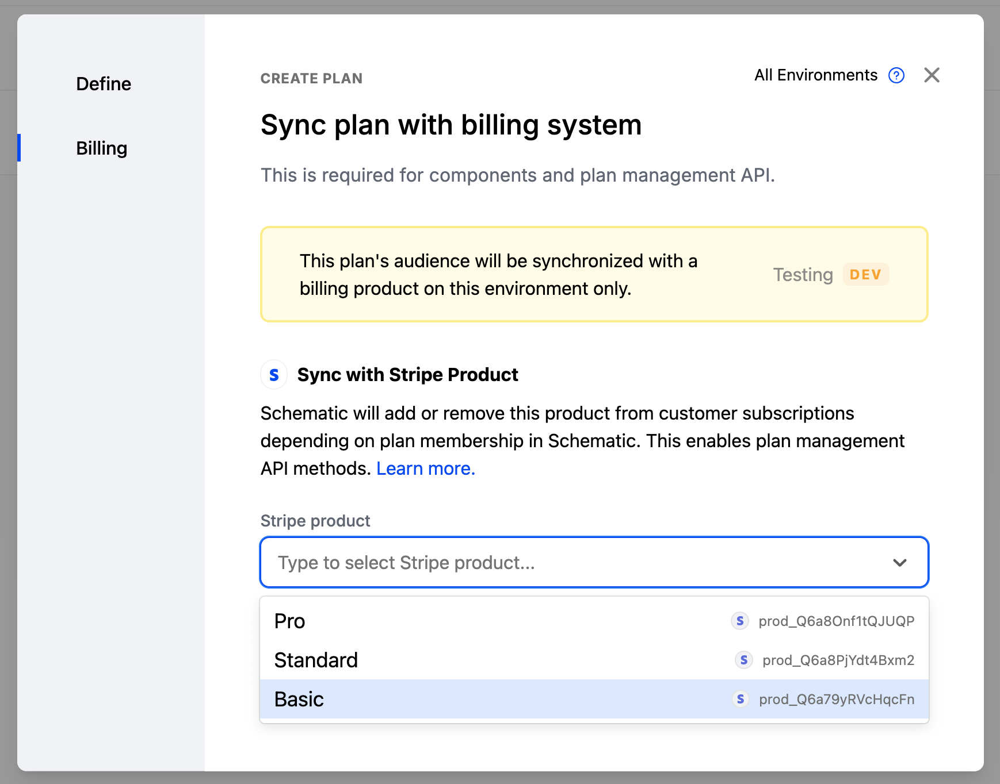
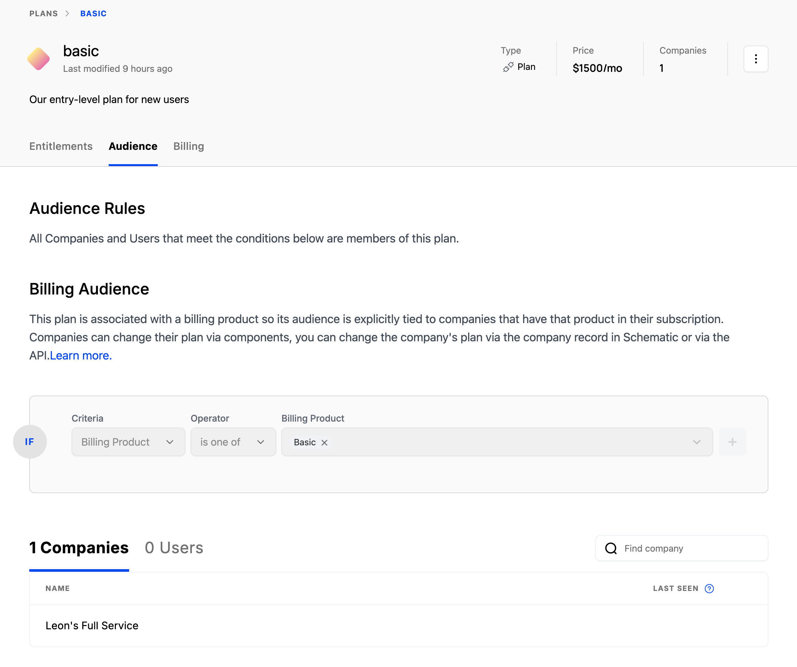
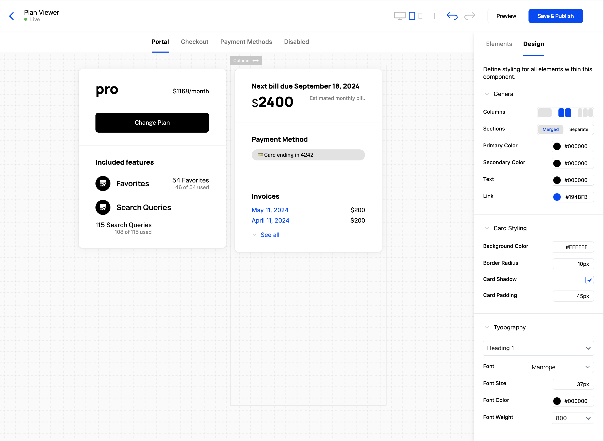

## Create environments and keys

### Setting up dev and prod environments

Manage and create new environments using the environment dropdown in the top right corner of Schematic. You can create API keys for each environment indpedently in Settings.

### Create an API key

Navigate to the API Keys section of your Settings page to generate your API keys. Once you create a key, an ID and a Secret will be generated. Make sure to store your Secret key in a secure place — Schematic will not display it again after it has been generated.

**Secret Keys** are used only for server-side integrations. These keys are meant to be confidential, so they should not be used on clients.

**Publishable Keys** are used in applications and websites to submit identify and track calls, as well as perform client-side feature evaluations. They can be embedded in your application and website.

All keys are environment scoped.

### Checking the Audit Log

You can view the Audit log [here](https://app.schematichq.com/settings/api-logs).

Within each request, you can view detail describing the response code, request ID, start/end times, the API key used, the method, the URL path, and the request & response payloads.

## Import your customers

Let’s set up companies within the Schematic Dashboard. We’ll do this by setting up the Stripe integration and importing customers.

<Info>Don’t use Stripe or just want to get started without it? You can create companies directly in the UI or via the [company upsert API](https://docs.schematichq.com/api-reference/companies/upsert-company).</Info>

1. In the Schematic Dashboard, go to **Settings > Stripe integration**
2. Grab your publishable and secret API keys from Stripe by going to **Developers > API Keys** (link [**here**](https://dashboard.stripe.com/apikeys)).
3. Go back to the Schematic Dashboard and put in your Stripe API keys to authenticate.
4. Schematic will ask you to choose a unique key to map Stripe Customers to Schematic Companies. Ideally this key is also used in your application so that when you make requests to Schematic’s API there is a common key to reference. There are two options:
    1. If you store a unique identifier in Stripe Customer metadata that you also use in your application (e.g. a `company_id` that is a GUID from your application), choose the first option
    2. If the unique ID that Stripe generates for you (e.g. `cus_nffrfeufn2hib`) is persisted in your application, choose the second option

We’ll opt for the second option in this guide (using the Stripe customer ID). Once connected, Schematic should sync companies, subscriptions, and products from Stripe and you should see them appear in the Schematic Dashboard.

## Set up Plans

Plans should correspond to your offerings. Eventually, we’ll add feature-level entitlements to them, but we’ll start with just creating Plans in the Schematic Dashboard and linking them to Stripe to inherit active subscriptions.

1. Navigate to **Catalog** and click “Create”
2. Add name and a description

3. In the Billing step, link the Schematic Plan to a Stripe Product
    1. Select the Stripe Product that reflects the Schematic Plan. Companies that have active Stripe subscriptions with the mapped product will automatically become a member of the Schematic Plan.

4. Once the Plan is created, click the Audience tab and verify the Audience rule and corresponding Companies that have been associated to the Plan.

Repeat the above for a few of your offerings.

<Info>Linking Schematic Plans to Stripe Products is optional, but allows Schematic to ensure both products are synchronized in terms of metadata and company assignment. Alternatively, you can set up your own targeting rules based on company attributes or usage. Here’s an [example](https://docs.schematichq.com/playbooks/rollout).</Info>

## Set up Features and Entitlements

Let’s add one feature to Schematic and entitle it to your plans: Search Queries.

1. Navigate to **Features** and click “Create”.
2. In the modal, add a name, description, and pick the event-based feature type. Click “Continue”.

<Info>You can choose between Boolean, Event-based, or Trait-based feature types.</Info>

3. Define a flag key.
    1. You’ll use this `key` in your application to reference this feature.

4. Attach an event to the feature. Add the `query` event to meter the feature and measure feature usage (if it doesn’t exist already, create it).

5. Once the feature is created, click ”Add plan entitlement” to add an entitlement and specify the limit for Search Query for a given plan.

<Info>Event-based features can have no limit, some numerical limit that is static within a period, or a limit that is dynamic based on traits that exist at the company level. Read more [here](https://docs.schematichq.com/playbooks/metering#entitlement-options).</Info>

<Info>You’ll need to make sure to send usage events to Schematic to track feature utilization as it occurs. Read more [here](https://docs.schematichq.com/playbooks/metering#setting-up-an-event-based-metered-feature).</Info>

## Build your Customer Portal

Finally, we’ll set up a customer portal that you can drop into your application to quickly add plan management for your users. Actions taken in your customer portal will automatically be synced to Stripe and vice-versa (e.g. checkout, upgrades, downgrades, cancellations, etc.).

After [configuring your Catalog](/components/overview), do the following:

1. Navigate to **Components** and click **New Component**
2. Choose “Customer Portal” and click “Create Component”
3. You should see a rendered customer portal in the Schematic Component Builder

<Info>Components are fully customizable both in the elements they are made up of (e.g. Current Plan, Included Features, Invoices, etc.) and in how they look and feel (so it appears native to your product).</Info>

<Info>Once you configure a component to your liking, you can [drop it directly into your application](/components/set-up).</Info>

## Integrate Schematic into your application

Now that your pricing and packaging is set up in the Schematic Dashboard, you can integrate it into your codebase. To integrate Schematic into your application, use one of our SDKs:

<CardGroup cols={2}>
  <Card
    title="Go"
    icon="fa-brands fa-golang"
    href="/developer_resources/sdks/go"
  >
  </Card>
  <Card
    title="Node.js"
    icon="fa-brands fa-node-js"
    href="/developer_resources/sdks/nodejs"
  >
  </Card>
  <Card
    title="C#"
    href="/developer_resources/sdks/csharp"
  >
  </Card>
  <Card
    title="Python"
    icon="fa-brands fa-python"
    href="/developer_resources/sdks/python"
  >
  </Card>
  <Card
    title="Javascript (Client-side)"
    icon="fa-brands fa-js"
    href="/developer_resources/sdks/javascript"
  >
  </Card>
  <Card
    title="PHP"
    icon="fa-brands fa-php"
    href="/developer_resources/sdks/php"
  >
  </Card>
</CardGroup>
