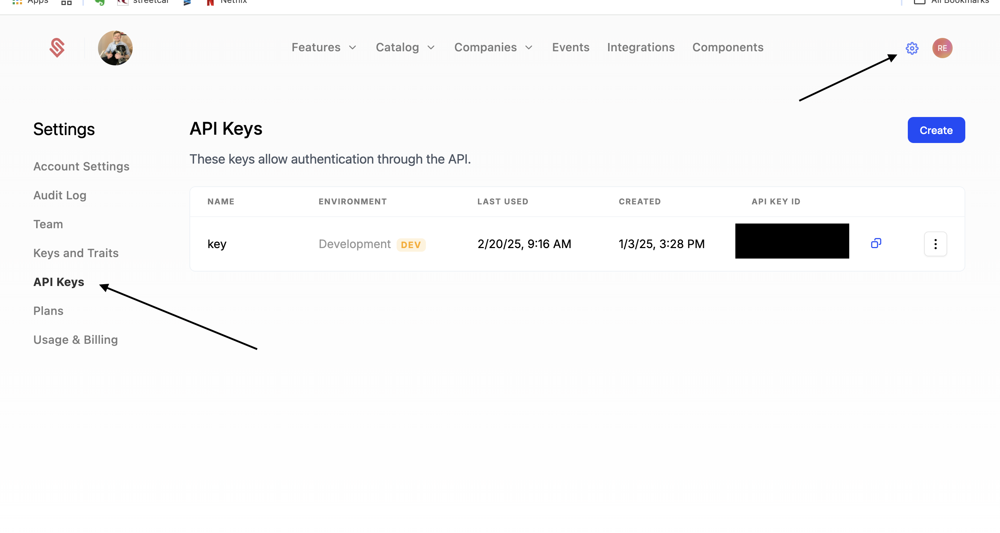

The `schematic-react` SDK is a client-side React library for [Schematic](https://schematichq.com) which provides hooks to track events, check flags, and more.

## Install

```bash
npm install @schematichq/schematic-react
# or
yarn add @schematichq/schematic-react
# or
pnpm add @schematichq/schematic-react
```

## Usage

### SchematicProvider

Similar to libraries like Clerk, Use the `SchematicProvider` to wrap your application and provide the Schematic instance to all components:

```tsx
`use client`

import { SchematicProvider } from "@schematichq/schematic-react";

ReactDOM.render(
    <SchematicProvider publishableKey="your-publishable-key">
        <App />
    </SchematicProvider>,
    document.getElementById("root"),
);
```

<Warning>At this time, the React SDK only supports client-side rendering.</Warning>

You can generate a publishable key from the [Schematic Dashboard](https://app.schematichq.com/x/settings/api-keys). These keys look like `api_...` and are meant to be used client-side.



### Identifying the user with Schematic

To set the user context for events and flag checks, you can use the `identify` function provided by the `useSchematicEvents` hook:

```tsx
import { useSchematicEvents } from "@schematichq/schematic-react";

const MyComponent = () => {
  const { identify } = useSchematicEvents();

  useEffect(() => {
    identify({
      company: {
        keys: { id: "company123" },
      },
    });
  }, []);

  return <div>My Component</div>;
};
```

This call will upsert the company into Schematic, and set the context for the current session.

### Check a flag

To check our flag, you can use the `useSchematicFlag` hook:

```tsx
import { useSchematicFlag } from "@schematichq/schematic-react";
import { Feature, Fallback } from "./components";

const MyComponent = () => {
  const isFeatureEnabled = useSchematicFlag("mechanical-keyboard");

  return isFeatureEnabled ? "Cherry MX Blues" : "1990's Logitech Keyboard";
};
```

### Next Steps!

Congrats 🎉! Now you have the basics setup to start using Schematic. 

If you'd like to dig deeper into our SDK and platform, here are a few places to start:

- [Out of the box components](/components/overview)
- [Usage-based plans](/billing/usage-based-billing)
- [Backend SDKs](/developer_resources/sdks/go)
- [Integrations](/integrations/stripe)
- [Events](/feature_management/feature_analytics)

If you'd like to learn more about how Schematic can build and manage your pricing and billing, here are a few places to start:

- [Building your pricing catalog](/catalog/overview)
- [Usage-based plans](/billing/usage-based-billing)
- [Per-company overrides](/playbooks/exceptions#what-are-examples-of-customer-exceptions)
- Legacy plan management 
- [Trials](/catalog/trials)
- [Add-ons](/catalog/add-ons)
