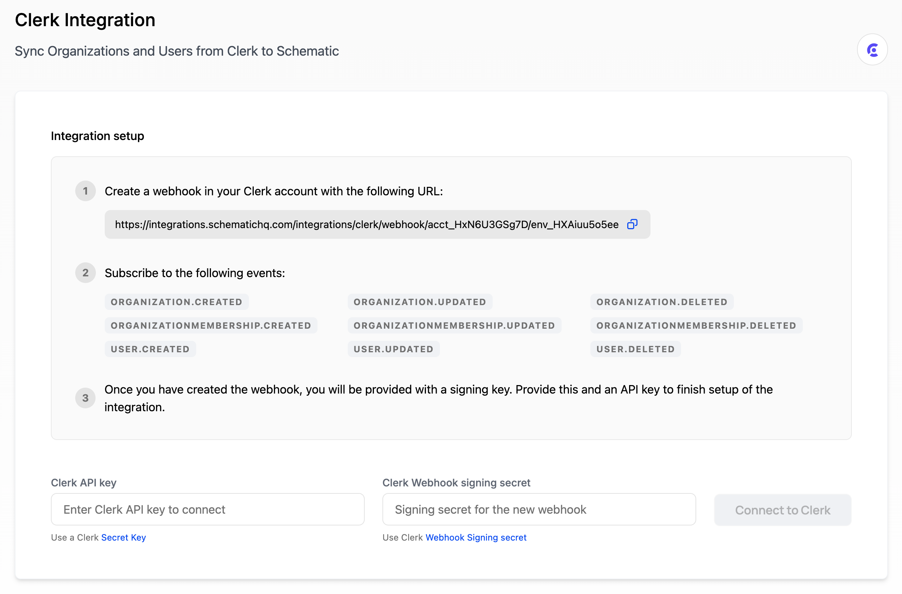

Using the Clerk integration with Schematic, you can:

- Automatically import organizations and users from your existing identity provider, Clerk
- Enrich Schematic company profiles with existing metadata
- Assign and enforce entitlements directly in your application with feature flags
- Embed drop-in components that are context-aware for a complete purchasing experience

This integration allows you to extend identity with entitlements and our library of embeddable UI components for end-to-end purchasing experiences and plan management.

Using Clerk and Schematic together allows you to build identity and pricing and packaging into your applications without toiling over extensive homegrown solutions, from log in to checkout.

## **Getting started**

### **Connecting Clerk to Schematic**

You can set up the Clerk integration in the **Integrations** tab within Schematic. 

Once there, do the following:

1. In Clerk, navigate to **Configure > Webhooks**
2. Add a new endpoint and add the URL from Schematic
3. Subscribe to the events listed above to ensure Schematic will receive updates from Clerk when organizations or users change, and click **Create**.
4. Once you’ve created the webhook, you should be provided a signing key. Copy that and add to the field in Schematic.
5. Create a Clerk secret key (**Configure > API keys**) and add that in the corresponding field in Schematic. Click **Connect to Clerk**.

Once you’re connected, Schematic will import organizations, users, and memberships from Clerk. A `clerkId` will be added as a unique key to all entities & additional key, `email`, will be added as a unique key for users. The following data will be imported and kept up-to-date automatically:

- Organizations
    - logourl
- Users
    - updatedat (epoch time)
    - createdat (epoch time)
    - imageurl
    - role

On initial import, if an organization or user in Schematic already exists with a `clerkId` that matches data from Clerk, the record will simply be updated.

You will now be able to assign entitlements and enforce them in your application using Schematic flags, features, and plans.

### **Using Schematic Components with the Clerk integration**

Similar to Clerk’s UI components, Schematic offers drop-in components for end-to-end purchasing experiences and plan management.

Once you’ve imported organizations and users and you've built out your packaging model in Schematic, you can navigate to the **Components** tab in Schematic to design, customize, and deploy customer portals.

When Schematic Components are embedded in your application, they will be aware of the identity of the logged in user and serve the appropriate data and controls.

## **Example**

To see a full example of a Schematic implementation with Clerk, check out [this sample app](/developer_resources/sample_apps/sample_nextjs).

