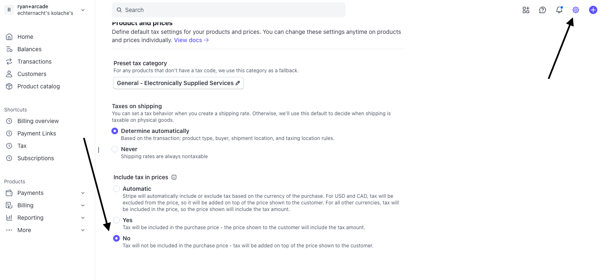
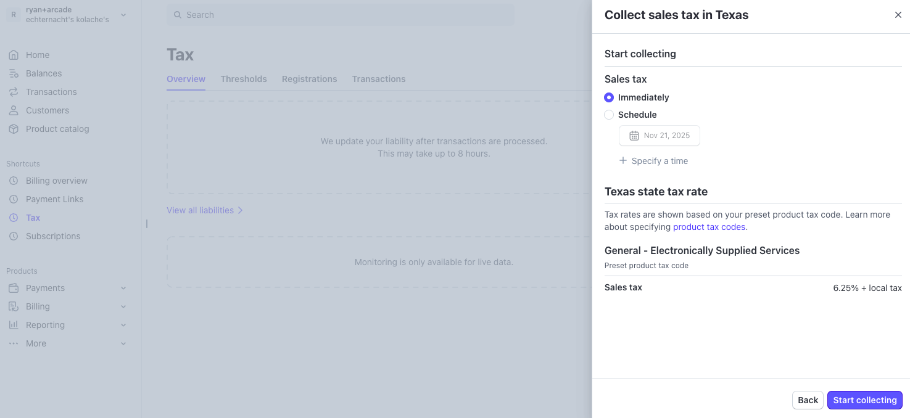

# Advanced Use Cases

This page covers advanced feature in advanced use cases for the Stripe integration. 

## Stripe Tax

Schematic supports Stripe Tax (and 3rd party tax providers that integrate with Stripe Tax) to simplify collecting tax and ensuring compliance with tax laws. Components can be configured to collect tax information from the user (e.g. billing address) and generate the correct taxes at checkout. 

For production use, we recommending using a Stripe approved 3rd party tax provider to handle registrations and compliance for any jurisdiction you are required to collect tax for.

For development and testing, to see taxes collected in the Schematic Checkout flow, you'll need

1. Taxes must be configured to be collected from the user in `Settings (top right gear icon) > Tax`. Then for "Include tax in prices", select "No" to set taxes to be added on top of the plan price.

2. On the left menu, select Tax, and then click "Add Registration". From here, you can select the jurisdiction you want to collect tax for. You will be prompted with a series of questions about your tax registration.  *NOTE: For testing, these answers don't typically matter; for production, a tax automation service is recommended to correctly register in each jursidiction and ensure tax law compliance.*

3. If you haven't already, you'll need to setup the Schematic component to [collect tax information from the user](/components/advanced-usage#collecting-taxes).

4. Finally, when going through checkout, **if** the customer is in a jurisdiction for which you setup tax registration, the tax information will be collected from the user and displayed on the checkout page.

