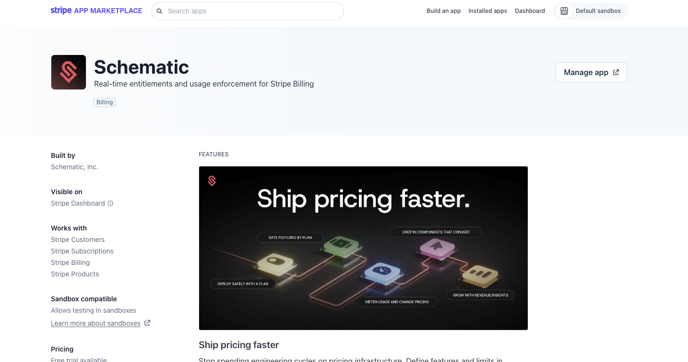
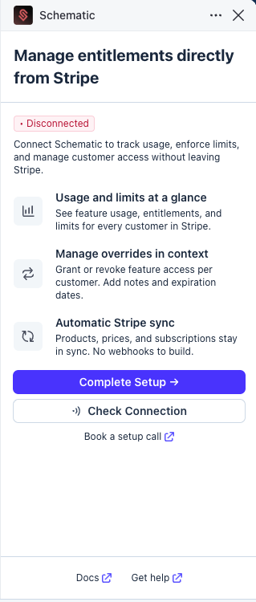
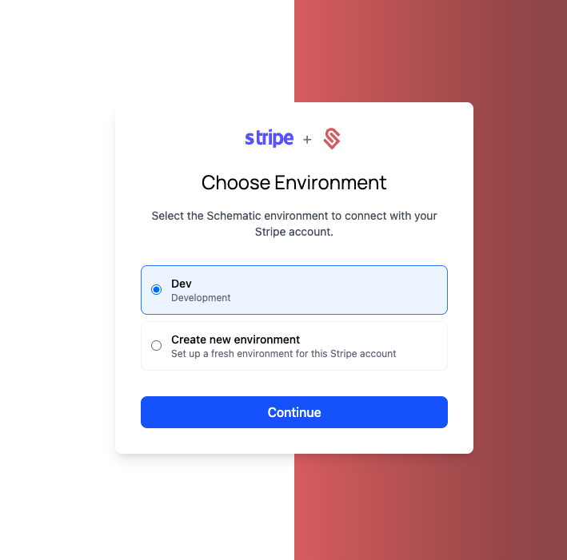
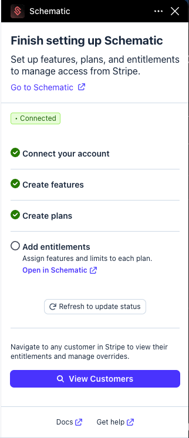
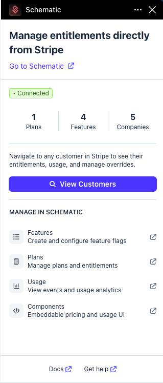
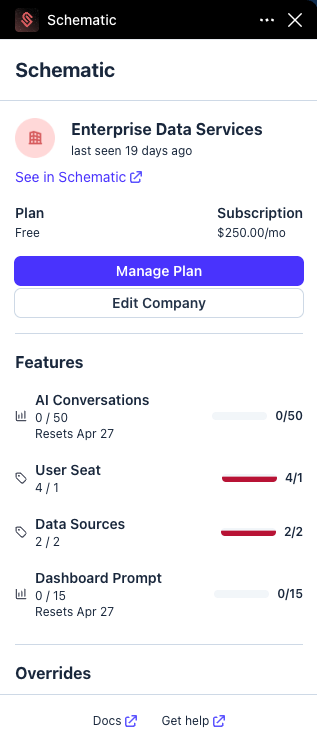
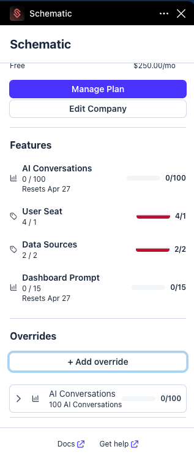
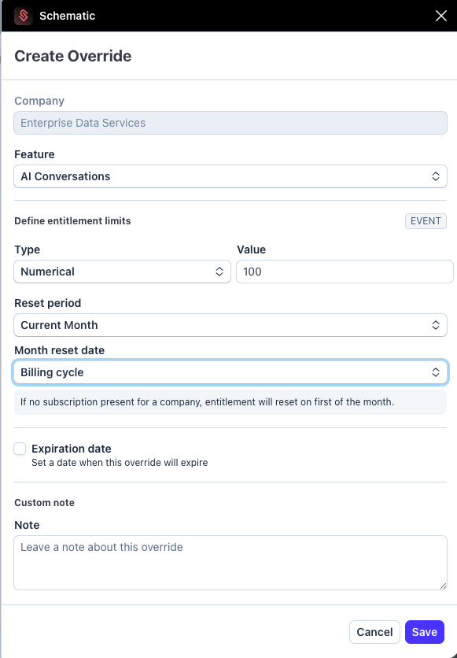
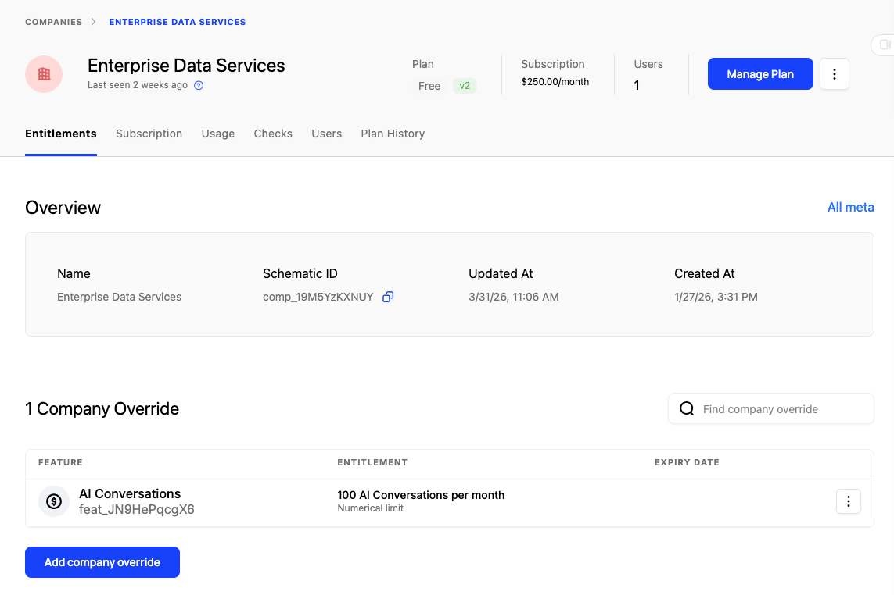

The new Schematic Stripe App adds a side panel directly inside Stripe that lets you view and manage Schematic data for your customers without leaving Stripe. It is designed for customer success and support workflows where you need to quickly understand what a customer has access to, make plan changes, or grant feature overrides.

## Installation

The Stripe App can be installed from the Stripe App Marketplace. It works in both sandbox and live Stripe accounts.

1. Open the [Schematic app in the Stripe Marketplace](https://marketplace.stripe.com/apps/schematic), or search for **Schematic** in the [Stripe App Marketplace](https://marketplace.stripe.com). click **Install** to add the app.

2. After installing, the app will show as not yet connected. Click **Complete Setup** to link your Stripe account to Schematic.

3. On the setup screen, link your Stripe account to a Schematic environment. You can either connect to an existing Schematic environment that isn't already linked to a Stripe account, or create a new environment.

4. Click **Connect**. That's it — no additional configuration is needed to establish the Stripe/Schematic connection.

5. Once connected, the app will show a checklist to help you complete your Schematic setup. Before the app is fully useful, you'll want to have the following in place in Schematic:
   - Features created ([see Features docs](/feature-management/overview))
   - Plans created ([see Plans docs](/catalog/plans))
   - Entitlements added to your plans ([see Quickstart](/quickstart/overview))

Once your features, plans, and entitlements are configured, the app is ready to use.

## Using the App

### Non-customer views

When the Stripe App side panel is open and you are not viewing a specific customer, it shows a summary of your Schematic connection status. This confirms that the integration is active and that your plans, features, and companies are synced.

### Customer detail view

Once you open a specific customer in Stripe, the side panel shows the full Schematic context for that company. This is where you can take action.

At the top of the panel, three links let you jump directly into Schematic for that company:

- **See in Schematic** opens the company profile in Schematic.
- **Manage Plan** opens the company profile in Schematic with the Manage Plan flow already open, so you can change their plan, add an add-on, or make other subscription changes.
- **Edit Company** opens the company profile in Schematic so you can update company details.

### Feature usage

Below the links, the panel shows all features the customer currently has access to, including whether each feature comes from their plan, an add-on they have purchased, or a company override.

For usage-based features, the panel shows current usage against the customer's limit.

### Overrides

The panel also shows any active overrides for the customer. Overrides let you grant a company access to a feature, or additional usage of a feature they are already paying for, outside of their standard plan.

<Info>
See the [overrides documentation](/playbooks/exceptions) for more detail on when and how to use overrides.
</Info>

Common reasons to use overrides include:

- Granting a prospect temporary access to a feature to help close a deal
- Giving a customer extra usage as a goodwill gesture after an incident
- Managing a custom enterprise arrangement

You can create, edit, and delete overrides directly from the Stripe side panel without navigating to Schematic.

**To add an override:**

1. Click **Add Override** in the overrides section.
2. Select the feature you want to grant.
3. For usage-based features, enter the amount and period (e.g., 50 events, monthly).
4. Optionally, set an expiration date or leave a note explaining the reason.
5. Save the override.

The override is immediately reflected in Schematic. You can confirm this by checking the company in Schematic, where the new override will appear.

