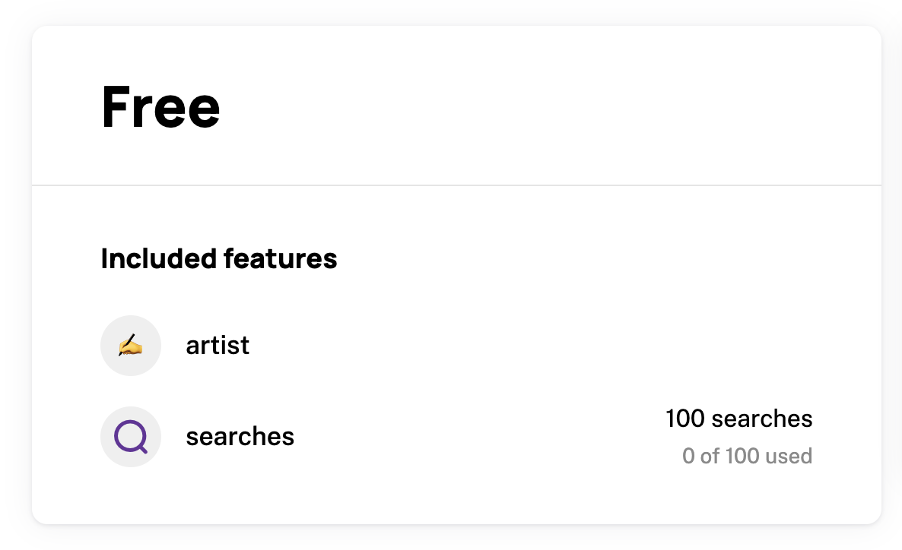

We've compiled a list of common pitfalls that we've seen in the wild. If you're experiencing an issue that isn't listed here, please let us know at help@schematichq.com.

## No Change Plan Button in Schematic Customer Portal Component

There are a few reasons a user might not be able to change their plan in the Schematic Customer Portal Component. These will affect 

### 1. There are no other live plans to switch to

A common cause is that the live plans within Schematic have not been configured. These can be configured in Plans > Configuration > Live Plans (see screenshot below). Be sure to "Save Changes" on this page for the changes to take effect.

### 2. There are no valid plans to change to

If a plan is linked to a Stripe product, it can only be changed to other plans that are also linked to a Stripe product. Likewise, a plan _not_ linked to a Stripe product can only be changed to other plans _not_ linked to a Stripe product. This is done to ensure that customers are billed correctly through Stripe. 

## Issues changing a customer's plan within the Schematic App

First, check the section about ensuring there are [valid plans to change to](#2-there-are-no-valid-plans-to-change-to). Those issues will also affect your ability to change a customer's plan within the Schematic App. 

If the issue persists, and the plan is linked to a Stripe product, the customer must have billing information on file with Stripe. The easiest way to achieve this is for the customer to checkout via the Schematic Customer Portal Component.

