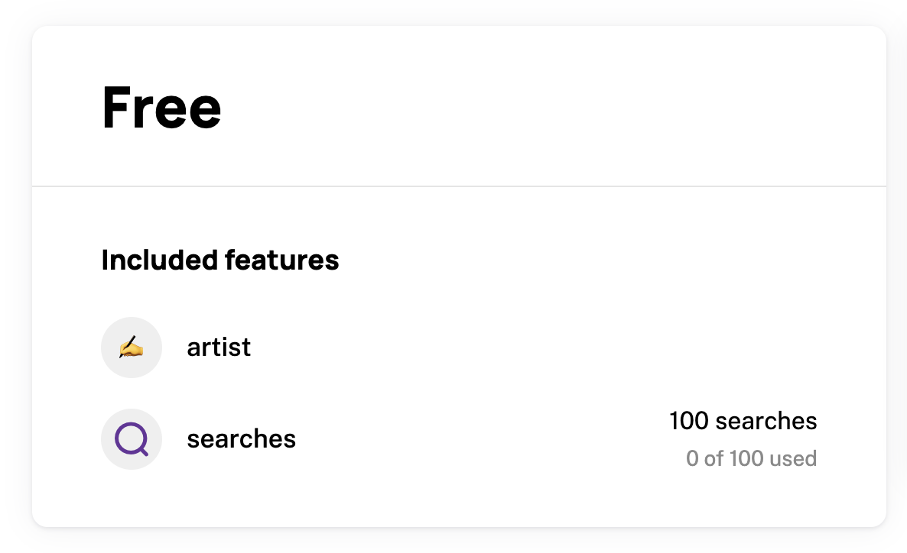
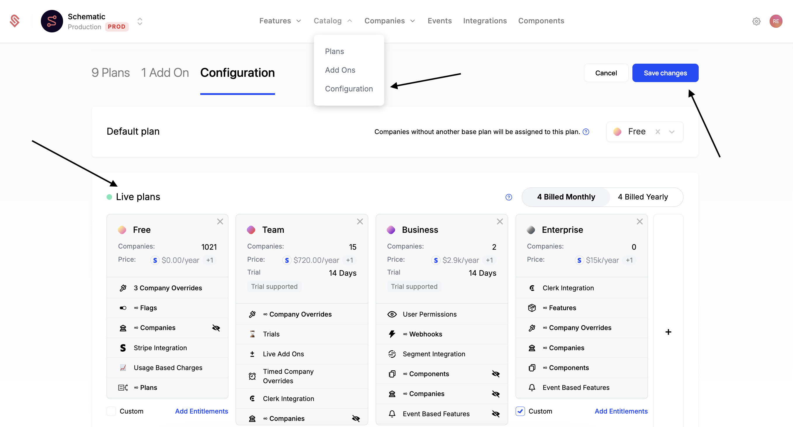

We've compiled a list of common pitfalls that we've seen in the wild. If you're experiencing an issue that isn't listed here, please let us know at help@schematichq.com.

## No Change Plan Button in Schematic Customer Portal Component

The most common reason a customer can't change plans is that are no live plans that they can switch to. Live Plans can be configured in Plans > Configuration > Live Plans (see screenshot below). Be sure to "Save Changes" on this page for the changes to take effect.

## Unable to change plan in Schematic App

The most common reason you can't change a customer's plan via the Schematic App is that the customer doesn't have a payment method on file with Stripe. The easiest way to solve this is to have the customer checkout via the Schematic Customer Portal Component. Alternatively (mostly for development purposes), you can enter a payment method in the Stripe Dashboard.

## Plan Change Flows

Within the schematic app, there are a few cases in which a plan can't be changed. The following table outlines these cases

| Plan Change | Self-service via Component | Sechamtic UI via "Manage Plan" | 
| --- | --- | --- |
| Free plan -> Free plan | ❌ | ✅ |
| Free plan -> Paid Plan   *Company is not in stripe OR Company is in Stripe without a payment method* | ✅  (Must enter a payment method) | ❌ |
| Paid Plan -> Paid Plan   *Company is in Stripe with a payment method* | ✅ | ✅ |
| Paid Plan -> Free Plan   *This is effectively a cancellation* | ✅ | ✅ |
