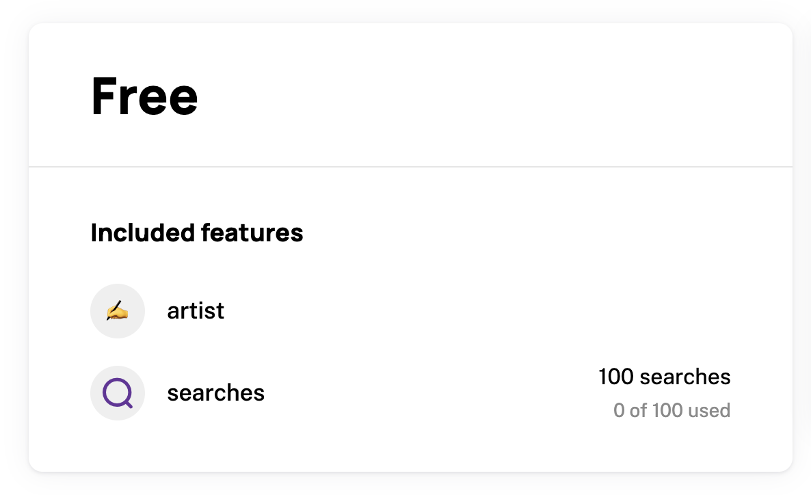
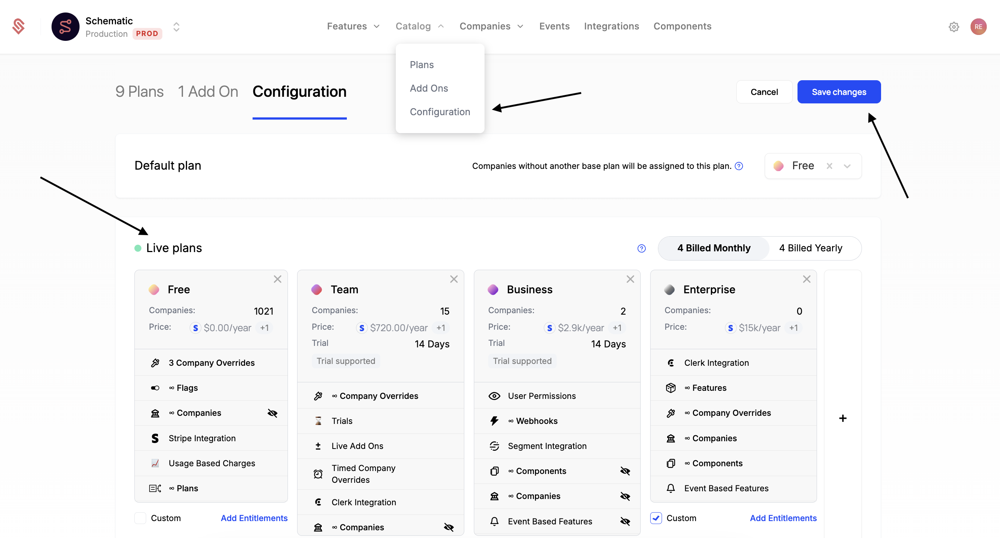

We've compiled a list of common pitfalls that we've seen in the wild. If you're experiencing an issue that isn't listed here, please let us know at help@schematichq.com.

## No Change Plan Button in Schematic Customer Portal Component

The most common reason a customer can't change plans is that are no live plans that they can switch to. Live Plans can be configured in Plans > Configuration > Live Plans (see screenshot below). Be sure to "Save Changes" on this page for the changes to take effect.

## Unable to change plan in Schematic App

The most common reason you can't change a customer's plan via the Schematic App is that the customer doesn't have a payment method on file with Stripe.

This can feel like a chicken-and-egg situation: you can't assign a paid plan without a payment method, but your customer hasn't gone through checkout yet to provide one. The intended flow is:

1. The customer uses the **Schematic Checkout Component** to subscribe to a paid plan. During checkout, they enter a payment method, and Schematic provisions both a Stripe customer and a subscription automatically.
2. Once a payment method is on file, you or the customer can freely change plans via the Schematic App or Customer Portal Component.

For development or internal purposes, you can also enter a payment method directly in the Stripe Dashboard for a given customer.

<Info>
Schematic does not currently support admins setting a payment method on behalf of a customer via the Schematic App. If this is a need, the checkout flow is the recommended path.
</Info>

## When does Schematic create a customer in Stripe?

Schematic only creates a customer record in Stripe when a company is subscribed to a Stripe-enabled plan — that is, a plan with a price configured (even if the price is $0). Companies on free plans with no Stripe-linked price will exist in Schematic but will not have a corresponding Stripe customer.

This is intentional: many teams prefer not to populate Stripe with free-tier users. However, if you want every new company to immediately have a Stripe customer provisioned, you can configure your **Initial Plan** (in Catalog > Configuration) to use a plan with a $0 price. This ensures all new companies are enrolled in a Stripe subscription from the moment they are created in Schematic.

See [Initial Plan](/catalog/configuration#initial-plan) for configuration details.

## Plan Change Flows

Within the schematic app, there are a few cases in which a plan can't be changed. The following table outlines these cases

| Plan Change | Self-service via Component | Sechamtic UI via "Manage Plan" | 
| --- | --- | --- |
| Free plan -> Free plan | ❌ | ✅ |
| Free plan -> Paid Plan   *Company is not in stripe OR Company is in Stripe without a payment method* | ✅  (Must enter a payment method) | ❌ |
| Paid Plan -> Paid Plan   *Company is in Stripe with a payment method* | ✅ | ✅ |
| Paid Plan -> Free Plan   *This is effectively a cancellation* | ✅ | ✅ |
