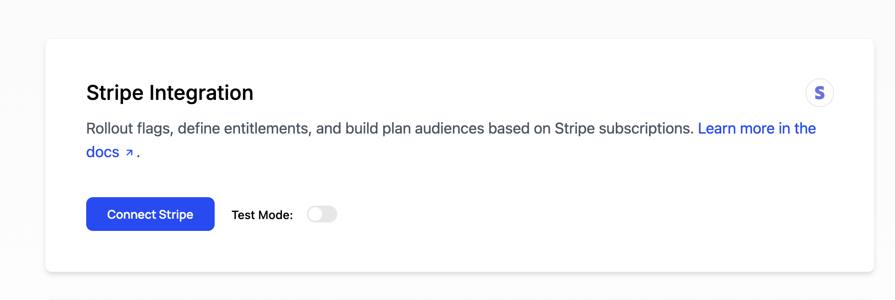

# Introduction

This is a developer's guide for ensuring that Schematic can sync data with Stripe. It is focused on the making sure data can be properly mapped between Schematic and Stripe.

For a more general overview of the Stripe integration and it's capabilities, see the [Stripe Integration](/integrations/stripe) page.

## Endstate

The endgoal of setting up Stripe integration is that Schematic has the following values correctly linked so that Schematic can 2-way sync data with Stripe. This ensures that newly created records in either system are mirrored into the other and that no duplicate records are created. The mapped data is

1. Schematic Company ↔ Stripe Customer
  - This is mapped via the `stripe_customer_id` trait on the company
  - This can be used to map to the company's Stripe Subscription as well
2. Schematic Plan, Addons, and Prices ↔ Stripe product, Stripe price

### Schematic Plan, Addon, and Price Mapping

Schematic Plans, Addons, and Prices are mapped to Stripe's Products and prices. 

**Stripe → Schematic**

Upon setup of the Stripe Integration, all plans and prices are immediately imported into Schematic. After Setup, any plans and prices created in Stripe are immediately imported in Schematic via webhooks. The imported products can be seen on the Stripe Integration page in Schematic.

**Schematic → Stripe**

The following Schematic concepts are synced to Stripe products/prices

1. Schematic Plan → Stripe product + monthly/yearly price
2. Schematic Addon → Stripe product + montly/yearly/one-time price
3. Schematic Usage Based Entitlement → Stripe price

When you setup one of these Schematic concepts, you are given the option to map these to an existing product/price in Stripe or to create a new product/price in Stripe to map to. 

### Schematic Company Mapping

To properly map companies between Stripe and Schematic, Schematic needs a key called `stripe_customer_id` set for each company that has a corresponding Stripe Customer. It's common and fully supported to have some customers not mapped to Stripe (most often, for non-paying customers that will be added to Stripe only when they upgrade to a paid plan).

After the integration is setup, Schematic will automatically setup the `stripe_customer_id` for any customers checking out through Schematic's checkout flow. Below is an example of a company with a `stripe_customer_id` set:

Before setting up the integration, you will need to ensure that each company record in Schematic is setup to link to it's corresponding record in Stripe. To achieve this there are a few options:

1. A one-time job to set `stripe_customer_id` on your companies already in Schematic.
2. Always `identify` companies with `stripe_customer_id` and an additional key (typically a database id). *This works best if implemented before you launch to ensure each company in Schematic will have a `stripe_customer_id` set.* 
3. Use `stripe_customer_id` as the main key you `identify` companies. *This requires that all companies will have a corresponding Stripe Customer.*
4. (Less common) If you have an identifier set in your companies's Stripe metadata (often your application database's id), Schematic can import this and use it to sync companies during setup. 

<Info>
To understand more about `identify` and keys, see the [Developer Resources - Keys](/developer_resources/key) page.
</Info>

#### Using a Company identifier from Stripe metadata

If you have have a company identifier already stored in Stripe metadata, Schematic can import that along with the companies. After connecting Stripe, choose the 2nd option so that Schematic can pull the correct key from Stripe. 

Then, select which metadata value you want Schematic to pull.

When importing companies this way, a few things to note:
1. Schematic will check existing companies for a key with the same name and value as the metadata field you selected. On a match, it will update the existing company instead of creating a new one.
2. When a new company is created, it will set both `stripe_customer_id` and the metadata key you selected.
3. Going forward, Schematic will still priotizie `stripe_customer_id` as the key it uses to sync companies with Stripe.

### Prod vs. Dev Stripe Accounts

Schematic supports Stripe accounts, sandboxes, and legacy test accounts. Each account is scoped to a specific Schematic Environment (e.g. you can connect a normal Stripe account to your production Schematic environment, a Sandbox to your development Schematic environment, and a different Sandbox to your QA environment). We don't recommend connecting the same Sandbox to multiple Schematic environments.

**Prod Stripe Account**

This the normal Stripe account you use for your production environment.

**Sandbox Stripe Account**

**Legacy Test Account**

Stripe has deprecated these legacy test accounts in favor of the new Sandbox system.

### What existing after setup

After setting up the integration, the Stripe Integration page in Schematic will show you the following:

- A list of imported Products
- A list of imported Companies
- A button to remove the connection. No data will be deleted from either system.
- A button to refresh the data. This will re-import all products and companies from Stripe.

<Info>Schematic should receive updates from Stripe automatically, in real-time, via webhooks. The "Refresh data" button should only be used for troubleshooting.</Info>

### Stripe Restricted Key permissions

If you are using a restricted key to connect to Schematic, make sure it has the following permissions:

- Core resources
  - Customers - Read/Write
  - PaymentIntents - Read/Write
  - PaymentMethods - Read/Write
  - Products - Read
  - SetupIntents - Read/Write
- Billing resources
  - Invoices - Read
  - Prices - Read
  - Subscriptions - Read/Write
- Webhook resources
  - Webhook Endpoints - Read/Write
