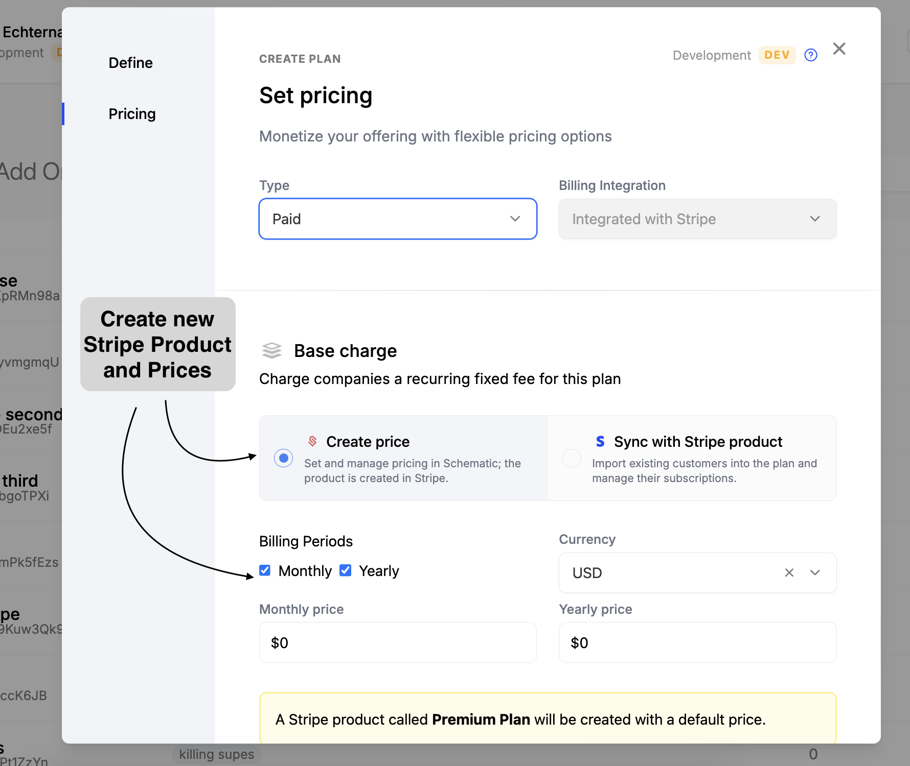
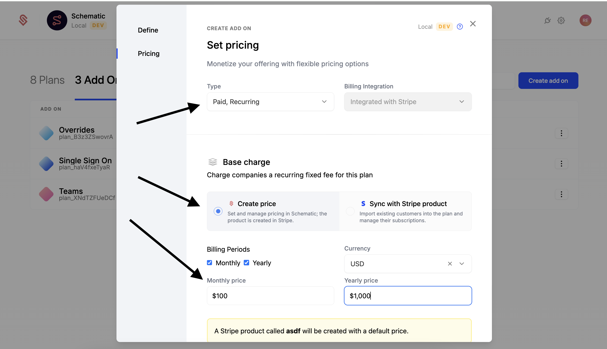
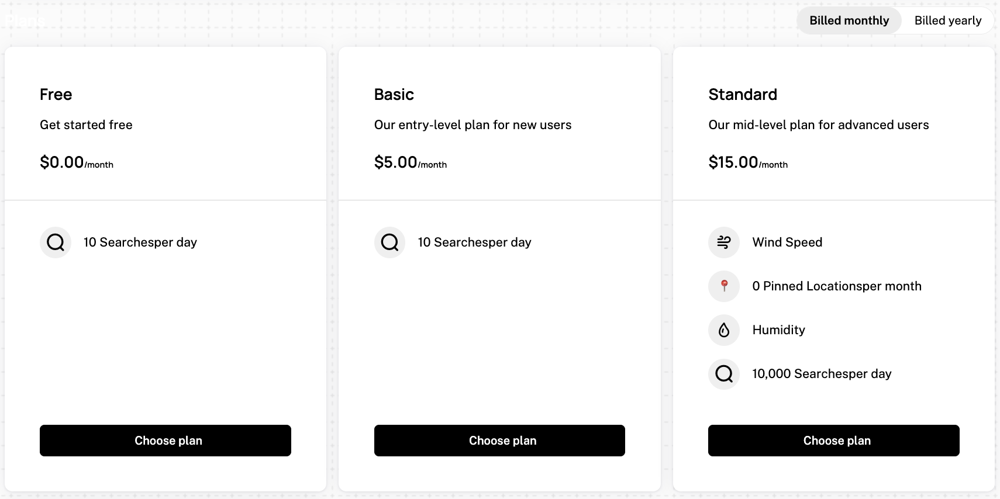

The Schematic Stripe integration is the most common way to implement Schematic into your application. It extends Stripe's billing platform into your application to seemlessly implement and enforce your pricing and packaging within your application. This includes: 

- Enforcing entitlements and usage-based limits
- Seemless upgrades, downgrades, cancellations, and trials
- An out of the box checkout component

The integration is powered by a bi-direcitonal sync with Stripe. Through the integration, you can:

- Import and synchronize customers and subscriptions 
- Map Stripe Products to Schematic Plans to automatically provision entitlements in your application
- Map Usage-based Features to Stripe Metered Products
- Use Schematic Components to power checkout, subscription management (e.g. invoices, payment method), and upgrade/downgrade/cancellation that will sync directly to Stripe to update subscriptions

# Setting up Product Catalog and features

## Plans

Plans are the core element of a product catalog. Schematic plans can be mapped to Stripe products and prices. When configuring a plan, you can choose to map to an existing Stripe product and price or create a new one. Schematic supports configuring both monthly and yearly prices for plans.

Mapping a plan to Stripe enables Schematic components (e.g. checkout flow) to support the plan for users. [See here for more details](#schematic-components)

This video is a quick walkthrough of how to set up a plan in Schematic and map it to Stripe products and prices.

!!!video example!!!

To create a new plan and a corresponding Stripe product, follow the steps below:
1. Navigate to the Plans page in Schematic (Catalog > Plans)
2. Click the "Create Plan" button
3. Name your plana and click "Continue" to setup pricing details.
4. Select "Paid" for "Type", then supply a monthly and/or yearly price. (Screenshot below)
5. Finally, click "Save"

## Plan Add-ons

In addition to plans, Schematic add-ons can similarly be mapped to Stripe products and prices. This is useful for offering additional features or services to your customers. Schematic supports configuring both monthly and yearly prices for add-ons.

This video is a quick walkthrough of how to set up a plan add-on in Schematic and map it to Stripe products and prices.

!!!video example!!!

To create a new add-on and a corresponding Stripe product, follow the steps below:
1. Navigate to the Add-ons page in Schematic (Catalog > Add-ons)
2. Click the "Create Add-on" button
3. Name your add-on and click "Continue" to setup pricing details.
4. Select "Paid, Recurring" for "Type", then supply a monthly and/or yearly price. (Screenshot below)
5. Finally, click "Save"

## Usage Based Features

Usage based features are core feature in most modern SaaS applications. Schematic usage based features are mapped to Stripe metered products, either existing or new. Usage is tracked in real time, and will be reflected within Schematic web app, Stripe, and any Schematic components (e.g. customer portal). 

This video is a quick walkthrough of how to set up a usage-based feature in Schematic and map it to Stripe metered products.

!!!video example!!!

To add a usage-based feature to a plan and createa a new price for it, follow the steps below:
1. Open the feature in Schematic (Features > Features)
2. Click “Add Plan Entitlement” to begin
3. Select the plan you want to add the feature to
4. Set a value for the feature's limit (25 in the example below)
5. For Period, select “Montly” and have the usage reset “According to Billing Period” (this is the most common setting). This means that the user will get 25 usages per month, and that the "month" will be measured based on the day they signed up (i.e. if they signup on March 15th, then the “month” will be March 15th to April 14th).

<Info>
See the [Usage Based Features](/tracking-usage#create-an-event-based-feature) page for more details on how to set up usage-based features.
</Info>

## Schematic Components

Schematic components are the easiest way to power your checkout flow and customer portal. These components allow your customers to easily:

1. Purchase a plan or add-on
2. Manage their subscription
3. View their invoices
5. Upgrade, downgrade, or cancel their subscription

Schematic components will sync any changes to the subscription to Stripe.

This video is a quick walkthrough of how to setup a billing portal and the end-user experience of the billing portal.

!!!video example!!!

<Info>
See the [Schematic Components](/components/overview) page for more details on how to setup and use Schematic components.
</Info>

## Viewing Company Data in Schematic

For companies in Schematic that have an associated Stripe subscription, you can view that data in the Subscription tab within a company profile. Data will include:

- Products & quantities
- Quantities and rates
- Discounts/coupons that are applied to the subscription
- Term
- Subscription status
- A link to the company in Stripe, if you need additional information.

## Subscription Statuses

Stripe supports a number of statuses that correspond to the subscription lifecycle. Schematic treats subscriptions differently based on that status. The table below summarizes how Schematic handles a Stripe subscription based on each status.

When a company's subscription is active in Schematic, they are granted entitlements that correspond to the products in that subscription. When a company's subscription is inactive, entitlements are revoked.

More on Stripe subscription statuses [here](https://docs.stripe.com/billing/subscriptions/overview#subscription-statuses).

| **Stripe Subscription status** | **Schematic Subscription status** | **Notes** |
| --- | --- | --- |
| trialing | active | We do not make a distinction between subscriptions in a trialing state and those in an active state. |
| active | active |  |
| incomplete | inactive | If a subscription moves from active to incomplete, we will treat the subscription as inactive and any corresponding entitlements will be revoked. |
| incomplete_expired | inactive | The same as incomplete. |
| past_due | active | Schematic treats past_due subscriptions as active. |
| cancelled | inactive | If a subscription moves from active to cancelled, we will treat the subscription as inactive and any corresponding entitlements will be revoked. |
| unpaid | inactive | If a subscription moves from past_due to unpaid, we will treat the subscription as inactive and any corresponding entitlements will be revoked. |
| paused | inactive | Schematic treats paused subscriptions as inactive. |
