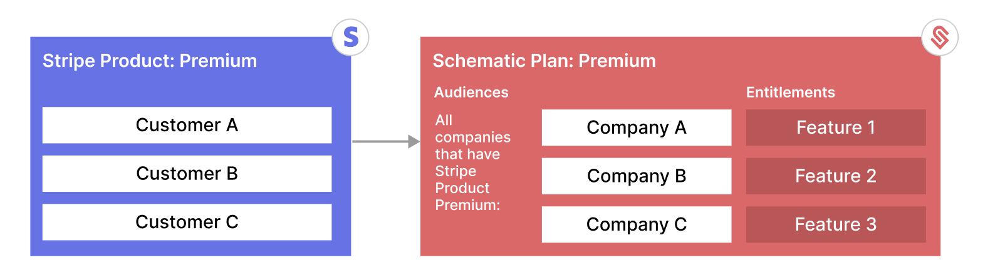
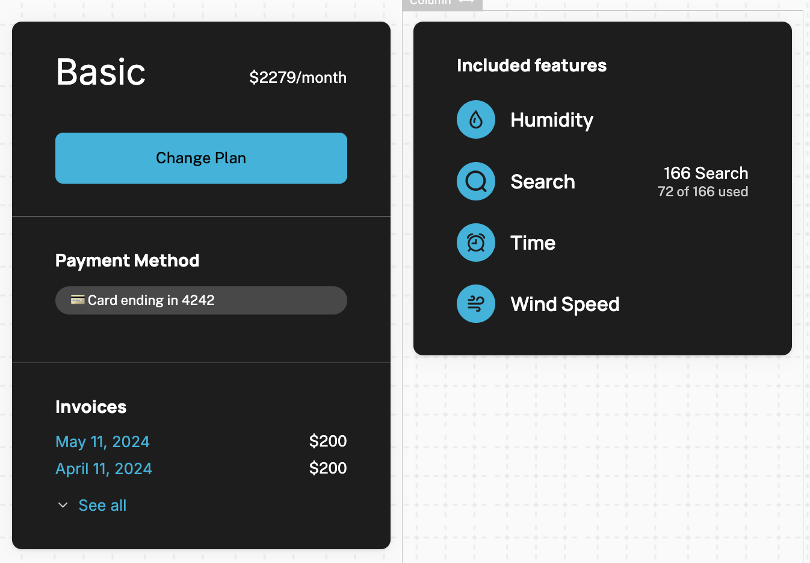
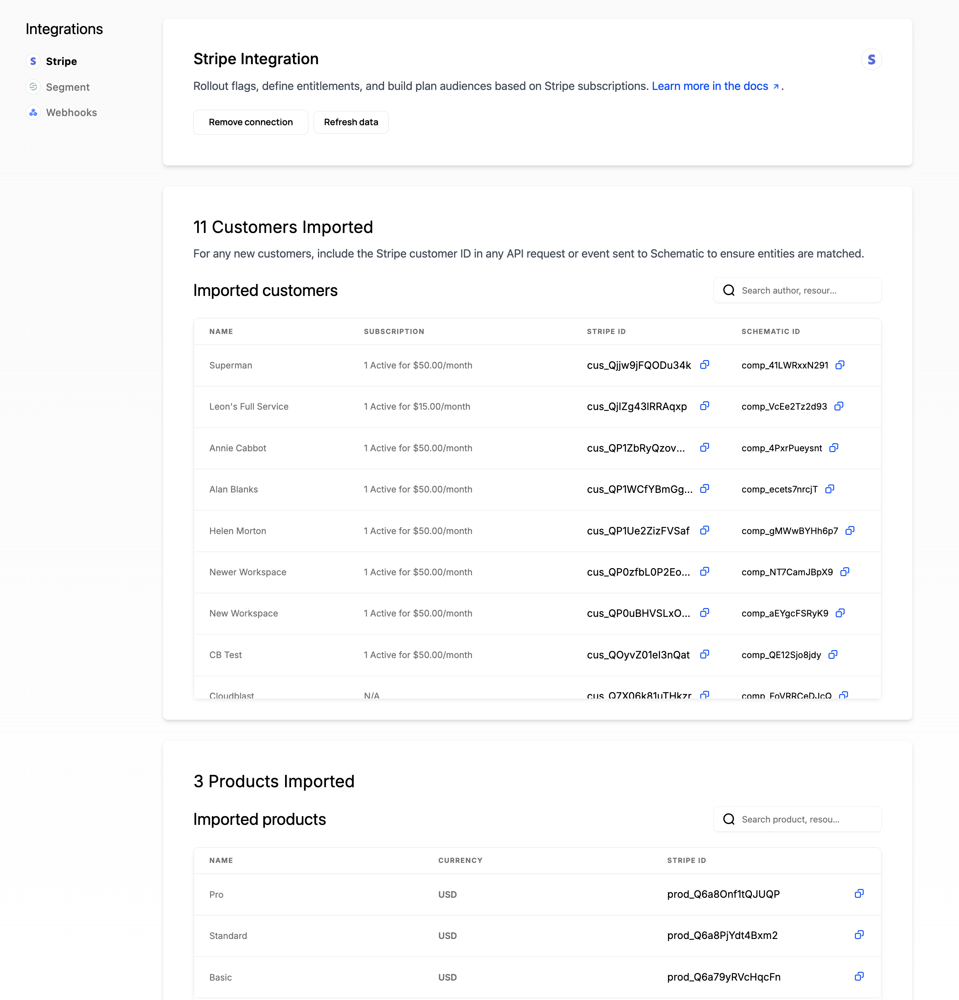
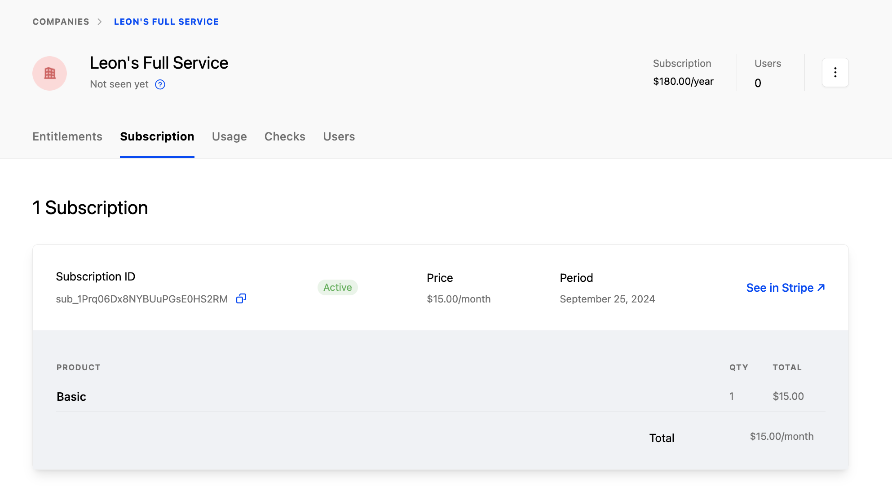
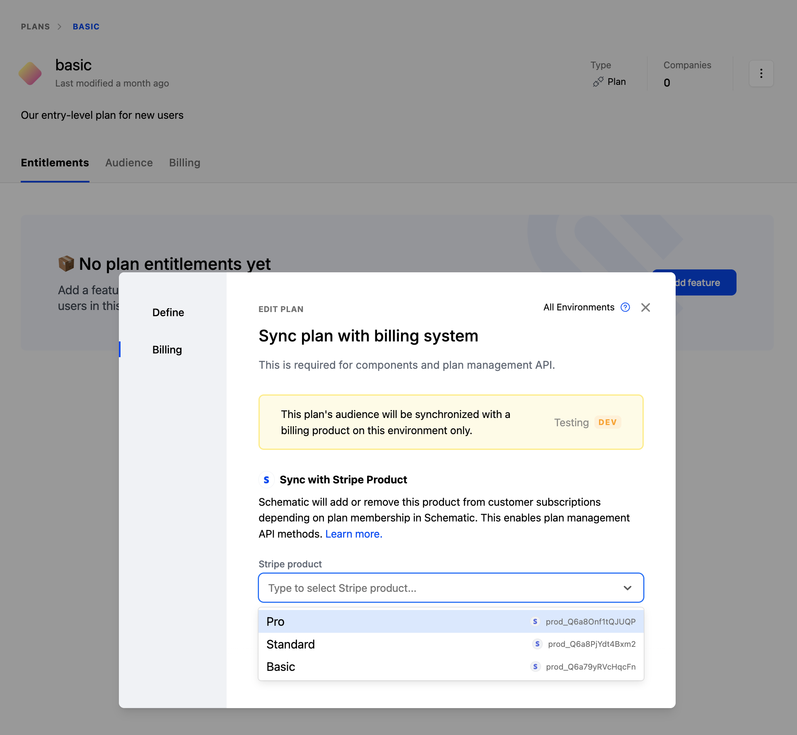
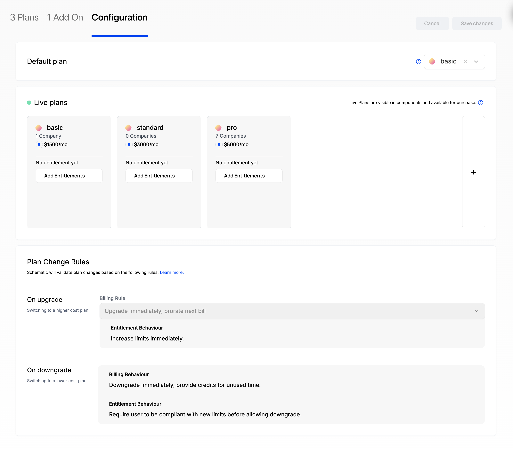
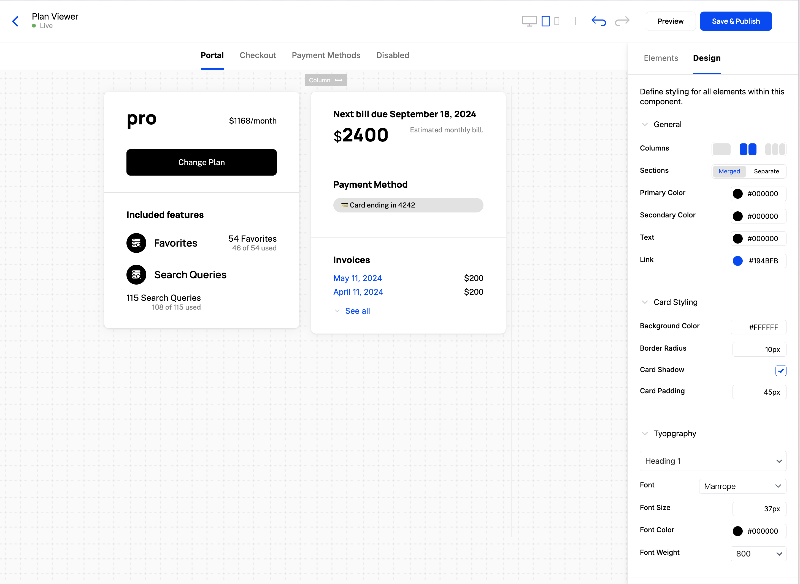
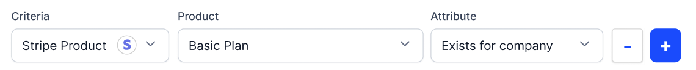

The Stripe integration for Schematic allows you to:

- Import and synchronize customers and subscriptions
- Map Stripe Products to Schematic Plans to automatically provision entitlements in your application
- Use Schematic Components to power checkout, subscription management (invoices, payment method, upgrade, downgrade, expand), and cancellation that will sync directly to Stripe to update subscriptions

The integration allows you to replace or augment your Stripe integration and fully outsource pricing and packaging from your application.

Why use the integration?

- Only integrate with one API for your end-to-end pricing and packaging
- See a unified company profile combining account, usage, and billing data in one place
- Use existing billing data to automatically assign entitlements to your customers
- Get beautiful customer purchasing experiences with drop in UX components
- Manage customer lifecycle automatically - when a subscription changes, entitlements will change via Schematic

## **Example 1 - Provisioning**

1. In Stripe, there is a “Premium” product.
2. Companies A, B, and C are subscribed to the Premium product.
3. In Schematic, there is a “Premium” plan containing premium entitlements like Feature 1, 2, 3.
4. The Schematic plan is mapped to the Stripe Premium product.
5. Companies A, B, and C are granted the entitlements associated with the “Premium” plan because of their Stripe subscription.

## Example 2 - Lifecycle

1. In Stripe, Company A is subscribed to “Basic” product
2. The “Basic” Product is $200 per month and has the “Humidity”, “Search”, “Time”, and “Wind Speed” features
3. Schematic Components show that information to the end user in a UI component that is generated by Schematic and drops into your application
4. The end user changes their plan to the “Standard” product, which has an additional entitlement, "Wind Direction", and a different price
5. Schematic will update the Company’s subscription based on that selection. The "Wind Direction" feature will now be accessible to the end user, and the Stripe subscription will also be updated to “Standard”

## **Getting started**

### **Connecting Stripe to Schematic**

1. In Schematic, go to **Settings > Stripe integration**
2. Depending on what type of Stripe instance you want to connect to, select Live or Test
3. Click "Connect Stripe" and you will be redirected to Stripe in another tab
4. Select the account you want to connect to Schematic and click "Continue"
5. Once redirected back to Schematic, select "Start data import"
6. Schematic will ask you to choose a unique key to map Stripe Customers to Schematic Companies. Ideally this key is also used in your application so that when you call Schematic’s API there is a common key to reference. There are two options:
    1. If you store a unique identifier in Stripe Customer metadata that you also use in your application (e.g. a `company_id` that is a GUID from your application), choose the first option
    2. If the unique ID that Stripe generates for you (e.g. `cus_nffrfeufn2hib`) is persisted in your application, choose the second option

Once connected and after a key is selected to map data between the two systems, Schematic will begin syncing companies, subscriptions, and products from Stripe.

<Note>Schematic does not import Guest Customers from Stripe (because they don't have a subscription). If you need to import Guest Customers, [let us know](https://roadmap.schematichq.com/roadmap)</Note>

### **Viewing Subscription Data**

For companies in Schematic that have an associated Stripe subscription, you can view that data in the **Subscription** tab within a company profile. Data will include:

- Products & quantities
- Quantities and rates
- Discounts/coupons that are applied to the subscription
- Term
- Subscription status

Schematic also links directly to Stripe if you need additional information.

#### Stripe Subscription statuses

Stripe supports a number of statuses that correspond to the subscription lifecycle. Schematic treats subscriptions differently based on that status. The table below summarizes how Schematic handles a Stripe subscription based on each status.

When a company’s subscription is active in Schematic, they are granted entitlements that correspond to the products in that subscription. When a company’s subscription is inactive, entitlements are revoked.

More on Stripe subscription statuses [here](https://docs.stripe.com/billing/subscriptions/overview#subscription-statuses).

| **Stripe Subscription status** | **Schematic Subscription status** | **Notes** |
| --- | --- | --- |
| trialing | active | We do not make a distinction between subscriptions in a trialing state and those in an active state. |
| active | active |  |
| incomplete | inactive | If a subscription moves from active to incomplete, we will treat the subscription as inactive and any corresponding entitlements will be revoked. |
| incomplete_expired | inactive | The same as incomplete. |
| past_due | active | Schematic treats past_due subscriptions as active. |
| cancelled | inactive | If a subscription moves from active to cancelled, we will treat the subscription as inactive and any corresponding entitlements will be revoked. |
| unpaid | inactive | If a subscription moves from past_due to unpaid, we will treat the subscription as inactive and any corresponding entitlements will be revoked. |
| paused | inactive | Schematic treats paused subscriptions as inactive. |

### Mapping Products to Plans

1. Go to a Plan you have created in Schematic (or create a brand new one)
2. Select the “Edit plan” option and navigate to the Billing section
3. In the dropdown, select the Stripe product that corresponds to the Schematic plan

For all current and future customers that have a subscription that includes the mapped product, Schematic will assign the appropriate feature entitlements.

### Using Components

#### **Configuring the Catalog**

Before Components reflect your data, you’ll need to configure the Catalog so that Schematic understands which plans should be shown to the end user.

1. Navigate to **Catalog > Configuration**
2. Choose a default plan that all companies will be assigned if there is no formal subscription
3. Choose “live plans” (those that your end users can choose to downgrade from or upgrade to)
4. Save changes

#### **Creating a new UI component**

Once you’ve configured your Catalog, Components will be populated with your data rather than sample data (if you skip to this section, you can simply use the sample data).

1. Navigate to **Components** in the navigation bar
2. Click **New Component** and choose “Customer Portal” as an example
3. Click into the new Component you created and you should see a rendered Customer Portal in the Schematic Component Builder
4. Press **Save & Publish** and follow the steps to drop into your application

Components are fully customizable both in the subcomponents they are made up of (e.g. Current Plan, Included Features, Invoices, etc.) and in how they look and feel (so it appears native to your product).

#### **Adding Component to your application**

Follow the instructions [here](/components/set-up).

### **Using Billing Products within Flag Rules and Plan Audiences**

We covered mapping Stripe Products directly to Schematic Plans above to keep them synchronized.

You can also use data from Stripe as criterion when building plan audiences or flag rules in Schematic. This gives you complete flexibility to target single flags or an entire set of entitlements based on your unique circumstances.

## **Stripe Restricted Key permissions**

When using a restricted key to connect to Schematic, make sure it has the following permissions:

* Core resources
  * Customers - Read/Write
  * PaymentIntents - Read/Write
  * PaymentMethods - Read/Write
  * Products - Read
  * SetupIntents - Read/Write
* Billing resources
  * Invoices - Read
  * Prices - Read
  * Subscriptions - Read/Write
* Webhook resources
  * Webhook Endpoints - Read/Write

## **Additional notes**

The Stripe integration is environment-scoped, so you can have a separate connection in each Schematic environment.

<Warning>Schematic does not support Stripe Test Clocks at this time. If you need Stripe Test Clocks, [let us know](https://roadmap.schematichq.com/roadmap)</Warning>
