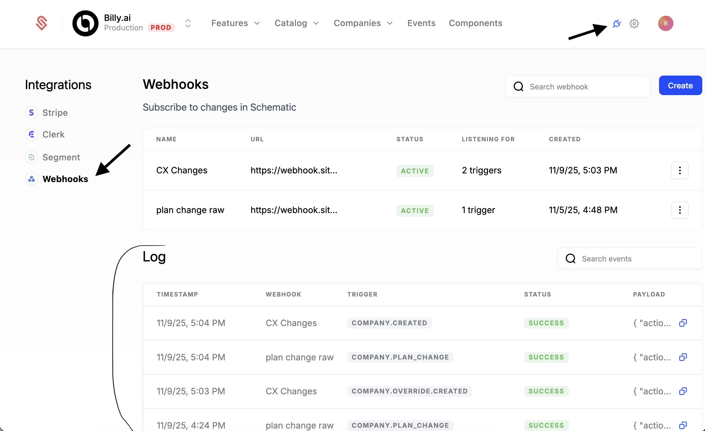

Webhooks allow you to listen to triggers from Schematic to create alerts or keep external services up to date when data changes.

The following guide walks through setting up Slack alerts from Schematic data. We'll be listening to company create and delete webhooks in a new Slack channel.

### Supported webhook events

We currently support the following webhooks in Schematic (with more on the way!):

| Object | Event |
| --- | --- |
| flag | created |
| flag | updated |
| flag | deleted |
| flag rule | created |
| flag rule | updated |
| flag rule | deleted |
| feature | created |
| feature | updated |
| feature | deleted |
| plan entitlement | created |
| plan entitlement | updated |
| plan entitlement | deleted |
| company override | created |
| company override | updated |
| company override | deleted |
| plan | created |
| plan | updated |
| plan | deleted |
| company | created |
| company | updated |
| company | deleted |
| user | created |
| user | updated |
| user | deleted |

### Webhook structure

Each webhook from Schematic will be structured with the following data:

```
{
  "action": "webhook.name",
  "account_id": "acct_xxxxxxx",
  "environment_id": "env_xxxxxxxx",
  "body": {
  },
  "object_type": "object"
}
```

**Webhook trigger parameters**

| Field | Description |
| --- | --- |
| action | The trigger action e.g. customer.created  |
| account_id | The account the trigger occurred in |
| environment_id | The environment within the account the trigger occurred in |
| body | Payload containing object metadata  |
| object_type | The type of object |

The contents of the body will vary depending on the trigger you listen to. You can test individual triggers easily by using free services like [Webhook-Test](https://webhook-test.com).

## Developer Tooling

On the webhooks page in Schematic, you can find a log of all webhooks Schematic has sent for your account. We will only show events that have an associated webhook configured.



