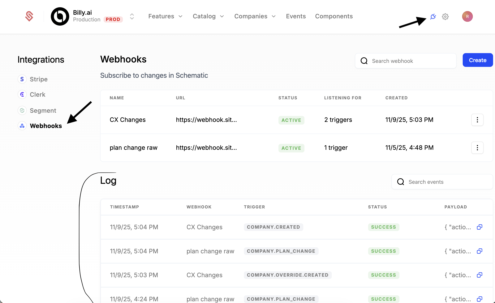

Webhooks allow you to listen to triggers from Schematic to create alerts or keep external services up to date when data changes.

## Supported webhook events

The table below lists every supported event and links to its payload type in the Node.js SDK. See [Payload types](#payload-types) below for links to other SDKs.

**Company & User events**

| Event | Body type |
| --- | --- |
| `company.created`, `company.updated`, `company.deleted` | [`CompanyDetailResponseData`](https://github.com/SchematicHQ/schematic-node/blob/main/src/api/types/CompanyDetailResponseData.ts) |
| `company.plan_changed` | [`PlanChangeResponseData`](https://github.com/SchematicHQ/schematic-node/blob/main/src/api/types/PlanChangeResponseData.ts) — see [Plan Changed Webhook](/integrations/webhooks/plan-changed) |
| `company.override.created`, `company.override.updated`, `company.override.deleted`, `company.override.expired` | [`CompanyOverrideResponseData`](https://github.com/SchematicHQ/schematic-node/blob/main/src/api/types/CompanyOverrideResponseData.ts) |
| `user.created`, `user.updated`, `user.deleted` | [`UserDetailResponseData`](https://github.com/SchematicHQ/schematic-node/blob/main/src/api/types/UserDetailResponseData.ts) |

**Catalog events**

| Event | Body type |
| --- | --- |
| `feature.created`, `feature.updated`, `feature.deleted` | [`FeatureDetailResponseData`](https://github.com/SchematicHQ/schematic-node/blob/main/src/api/types/FeatureDetailResponseData.ts) |
| `flag.created`, `flag.updated`, `flag.deleted` | [`FlagDetailResponseData`](https://github.com/SchematicHQ/schematic-node/blob/main/src/api/types/FlagDetailResponseData.ts) |
| `flag_rules.updated`, `rule.deleted` | [`RuleDetailResponseData`](https://github.com/SchematicHQ/schematic-node/blob/main/src/api/types/RuleDetailResponseData.ts) |
| `plan.created`, `plan.updated`, `plan.deleted` | [`PlanDetailResponseData`](https://github.com/SchematicHQ/schematic-node/blob/main/src/api/types/PlanDetailResponseData.ts) |
| `plan_version.deleted` | [`PlanVersionResponseData`](https://github.com/SchematicHQ/schematic-node/blob/main/src/api/types/PlanVersionResponseData.ts) |
| `plan.entitlement.created`, `plan.entitlement.updated`, `plan.entitlement.deleted` | [`PlanEntitlementResponseData`](https://github.com/SchematicHQ/schematic-node/blob/main/src/api/types/PlanEntitlementResponseData.ts) |

**Billing events**

| Event | Body type |
| --- | --- |
| `subscription.trial.ended` | [`BillingSubscriptionView`](https://github.com/SchematicHQ/schematic-node/blob/main/src/api/types/BillingSubscriptionView.ts) |

**Usage-based trigger events** — see [Entitlement & Credit Trigger Webhooks](/integrations/webhooks/entitlement-triggers)

| Event | Body type |
| --- | --- |
| `entitlement.limit.reached`, `entitlement.limit.warning`, `entitlement.soft_limit.reached`, `entitlement.soft_limit.warning`, `entitlement.tier_limit.reached`, `entitlement.tier_limit.warning` | [`WebFeatureUsageWebhookOutput`](https://github.com/SchematicHQ/schematic-node/blob/main/src/api/types/WebFeatureUsageWebhookOutput.ts) |
| `credit.limit.reached`, `credit.limit.warning` | — |
| `auto.topup.hard.failure` | [`CreditsAutoTopupHardFailure`](https://github.com/SchematicHQ/schematic-node/blob/main/src/api/types/CreditsAutoTopupHardFailure.ts) |
| `auto.topup.retry.exceeded` | [`CreditsAutoTopupRetryFailure`](https://github.com/SchematicHQ/schematic-node/blob/main/src/api/types/CreditsAutoTopupRetryFailure.ts) |

## Payload types

All webhook event payloads are strongly typed in each of our SDKs. The Node.js types are linked in the table above. For other SDKs, find the same type names in their respective type directories:

| SDK | Types location |
| --- | --- |
| Node.js | [`src/api/types/`](https://github.com/SchematicHQ/schematic-node/tree/main/src/api/types) |
| Go | [`types.go`](https://github.com/SchematicHQ/schematic-go/blob/main/types.go) |
| C# | [`src/SchematicHQ.Client/Types/`](https://github.com/SchematicHQ/schematic-csharp/tree/main/src/SchematicHQ.Client/Types) |
| Java | [`src/main/java/com/schematic/api/types/`](https://github.com/SchematicHQ/schematic-java/tree/main/src/main/java/com/schematic/api/types) |
| Python | [`src/schematic/types/`](https://github.com/SchematicHQ/schematic-python/tree/main/src/schematic/types) |

## Webhook structure

Each webhook from Schematic is a `POST` request with a JSON body structured as follows.

```json
{
  "action": "<webhook.name>",
  "account_id": "acct_xxxxxxx",
  "environment_id": "env_xxxxxxxx",
  "object_type": "<object>",
  "body": {},
  // if applicable
  "company_id": "comp_xxxxxxxx",
  "feature_id": "feat_xxxxxxxx"
}
```

| Field | Description |
| --- | --- |
| `action` | The webhook event type, e.g. `company.created` |
| `account_id` | The account the event occurred in |
| `environment_id` | The environment within the account the event occurred in |
| `object_type` | The type of object the event relates to |
| `body` | Payload containing event-specific data; shape varies by event type |
| `company_id` | Present on company-scoped and entitlement trigger events |
| `feature_id` | Present on entitlement trigger events |

The contents of `body` vary depending on the event. You can inspect real payloads using free services like [Webhook-Test](https://webhook-test.com) or the webhook log in the Schematic dashboard.

## Signature verification

Every webhook request Schematic sends includes three headers for verifying authenticity:

| Header | Description |
| --- | --- |
| `X-Schematic-Webhook-Signature` | HMAC-SHA256 signature of the request body, hex-encoded |
| `X-Schematic-Webhook-Signature-Version` | Signature version — currently `v1` |
| `X-Schematic-Webhook-Timestamp` | Unix timestamp of when the webhook was sent |

The signature is computed as:

```
HMAC-SHA256(secret, rawBody + "+" + timestamp)  →  hex-encoded
```

where `secret` is the webhook secret shown in the Schematic dashboard when you create the webhook endpoint.

Each SDK ships a built-in helper to handle verification for you:

<CodeBlocks>
```typescript title="Node.js"
import { verifyWebhookSignature } from "@schematichq/schematic-typescript-node";

// Express example
app.post("/webhook", express.raw({ type: "application/json" }), (req, res) => {
  try {
    verifyWebhookSignature(req, process.env.SCHEMATIC_WEBHOOK_SECRET, req.body);
  } catch (err) {
    return res.status(400).send("Invalid signature");
  }

  const event = JSON.parse(req.body.toString());
  // handle event...
  res.sendStatus(200);
});
```

```python title="Python"
from schematichq.webhook_utils import verify_webhook_signature, WebhookSignatureError

# Flask example
@app.route("/webhook", methods=["POST"])
def webhook():
    try:
        verify_webhook_signature(request, secret=os.environ["SCHEMATIC_WEBHOOK_SECRET"])
    except WebhookSignatureError:
        return "Invalid signature", 400

    event = request.get_json()
    # handle event...
    return "", 200
```

```go title="Go"
import "github.com/schematichq/schematic-go/webhooks"

func webhookHandler(w http.ResponseWriter, r *http.Request) {
    err := webhooks.VerifyWebhookSignature(r, os.Getenv("SCHEMATIC_WEBHOOK_SECRET"))
    if err != nil {
        http.Error(w, "Invalid signature", http.StatusBadRequest)
        return
    }

    // handle event...
    w.WriteHeader(http.StatusOK)
}
```
</CodeBlocks>

<Warning>Always use your framework's raw body middleware when verifying signatures — parsed or re-serialized bodies will not match the original signature.</Warning>

## Developer Tooling

On the webhooks page in Schematic, you can find a log of all webhooks Schematic has sent for your account. We will only show events that have an associated webhook configured.


