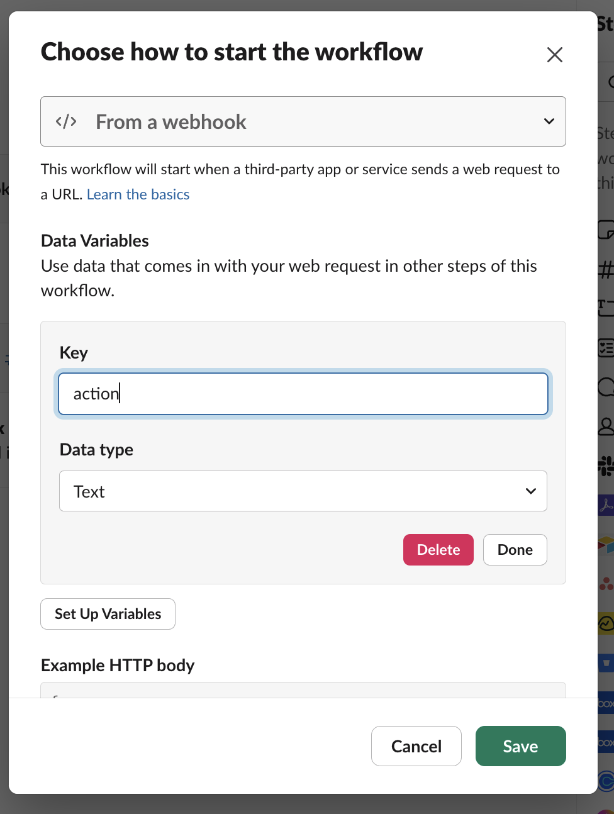

Webhooks allow you to listen to triggers from Schematic to create alerts or keep external services up to date when data changes.

The following guide walks through setting up Slack alerts from Schematic data. We’ll be listening to company create and delete webhooks in a new Slack channel.

### Supported webhook events

We currently support the following webhooks in Schematic (with more on the way!):

| Object | Event |
| --- | --- |
| flag | created |
| flag | updated |
| flag | deleted |
| flag rule | created |
| flag rule | updated |
| flag rule | deleted |
| feature | created |
| feature | updated |
| feature | deleted |
| plan entitlement | created |
| plan entitlement | updated |
| plan entitlement | deleted |
| company override | created |
| company override | updated |
| company override | deleted |
| plan | created |
| plan | updated |
| plan | deleted |
| company | created |
| company | updated |
| company | deleted |
| user | created |
| user | updated |
| user | deleted |

### Webhook structure

Each webhook from Schematic will be structured with the following data:

```
{
  "action": "webhook.name",
  "account_id": "acct_xxxxxxx",
  "environment_id": "env_xxxxxxxx",
  "body": {
  },
  "object_type": "object"
}
```

**Webhook trigger parameters**

| Field | Description |
| --- | --- |
| action | The trigger action e.g. customer.created  |
| account_id | The account the trigger occurred in |
| environment_id | The environment within the account the trigger occurred in |
| body | Payload containing object metadata  |
| object_type | The type of object |

The contents of the body will vary depending on the trigger you listen to. You can test individual triggers easily by using free services like [Webhook-Test](https://webhook-test.com).

## Getting started

### Create a Slack Automation

1. Navigate to Automations in Slack


2. Click “New Workflow”
3. Rename the workflow to “Schematic Webhook”
4. Start the workflow “From a webhook” and click Continue in the modal (we’ll set up variables later)
5. Copy the Web request URL

### Create a Schematic endpoint

1. Navigate to Integrations in Schematic
2. Click Webhooks and Create an endpoint
3. In the modal, name the endpoint “Slack Alerts”
4. Use the “Web request URL” from Slack in the URL field
5. Select the following triggers: company.created, company.deleted

<iframe
  width="560"
  height="400"
  src="https://schematichq-1.wistia.com/embed/iframe/5h2yziakzr"
  title="Create Webhook Endpoint"
  frameBorder="0"
  allow="accelerometer; autoplay; clipboard-write; encrypted-media; gyroscope; picture-in-picture"
  allowFullScreen
></iframe>

Company webhooks will look like this:

```
{
  "action": "company.deleted",
  "account_id": "acct_xxxxxxx",
  "environment_id": "env_xxxxxxx",
  "body": {
    "created_at": "2024-07-31T19:20:01.223757Z",
    "environment_id": "",
    "id": "comp_xxxxxxx",
    "last_seen_at": null,
    "logo_url": null,
    "name": "cus_xxxxxxx",
    "updated_at": "2024-07-31T19:20:01.223757Z",
    "add_ons": null,
    "entity_traits": [],
    "keys": [],
    "plan": null,
    "plans": null,
    "traits": {},
    "user_count": 0
  },
  "object_type": "company"
}
```

## Configure the Slack Automation

1. Navigate to the Schematic Webhook workflow in Slack
2. Click into the Webhook step to configure it, and click “Set up variables”
3. Type action into the key field and select the Text data type



4. Once your webhook is configured, set up a new channel in Slack named “test-slack-alerts” (or anything you like!)
5. In your workflow, select Messages > Send a message to a channel
6. Insert the action variable and add a message.

```
{} action was triggered in Schematic.
```

## Test your webhook

Now that our Slack Automation is set up, we can test triggering webhooks from Schematic.

1. Navigate to the Company tab in Schematic
2. Click Create and fill in a name and a key for the test company
3. You should see a new alert in Slack
    
 

You can also try deleting the company to trigger a company.delete.

<Info> Slack is limited to parsing top level fields (it cannot access nested fields, unfortunately) </Info>

## Next steps

Nearly every operation you can make on objects in Schematic will trigger a webhook, so you can support a variety of scenarios, such as:

- Keeping CRM records in sync
- Updating Billing records
- Alerting internal stakeholders of customer changes via Slack or email
- …and more

We will be expanding support for other webhook scenarios in the future, including reaching limits.