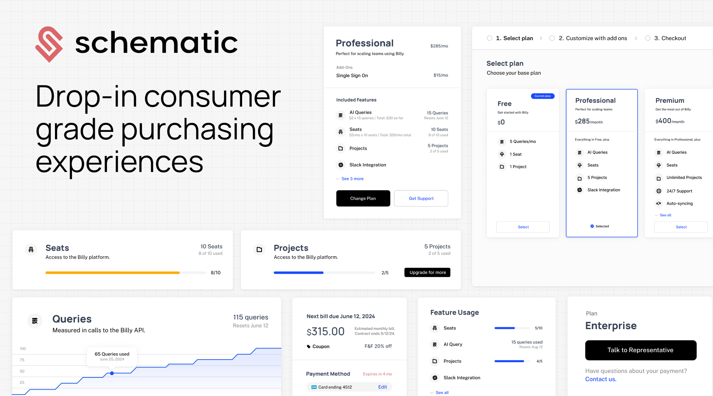

Using the WorkOS integration with Schematic, you can:

- Automatically import organizations and users from your existing identity provider, WorkOS
- Enrich Schematic company profiles with existing metadata
- Assign and enforce entitlements directly in your application with feature flags
- Embed drop-in components that are context-aware for a complete purchasing experience

This integration allows you to extend identity with entitlements and our library of embeddable UI components for end-to-end purchasing experiences and plan management.

Using WorkOS and Schematic together allows you to build identity and pricing and packaging into your applications without toiling over extensive homegrown solutions, from log in to checkout.

## **Getting started**

### **Connecting WorkOS to Schematic**

You can set up the WorkOS integration in the **Integrations** tab within Schematic.

TODO: add screenshot at fern/docs/assets/images/workos/workos-integrationpage.png and uncomment

Once there, do the following:

1. In your WorkOS dashboard, create a new webhook and set its endpoint to the URL shown in Schematic.
2. Subscribe to the events listed in Schematic so that Schematic receives updates from WorkOS when organizations, memberships, or users change:
    - `organization.created`, `organization.updated`, `organization.deleted`
    - `organization_membership.created`, `organization_membership.updated`, `organization_membership.deleted`
    - `user.created`, `user.updated`, `user.deleted`
3. Once you've created the webhook, WorkOS will provide a signing secret. Copy it and add it to the **WorkOS Webhook signing secret** field in Schematic.
4. Create a WorkOS secret API key and add it to the **WorkOS API key** field in Schematic. Click **Connect to WorkOS**.

Once you're connected, Schematic will import organizations, users, and memberships from WorkOS. A `workos_organization_id` will be added as a unique key to companies, and a `workos_user_id` will be added as a unique key to users along with an additional key, `email`. The following data will be imported and kept up-to-date automatically:

- Organizations
    - name
- Users
    - email
    - createdat (epoch time)
    - updatedat (epoch time)
    - role

On initial import, if an organization or user in Schematic already exists with a `workos_organization_id` or `workos_user_id` that matches data from WorkOS, the record will simply be updated.

You will now be able to assign entitlements and enforce them in your application using Schematic flags, features, and plans.

### Migrating from a Manual WorkOS Integration

If you've already setup WorkOS manually and can easily switch to Schematic's Native WorkOS integration.

To avoid duplicating companies and users in Schematic, you'll want to make sure that your Schematic companies have a `workos_organization_id` key set to the organization id from WorkOS. Likewise, Schematic users need to have a `workos_user_id` set to the user id from WorkOS. 

If you currently use different key names, the migration approach is:
1. Run a backfill that adds `workos_organization_id` and `workos_user_id` to your companies and users
2. Switch your api calls to using these key names instead of your existing key names
3. Enable the integration

### **Using Schematic Components with the WorkOS integration**

Similar to WorkOS's UI components, Schematic offers drop-in components for end-to-end purchasing experiences and plan management.

Once you've imported organizations and users and you've built out your packaging model in Schematic, you can navigate to the **Components** tab in Schematic to design, customize, and deploy Customer Portals.

When Schematic Components are embedded in your application, they will be aware of the identity of the logged in user and serve the appropriate data and controls.

