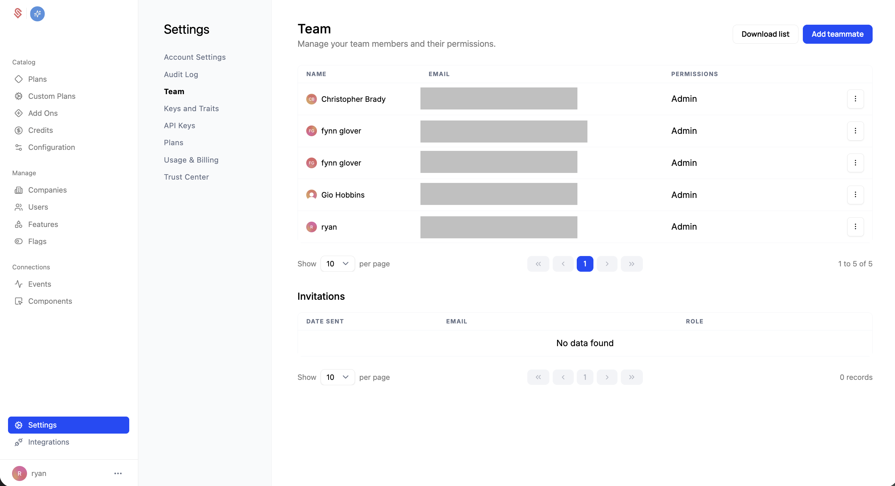

Schematic uses role-based access control (RBAC) to govern what each of your team members can do. You manage your team and their access from **Settings → Team**.

<Note>RBAC is available on paid plans. You can upgrade to the growth plan in Settings > Usage & Billing to enable RBAC.</Note>

## Roles

Every team member has one of two roles:

- **Admin** — Full access to everything in the account, across all environments. Admins can manage team members, billing, and every resource. Permission toggles don't apply to admins; they always have full access.
- **Member** — Access is limited to exactly the permissions you grant. A member with no permissions can sign in and view data but cannot make changes.

## How permissions are scoped

For members, permissions are granted at two levels:

- **Account permissions** apply across your whole account, regardless of environment. These cover catalog-wide resources.
- **Environment permissions** are granted per environment. A member can have different permissions in your Production environment than in a Sandbox or Development environment, which lets you give someone freedom to experiment in a sandbox while restricting what they can change in production.

## Account permissions

These apply across all environments:

- **Flags** — Create, edit, and delete feature flags.
- **Features** — Create, edit, and delete features.
- **Plans & Add-ons** — Create, edit, and delete plans and add-ons.

## Environment permissions

These are granted per environment:

- **Companies** — Create, edit, and delete companies, and assign plans to companies.
- **Users** — Create, edit, and delete users.
- **Overrides** — Create, edit, and delete company-level overrides.
- **Plan Entitlements** — Create, edit, and delete the entitlements attached to a plan.
- **Plan Versions** — Create, edit, and delete plan versions.
- **Plan & Billing** — Manage plan billing configuration and grant credits to companies.
- **Credits** — Create, edit, and delete credits.
- **Components** — Create, edit, and delete embedded UI components.
- **Webhooks** — Create, edit, and delete webhooks, and reveal webhook signing secrets.

## Assigning roles and permissions

1. Go to **Settings → Team**.
2. Click **Add teammate** to invite someone, or click **Edit** on an existing member.
3. Choose a role. If you select **Member**, the permission controls appear.
4. Toggle the account permissions and, for each environment, the environment permissions you want to grant. Use **Select all** / **Unselect all** to set a whole group at once.
5. Save. The teammate's access updates immediately.

Only admins can add teammates and change roles or permissions.

## Example: a sales or customer success role

A common setup is a teammate who can manage customer accounts and exceptions but should not change your core catalog. Grant a **Member** these environment permissions (typically in Production):

- **Companies** — to assign existing plans to companies.
- **Overrides** — to create company-level overrides.
- **Plan & Billing** — to grant existing credits to companies.

Leave the account permissions (**Flags**, **Features**, **Plans & Add-ons**) off so they cannot change your catalog, and leave **Users**, **Plan Entitlements**, and **Plan Versions** off as well. 
