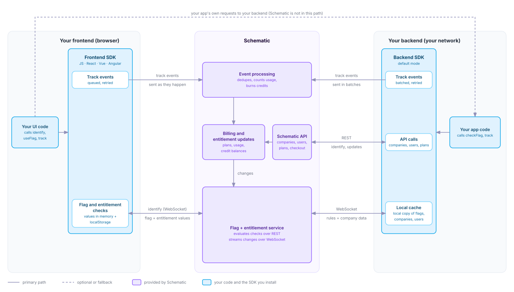
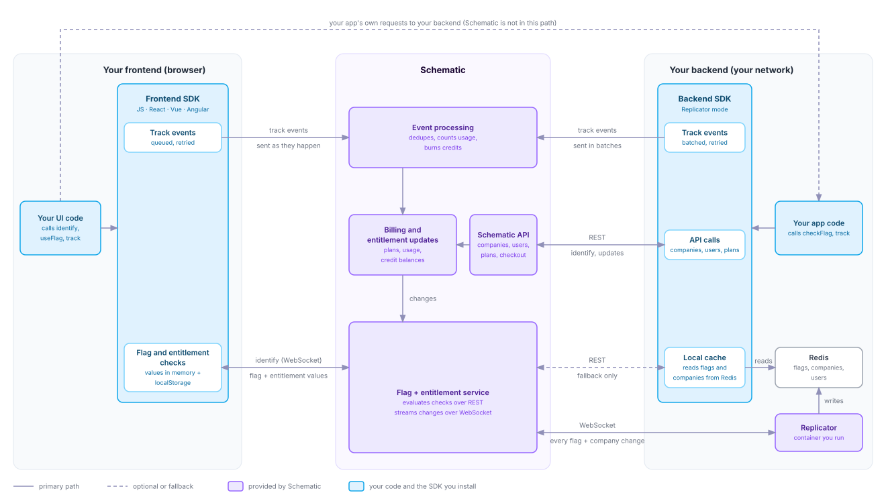

Schematic runs in two places in your stack: the browser and your backend. Each runs an SDK. Your code calls `identify` to tell Schematic who a user is and which company they belong to, and the SDK keeps that company's flag values close to your code and sends usage events back to Schematic. Requests from your frontend to your backend never pass through Schematic, so when Schematic is slow or unreachable, what changes is the value a flag check returns. Whether your app can serve the request is unaffected.

By default, the backend SDK evaluates checks in your process. Teams whose infrastructure needs a higher level of availability add Replicator, which keeps every customer's entitlement state in a cache inside their own network. Pick a tab to see yours. The browser side is the same in both.

<Tabs>
  <Tab title="Default">
    
  </Tab>
  <Tab title="Replicator">
    
  </Tab>
</Tabs>

## In the browser

When you call `identify`, the frontend SDK opens a WebSocket to Schematic's flag and entitlement service using your publishable key and sends the keys of the current company and user. Schematic evaluates every flag for that company and user on its side and sends back the results. The browser receives flag values and entitlement details. It never receives flag rules or data about other companies.

The SDK keeps those values in memory and in `localStorage`. A returning visitor sees the last known values immediately, and the SDK refreshes them over the socket in the background. When a plan, override, trait, or usage count changes, Schematic pushes the new values over the same socket, and the React, Vue, and Angular SDKs update your components without a reload. Until the first values arrive, a check returns the default you configured for that flag.

`track` events go to Schematic as they happen, and the SDK retries a request that fails. After a `track`, the SDK also optimistically updates its own cache, so the change shows up in your frontend immediately. As the event moves through Schematic, the SDK merges the updated state automatically when it arrives.

### Publishable keys

Your publishable key ships in your frontend, so anyone who loads your app can read it. Schematic limits it to what a browser needs: checking flags for one company and user at a time, opening the WebSocket, sending `identify` and `track` events, and reading your public plans. Everything else needs a secret key, including reading or changing companies, users, and credits, checking many companies in one request, reserving credits, and sending negative or backfilled usage.

The key is not tied to one company. Anyone holding it can check flags or send `track` events for any company key they know, so use browser checks to shape the UI and make the check that protects a feature in your backend. Send usage you bill for from your backend too, where a user cannot forge the event.

## In your backend

Your app code calls the backend SDK with a secret key. The SDK is a typed client for the full Schematic API, generated from the same OpenAPI spec as the [API reference](/api-reference), so any endpoint you can call over REST you can also call through the SDK. On top of that client, it adds its own handling for the two calls your app makes most often, entitlement checks and `track` events.

Your backend uses the API for writes, such as identifying companies and users, changing a company's plan, and starting checkout. Each write becomes a billing and entitlement update, and the change reaches every connected SDK the same way usage does.

The SDK buffers `track` events in memory and sends them to Schematic in batches, retrying a batch that fails. Close the client when your process shuts down so it flushes what it is holding. After a `track`, the SDK optimistically updates its own cache, the same way the frontend SDK does.

When a check cannot complete, the SDK returns the default value you configured for that flag, or `false`, instead of throwing. Set defaults for flags that gate something important, so an outage fails the way you choose. [Availability](/production_readiness/availability) covers how each setup behaves during an interruption.

Where the SDK gets the data for a check depends on whether you run Replicator.

### Default

The SDK holds a WebSocket to Schematic and keeps a local copy of your flags and rules, plus every company and user it has checked. It evaluates checks locally with the same rules engine Schematic runs, compiled to WebAssembly. The first check for a company fetches that company over the socket. Later checks for it never leave your process, and Schematic pushes changes to the company, its usage, and your flags as they happen.

Each process keeps its own copy unless you point the SDK at Redis, which shares one copy across instances so that a company loaded by one instance is ready for all of them. See the SDK page for your language, such as [Node.js](/developer_resources/sdks/nodejs#datastream), for setup.

### Replicator

[Replicator](/production_readiness/replicator) is for infrastructure that needs a higher level of availability and reliability. It proactively caches all of your customers' entitlement state in a durable cache in your own system, such as Redis, and the Schematic SDKs serve flag checks from that cache. If Schematic has a service disruption, your app keeps serving entitlement state from data that is already in your network.

Replicator is a container you run alongside your app. It loads every flag, company, and user in your environment into Redis, then holds a WebSocket to Schematic and writes each change as it arrives. The SDK runs in Replicator mode, reads from Redis, and evaluates checks locally. Because every company is already loaded, even the first check for a company is served locally.

The SDK polls the Replicator's readiness endpoint to know whether the data in Redis is current. If a flag is missing from Redis, the SDK falls back to a REST call for that check. After a restart or a dropped connection, Replicator resumes from its last saved position rather than reloading everything.

Run one Replicator per Redis. A second instance waits for the first to release its lock before it writes.

Replicator applies to backend SDKs. Browsers connect to Schematic directly in both setups, as the diagrams show.

## Inside Schematic

Event processing accepts a `track` event and responds before working on it, so a `track` call never waits on metering. It then processes events asynchronously, dropping duplicates, updating each company's usage counts, and burning credits for credit-metered features.

Those results land as billing and entitlement updates, alongside every other change to a company's plan, overrides, traits, and credit grants. A company's credit balance is tracked in a ledger, and debits against a company's balance of one credit type are serialized, so two debits that race for the last of a balance cannot both succeed.

Every update flows to the flag and entitlement service, which pushes it to connected SDKs and Replicator instances. A usage event tracked in your backend reaches every browser tab showing that company without anyone polling.

Because event processing is asynchronous, usage and credit balances trail the `track` call slightly. For most gating that lag is invisible, because the SDK has already updated its own cache. When several workers spend from one credit balance at once, gate the work with a [credit lease or reservation](/billing/credit-leases-and-reservations). Both debit the balance before the work runs, so concurrent workers cannot overspend it.

## Availability and performance

Schematic targets 99.99% uptime and publishes its record on the [status page](https://schematic.statuspage.io/). See [Availability](/production_readiness/availability) for how that target relates to your contract.

Flag checks that reach Schematic are evaluated against cached flag and company data, with a p99 latency under 50ms. In the default setup, most backend checks never make that trip, because the SDK evaluates them in your process. For environments where uptime is critical, Replicator keeps serving checks from your own Redis through a Schematic disruption.

Event tracking runs separately from the core API. Schematic writes every event it accepts to a durable log before processing it, so events sent during an incident are processed once the pipeline recovers.

## Further reading

- [Availability](/production_readiness/availability) — compare how each setup behaves during a Schematic interruption
- [SDKs](/developer_resources/sdks/overview) — install and configure the frontend and backend SDKs for your language
- [Replicator](/production_readiness/replicator) — deploy and configure the Replicator container and its Redis
- [Authentication](/api-reference/authentication) — decide which key belongs in your frontend and which stays on your server
- [Metering](/playbooks/metering) — send usage events with idempotency keys so retries never double count
- [Credit Leases and Reservations](/billing/credit-leases-and-reservations) — keep concurrent workers from overspending one credit balance
