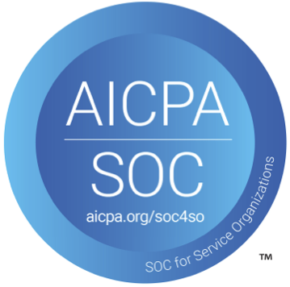
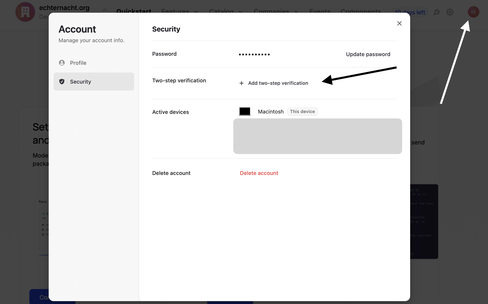

Our founding team includes operators that have worked in dev tools, fintech, and cybersecurity, so we take security seriously across every aspect of our product and processes.

Schematic has put in place several technical and organizational measures designed to protect data and the application. We are secure by design and practice.

### SOC 2

Schematic is SOC 2 Type 1 and Type 2 compliant.

### Payment Security (PCI Compliance)

Schematic leverages Stripe for all payment processing. Stripe is certified as a PCI Level 1 Service Provider, ensuring industry-standard protection for all payment data.

### Application Security Measures

Schematic has implemented the following security measures:

- **Continuous Dependency Scanning**: Automated monitoring for vulnerabilities in third-party libraries and frameworks, with alerts surfaced in CI/CD and tracked to resolution.
- **Static Application Security Testing (SAST)**: Regular analysis of source code to detect and remediate potential vulnerabilities before deployment.
- **Dynamic Application Security Testing (DAST)**: Runtime scanning of deployed environments to detect vulnerabilities such as XSS, SQL injection, and other common attack vectors.

### Monitoring and Logging

Schematic has internal and external monitoring in place to ensure the security of our application.

- **Audit Logging**: All critical user and system actions are logged for traceability and incident investigation.
- **Intrusion and Threat Detection**: AWS GuardDuty provides continuous monitoring for malicious activity and unauthorized behavior.
- **Cloud Security Automation**: Schematic uses AWS Security Hub and automated compliance checks via Vanta to enforce best practices and alert on misconfigurations.

### SSO and 2FA

For all customers, Schematic supports SSO through Google and Github. Additionally, customers can enable 2FA through 

We can also support Custom SSO providers such as Okta, Auth0, etc for customers on the Enterprise plan. If you have any questions, please reach out to us at `support@schematichq.com`.

### Policies

We have a number of policies in place to support SOC 2 compliance. All of these policies are available for viewing upon request:

- Acceptable Use Policy
- Asset Management Policy
- Backup Policy
- Business Continuity Plan
- Code of Conduct
- Data Classification Policy
- Data Deletion Policy
- Data Protection Policy
- Disaster Recovery Plan
- Encryption Policy
- Incident Response Plan
- Information Security Policy
- Password Policy
- Physical Security Policy
- Responsible Disclosure Policy
- Risk Assessment Policy
- Software Development Lifecycle Policy
- System Access Control Policy
- Vendor Management Policy
- Vulnerability Management Policy

### Reporting a Vulnerability / Bug

Please report security vulnerabilities or bugs to `support@schematichq.com`.

We currently do not operate a bug bounty program, but we will be forever grateful for any actionable security vulnerability found and will shower you with thanks and merch.