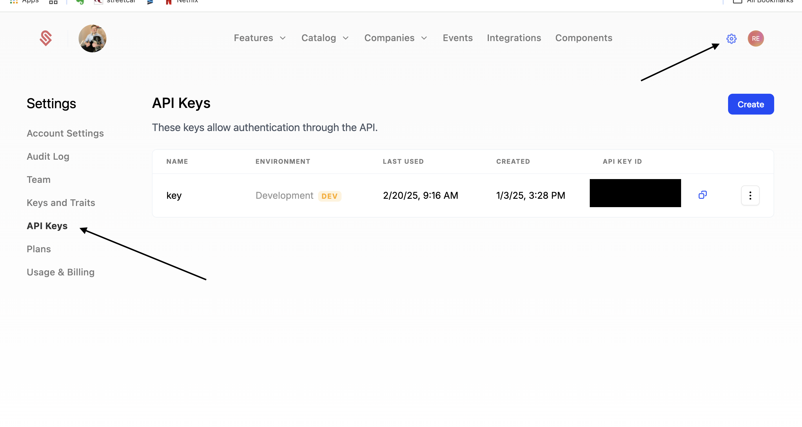

First, you'll need to create a Schematic account. This is free and will only take a few minutes. 

<iframe
  width="100%"
  height="450px"
  src="https://www.youtube.com/watch?v=30V1OTAVM00&list=PLaAbRmJj8zVr0zLAL_GDgcF2NpgHSGO4S"
  frameborder="0"
  allow="accelerometer; autoplay; clipboard-write; encrypted-media; gyroscope; picture-in-picture; web-share"
  referrerpolicy="strict-origin-when-cross-origin"
  allowfullscreen
></iframe>

## 1. Create an account

Go to [Schematic](https://app.schematichq.com/sign-in) and create an account with your Google account, or Github account, or email.

This flow will ask you a few simple questions about your company.

## 2. Create an API Key

1. Click the Gear icon in the top right
2. Click "API Keys" on the left menu
3. Click "Create" in the top right
4. Give the key a name, e.g. "Quickstart"
5. Click "Create"
6. Copy the publishable key and secret key, and add them to the `.env.local` file.
7. *NOTE: the secret key is never shown again, so make sure to save it in a secure location. You can always create a new key if you lose it.*

### You're done!

You've now created your first Entitlement of "Mechanical Keyboards" and added it to the "Developers" Plan.

Next, we'll look at integrating the Schematic SDK into your application, to make sure that developers always have access to mechanical keyboards.

*NOTE: To simplify this quickstart and demonstrate key Schematic features, each new account is provisioned with a demo customer, plan, and a few features. This quickstart is designed to leverage those to help guide you through Schematic. Feel free to delete those when you're ready.*