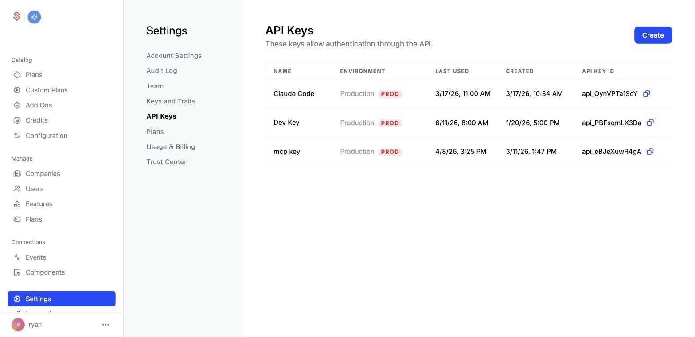
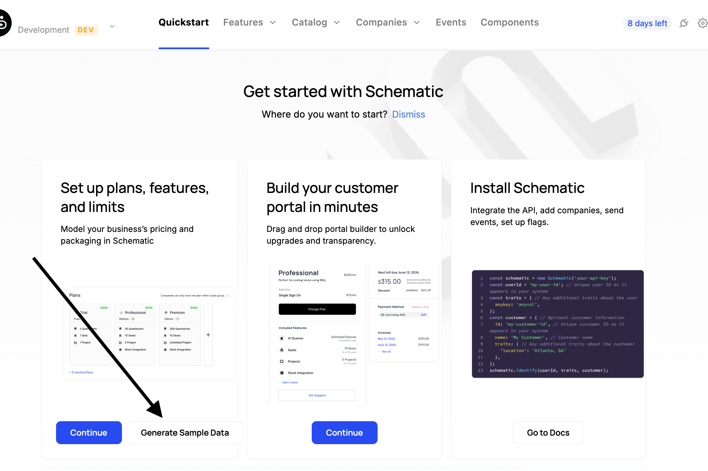

Creating a Schematic account is free and takes a few minutes. This is step one of [Set up your first plan](/quickstart/set-up-your-first-plan).

<iframe
  width="100%"
  height="450px"
  src="https://www.youtube.com/embed/30V1OTAVM00?si=wIuW3daxBJoyx2oU"
  frameborder="0"
  allow="accelerometer; autoplay; clipboard-write; encrypted-media; gyroscope; picture-in-picture; web-share"
  referrerpolicy="strict-origin-when-cross-origin"
  allowfullscreen
></iframe>

## 1. Create an account

Go to [Schematic](https://app.schematichq.com/sign-in) and sign up with Google, GitHub, or email. The signup flow asks a few questions about your company and then drops you into the dashboard.

## 2. Create your API keys

API keys are how your application talks to Schematic. You do not need them for anything on this track, but creating them now means your engineers are not blocked when they start [instrumenting your app](/quickstart/instrument-your-app).

1. Click **Settings**, the gear icon at the bottom of the left navigation.
2. Click **API Keys** in the Settings menu.
3. Click **Create** in the top right.
4. Give the key a name, for example "Quickstart".
5. Click **Create**.
6. Copy both keys and hand them to whoever is doing the integration.

<Warning>The secret key is shown once and never again. Store it somewhere secure the moment you create it. If you lose it, create a new key and delete the old one.</Warning>

## 3. Load sample data

On the Quickstart page in your account, click **Generate Sample Data**. This creates a demo customer, a plan, and a few features, so you have something realistic to work against instead of an empty dashboard.

<Info>The sample data exists only for demonstration. Delete it freely once you have finished the quickstart.</Info>

## Next step

Your account is ready. Next, [add your first feature](/quickstart/entitling-a-feature) and entitle it to a plan.
