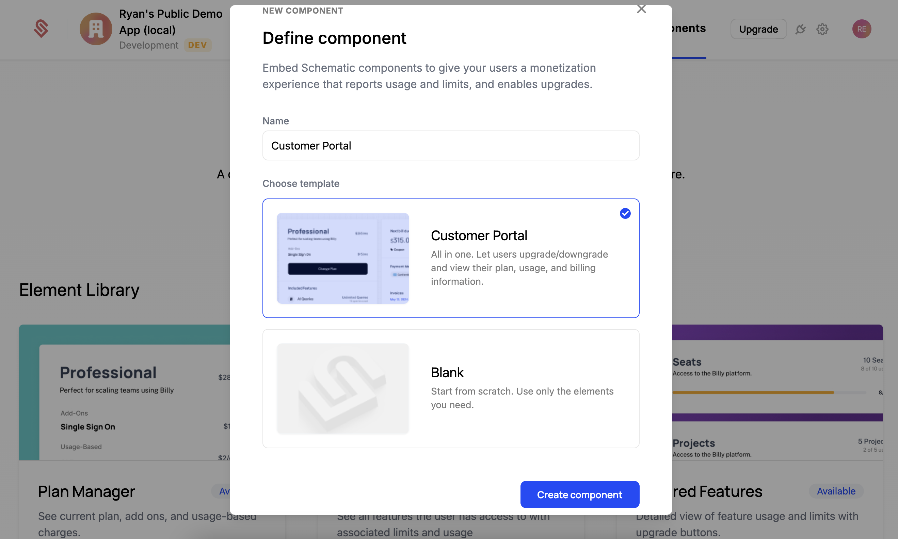
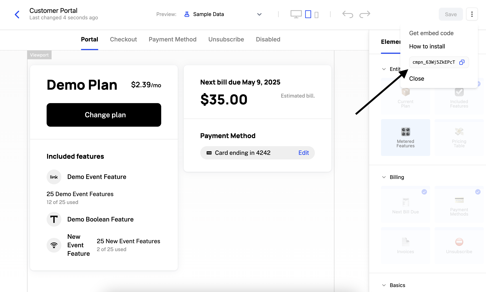

Components are drop-in UI elements to quickly implement common billing scenarios. There are 2 main types of components that Schematic Supports

1. Full page: Customer Portal and Checkout flow
2. UI elements: Meters, Paywalls

In the [online quickstart](TODO), you can see a setup component. Let's quickly add one to our local [quickstart app](https://github.com/schematichq/quickstart)

TODO video!

## Creating a component

Components can be created through the "Components" tab within Schematic. We're going to create a Customer Portal component, which is a fully built portal for customers to manage their current plan and conduct a checkout flow. This can be to start a paid plan, upgrade/downgrade to a different plan, or to add additional add-ons to their current plan.

1. Select "Create" in the top right.
2. Select "Customer Portal" for this example. 
3. Give your component a name, e.g. "Customer Portal".
4. Click "Create".



You can see that our component is fully built and ready to deploy. If you'd like to learn more about how to extend the Customer Portal or how to build UI elements like Meters and Paywalls, please refer to the [Components docs](/components/overview).

To add our component to the quickstart app, we'll need to get it's component id and then add it to our quickstart's `.env.local` file. 

1. Click the right 3-dot menu in the top right.
2. Click the 2 rectangle icon to copy the component id. 
3. In our quickstart, paste the component id into the `NEXT_PUBLIC_SCHEMATIC_COMPONENT_ID` field of our `.env.local`. 
4. Restart the quickstart app to make sure the `.env.local` is reloaded. 
5. Checkout our component on the "Components" page or our quickstart app.



## Temporary Access Tokens

Becuase components enable users to take sensitive actions like changing their billing status, Schematic requires an additional security step to render a component. This step is the creation of a temporary access token that is scoped to the current company. These tokens require a Schematic Secret Key, so they must be generated on your server (it is important to never expose a Schematic Secret Key to the client.)

All of our SDKs support creating temporary access tokens. The value for `lookup` is just the keys you'd use to lookup the comapany (learn more [here](/developer_resources/key_management)). Below is a typescript example. 

```
import { SchematicClient } from "@schematichq/schematic-typescript-node";

const schematicClient = new SchematicClient({ apiKey });

const resp = await schematicClient.accesstokens.issueTemporaryAccessToken({
  resourceType: "company",
  lookup: {
    id: 'demo-company',
  },
});

const accessToken = resp.data?.token;
```

## We're done!

You just created a fully feature customer portal and checkout flow. This is the most commonly used Schematic component, but there are [many other ways to leverage components](/components/overview) in Schematic.

## Next steps

We recommend you checkout the Identifying Users page in the quickstart app to see how to create a fully featured Billing Portal.
