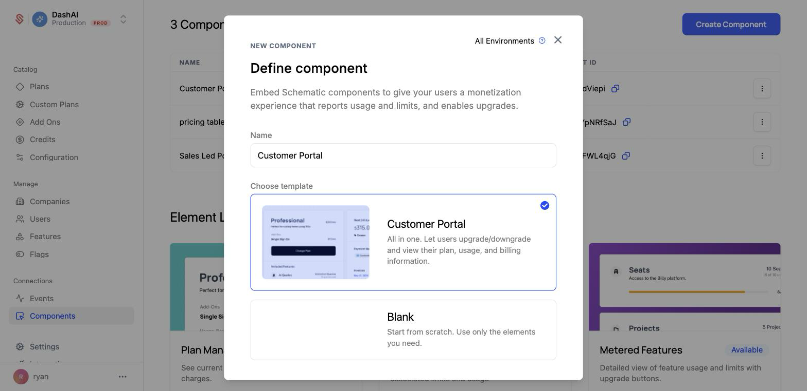
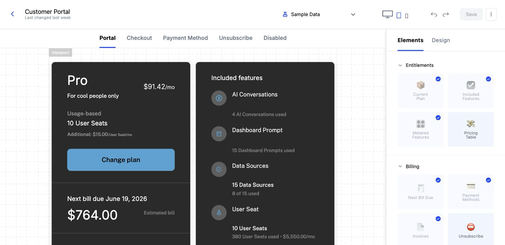

Components are ready-made pieces of billing interface that you configure in Schematic and your engineers drop into your product. Schematic offers two kinds.

1. Full pages, such as the Customer Portal and the checkout flow.
2. Smaller elements, such as meters and paywalls.

This is step four of [Set up your first plan](/quickstart/set-up-your-first-plan). You will build a Customer Portal, which lets customers see their current plan, upgrade or downgrade, and add add-ons without contacting you.

<iframe
  width="100%"
  height="450px"
  src="https://www.youtube.com/embed/30V1OTAVM00?si=G25D0t2NqewRiJIU"
  frameborder="0"
  allow="accelerometer; autoplay; clipboard-write; encrypted-media; gyroscope; picture-in-picture; web-share"
  referrerpolicy="strict-origin-when-cross-origin"
  allowfullscreen
></iframe>

## Create the component

1. Select **Components** from the left navigation.
2. Click **Create Component** in the top right.
3. Give the component a name, for example "Customer Portal".
4. Under **Choose template**, select **Customer Portal**.
5. Click **Create**.

The portal arrives fully built. It already reflects the plans, features, and allowances you configured in the earlier steps, so there is nothing to lay out or style before it works.

## Hand off the component ID

Every component has an ID. That ID is the only thing your engineers need in order to place the portal in your product.

1. Click the three-dot menu in the top right.
2. Click the copy icon to copy the component ID.
3. Send that ID to whoever is doing the integration.

Once the portal is embedded, you can keep editing it here. Changes you make in Schematic reach customers without a release.

## You're done

You now have an account, a feature entitled to a plan, a metered feature with a monthly allowance, and a customer-facing portal. That is a complete packaging setup, built entirely in the dashboard.

The Customer Portal is the most used component, and there are [many others](/components/overview), including checkout, meters, and paywalls.

## What's next

Go back to [Set up your first plan](/quickstart/set-up-your-first-plan) for the deeper guides, or hand [Instrument your app](/quickstart/instrument-your-app) to an engineer so your product starts respecting what you just built.
