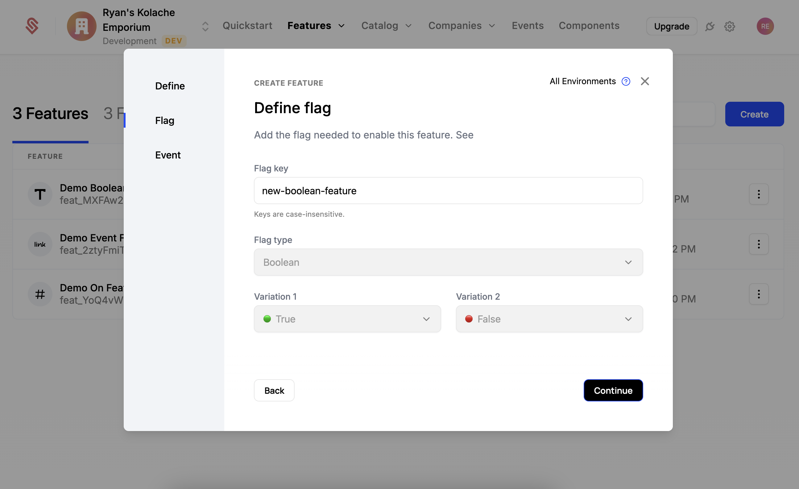
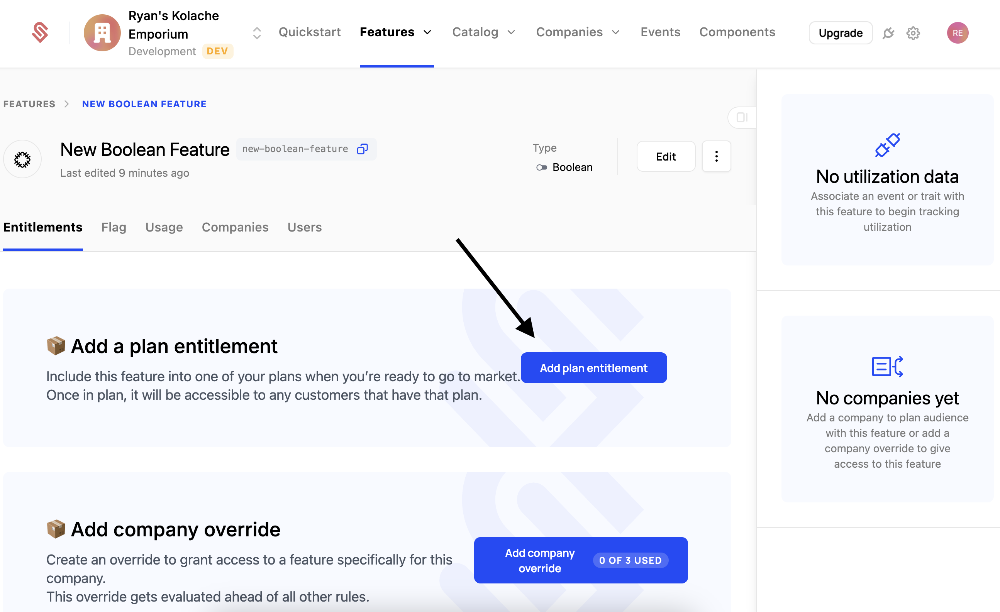
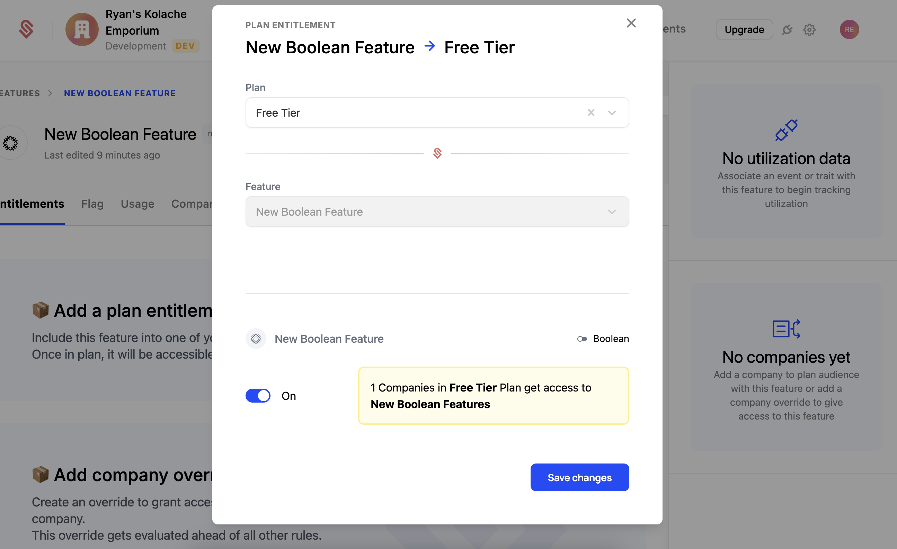
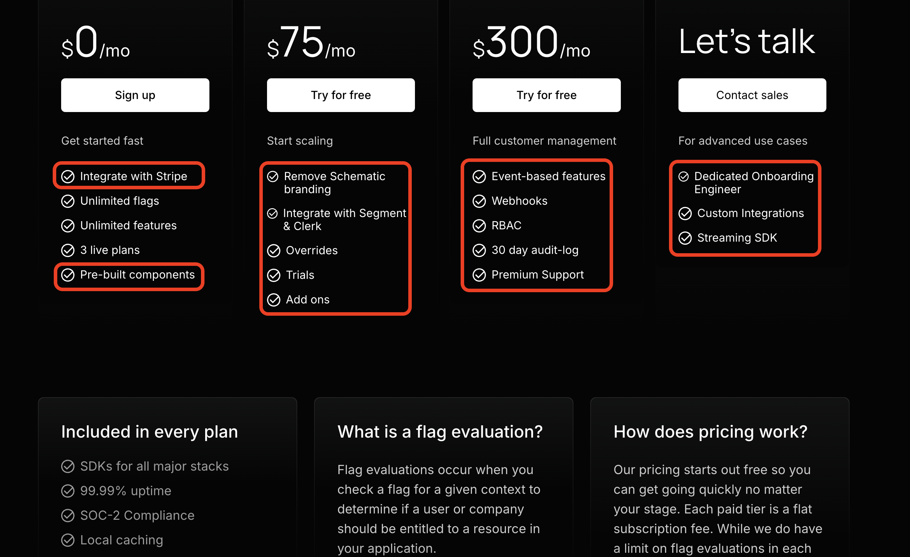

In the [quickstart app](https://github.com/schematichq/quickstart), the entitlements page shows 2 buttons, one of which is disabled. Let's create a feature in Schematic and entitle it to our plan so that this button will become clickable. 

TODO video!

## Create a boolean feature

First, we'll need to create a feature in Schematic. 

1. Select "Features" from the top navigation
2. Click "Create" on the right side of the screen
3. Call the feature "New Boolean Feature"
4. *NOTE: The type of this feature is "Boolean"  -- either we have access or we don't.*
5. Click "Continue" at the bottom
6. On the next screen, for the flag key, you MUST provide "demo-off-feature". This is the value the quickstart app is expecting. 
7. Click "Continue", then click "Save" on the final screen




## Entitle the feature to a plan

Now that we have a feature, we need to "entitle" it to the plan -- this is how we give our customers on a plan access to this feature. 

When you saved the feature, you should have dropped onto that feature's page. If not, then select "Features" from the top navigation and click on the feature you just created (New Boolean Feature).

1. Click "Add Plan Entitlement" to begin
2. Select the "Demo Plan" plan
3. Click "Save"





If you go back to the quickstart app, you should see the second entitlementbutton is now clickable (and the text has changed). Congrats! you've just entitled a feature to a plan.

## Code example

Below is the code that controls the button we just enabled. Tracking users and plans and then determining what a user is entitled to happens within Schematic. Our APIs and SDKs expose an interface similar to a feature flag -- you just need to check if the user has access and respond accordingly.

```
const {
  value: isNewBooleanFeatureEnabled,
} = useSchematicEntitlement("new-boolean-feature");

<button 
  className="bg-blue-500 text-white px-4 py-2 rounded-md"
  disabled={!isNewBooleanFeatureEnabled}
  onClick={() => { ... })
>
 {isNewBooleanFeatureEnabled ? "I'm entitled too!" : "I'm not entitled (yet)!"}
</button>
```

## We're done!

You just created a feature in Schematic and entitled it to a plan. This is the core building block of Schematic. The feature we created here was a Boolean feature, a simple feature that either grants or denies access. These are the most common type of feature in most plans. For example everything boxed in red below is a boolean feature.



## Next steps

We recommend you checkout the events page in the quickstart app to see how to track feature usage.
