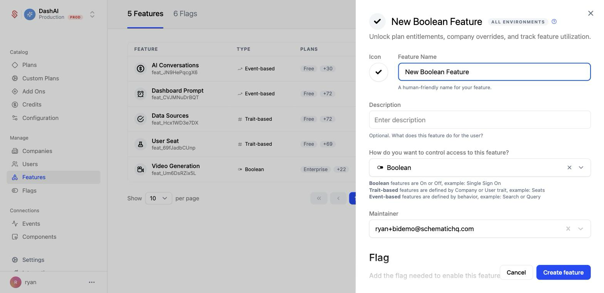
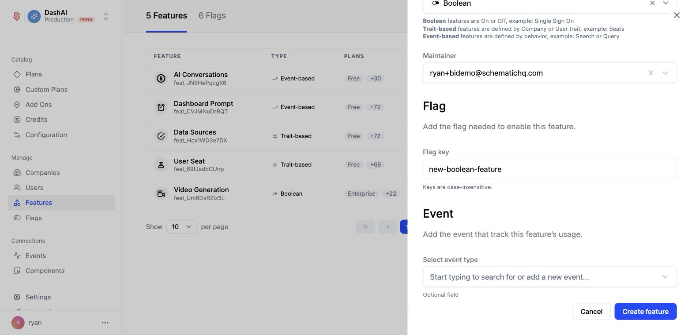
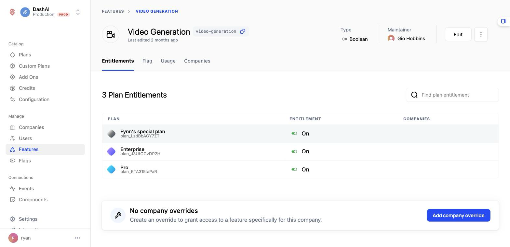
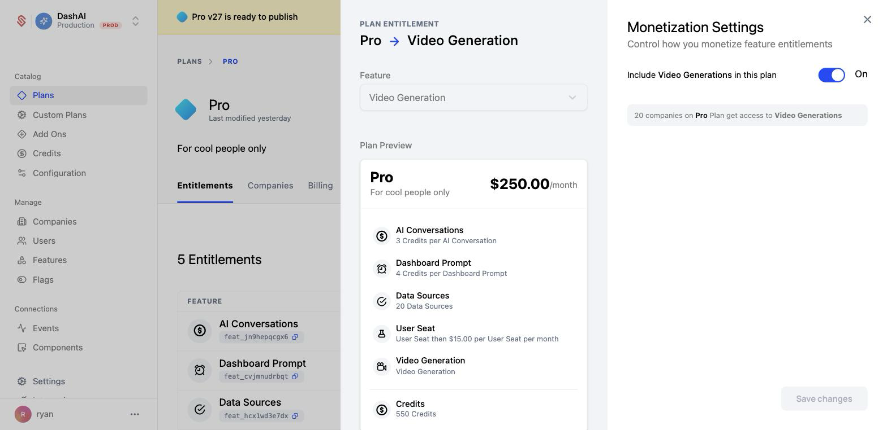
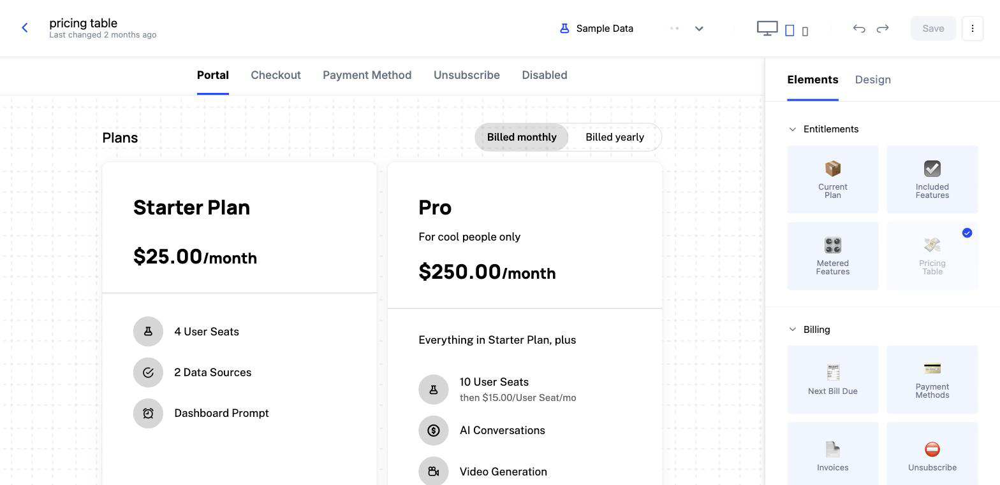

In the [quickstart app](https://github.com/schematichq/schematic-quickstart), the entitlements page shows 2 buttons, one of which is disabled. Let's create a feature in Schematic and entitle it to our plan so that this button will become clickable. 

<iframe
  width="100%"
  height="450px"
  src="https://www.youtube.com/embed/NvLMCfx_bPs?si=4zqLsbgYJLtF5Of_"
  frameborder="0"
  allow="accelerometer; autoplay; clipboard-write; encrypted-media; gyroscope; picture-in-picture; web-share"
  referrerpolicy="strict-origin-when-cross-origin"
  allowfullscreen
></iframe>

## Create a boolean feature

First, we'll need to create a feature in Schematic.

1. Select **Features** from the left navigation.
2. Click "Create" in the top right of the screen.
3. In the panel that opens, name the feature "New Boolean Feature". Leave the type set to **Boolean** -- either a company has access or it doesn't.



4. Scroll down to **Flag** and set the flag key to "new-boolean-feature". You MUST use this exact key, as it's the value the quickstart app expects. Then click "Create feature".



## Entitle the feature to a plan

Now that we have a feature, we need to "entitle" it to a plan -- this is how we give customers on a plan access to the feature.

When you create the feature, you'll drop onto that feature's page. If not, select **Features** from the left navigation and click the feature you just created (New Boolean Feature).

1. On the **Entitlements** tab, click the plan you want to give access to, or click "Add plan entitlement" to choose one. The example below shows the Entitlements tab for an existing feature, **Video Generation**, that is already entitled to several plans -- your feature's tab will look like this once you add a plan.



2. In the **Monetization Settings** panel, toggle the feature **On** for that plan, then click "Save changes". For a boolean feature this simply includes it in the plan. The example below includes Video Generation in the Pro plan.



If you go back to the quickstart app, you should see the second entitlement button is now clickable and the text has changed (you made need to refresh the page). 

Congrats! you've just entitled a feature to a plan.

## Code example

Below is the code that controls the button we just enabled. Tracking users and plans and then determining what a user is entitled to happens within Schematic. Our APIs and SDKs expose an interface similar to a feature flag -- you just need to check if the user has access and respond accordingly.

```
const {
  value: isNewBooleanFeatureEnabled,
} = useSchematicEntitlement("new-boolean-feature");

<button 
  className="bg-blue-500 text-white px-4 py-2 rounded-md"
  disabled={!isNewBooleanFeatureEnabled}
  onClick={() => { ... })
>
 {isNewBooleanFeatureEnabled ? "I'm entitled too!" : "I'm not entitled (yet)!"}
</button>
```

## We're done!

You just created a feature in Schematic and entitled it to a plan. This is the core building block of Schematic. The feature we created here was a Boolean feature, a simple feature that either grants or denies access. These are the most common type of feature in most plans. For example, the on/off features listed on each plan in the pricing table below are boolean features.



## Next steps

We recommend you checkout the events page in the quickstart app to see how to track feature usage.
