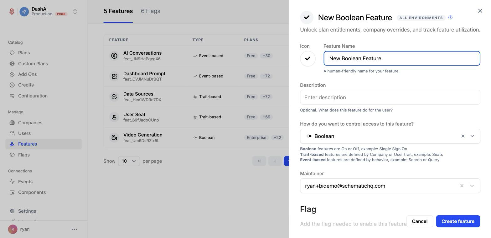
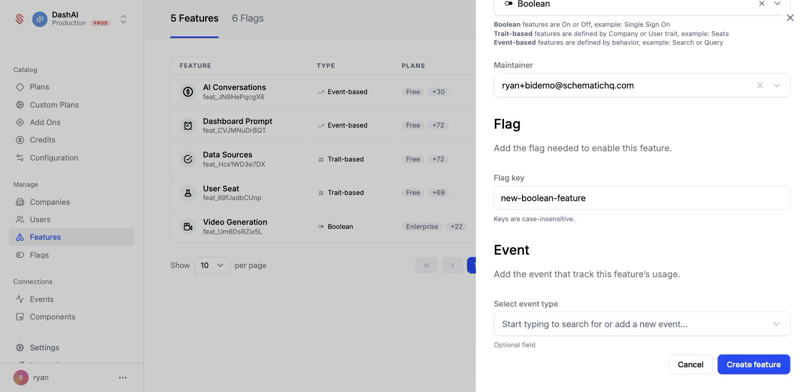
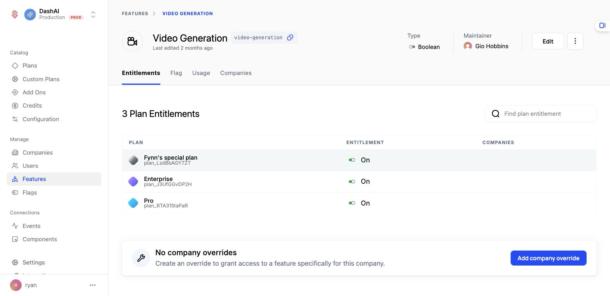
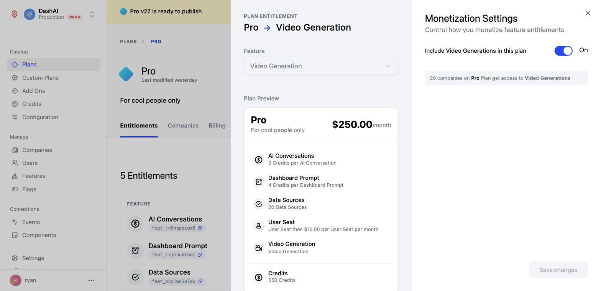

A feature is a thing your product does that you want to sell, gate, or limit. Entitling that feature to a plan is how every company on that plan gets access to it. This is step two of [Set up your first plan](/quickstart/set-up-your-first-plan).

<iframe
  width="100%"
  height="450px"
  src="https://www.youtube.com/embed/NvLMCfx_bPs?si=4zqLsbgYJLtF5Of_"
  frameborder="0"
  allow="accelerometer; autoplay; clipboard-write; encrypted-media; gyroscope; picture-in-picture; web-share"
  referrerpolicy="strict-origin-when-cross-origin"
  allowfullscreen
></iframe>

## Create a boolean feature

1. Select **Features** from the left navigation.
2. Click **Create** in the top right of the screen.
3. In the panel that opens, name the feature "New Boolean Feature". Leave the type set to **Boolean**, meaning a company either has access or it does not.

4. Scroll down to **Flag** and set the flag key to "new-boolean-feature". The flag key is the name your application uses to ask about this feature, so agree on it with your engineers before you save. Then click **Create feature**.

## Entitle the feature to a plan

Creating the feature drops you onto that feature's page. If you navigated away, select **Features** from the left navigation and click **New Boolean Feature**.

1. On the **Entitlements** tab, click the plan you want to give access to, or click **Add plan entitlement** to choose one. The example below shows the Entitlements tab for an existing feature, **Video Generation**, already entitled to several plans. Your feature's tab will look like this once you add a plan.

2. In the **Monetization Settings** panel, toggle the feature **On** for that plan, then click **Save changes**. For a boolean feature this simply includes it in the plan. The example below includes Video Generation in the Pro plan.

That is the whole loop. Every company on that plan now has access, and every company on any other plan does not. The change takes effect immediately, with no release and no engineering ticket.

## Why boolean features matter

Boolean features are the most common kind in most plans. Anything that shows up as a check mark or an X on a pricing page is a boolean feature.

## Next step

Not every feature is on or off. Next, [meter usage](/quickstart/tracking-usage) with a feature that counts each use and enforces a monthly allowance.
