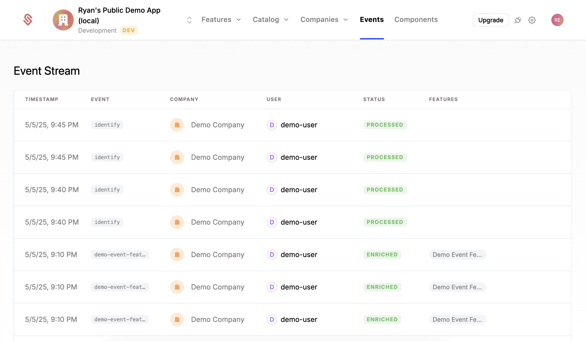

Schematic implements a flexible system for identifying users and companies. Instead of creating our own identifiers, we use the identifiers that are already in your system. We often refer to the identifiers as "keys".

A key can be any alphanumeric string, and should normally be an identifier you're already using. Good examples include your internal customer ID, a Stripe customer ID, or a Salesforce account ID. 

## Identifying a user on the frontend

Schematic frontend SDKs provide an `identify` function that can be used to identify a user. This function takes a information about both the user and company. It further ensures that future SDK calls will use this information as context for further calls. A react example looks like this:

```
useEffect(() => {
  identify({
    company: {
      keys: { id: 'demo-company' },
    },
    keys: { id: 'demo-user' },
  });
}, [identify]);
```

In this example, we are identifying the company with an id of `demo-company` and the user with an id of `demo-user`.

## Identifying a user on the backend

The API calls that the backend SDKs wrap all take a `keys` argument that are used to identify the company and user. Below is an example of providing the keys when creating a company via the `upsertCompany` function in Python.

```python
client.companies.upsert_company(
    keys={"id": "demo-company"},
)
```

## Details on Identifying a user

Fundamentally, when identifying a user, the most important information is the keys for the company -- these are required to load the correct plan, entitlements, and usage data for the user. Identifying the user can also be helpful for better understanding usage data. 

In addition to the keys, you can also provide traits and a name for the company and user. Traits represent metadata that can be used for targeting and entitlements ([example](/playbooks/metering#trait-based-vs-event-based-features)). 

Below are examples of `identify` and `upsertCompany` that use keys, traits, and a name:

```
useEffect(() => {
  identify({
    company: {
      keys: { id: 'demo-company' },
      name: "Acme Widgets, Inc.",
      traits: {
        "city": "Atlanta",
        "high_score": 25,
        "is_active": true,
      }
    },
    keys: { id: 'demo-user' },
    traits: {
      "role": "admin",
    },
    name: "John Doe",
  });
}, [identify]);
```

```python
client.companies.upsert_company(
    keys={"id": "demo-company"},
    name="Acme Widgets, Inc.",
    traits={
        "city": "Atlanta",
        "high_score": 25,
        "is_active": true,
    },
)
```

## Differences between `identify` and `upsertCompany`

`Identify` and `upsertCompany`/`upsertUser` are similar. Both will upsert the company (and user) they receive: this means that if you identify a company that has never been seen before, it will be created. The core difference is that `identify` is designed to be called on the frontend, is asynchronous, and creates an `identify` event in the event table (see the events tab); `upsertCompany`/`upsertUser` are designed to be called server side, are synchronous, and return the newly created item -- this makes them better for programmatic use cases.



## Learn more about Keys

Keys are a core concept in Schematic. Learn more about them in the [Key Management](/developer_resources/key)management) docs. 
