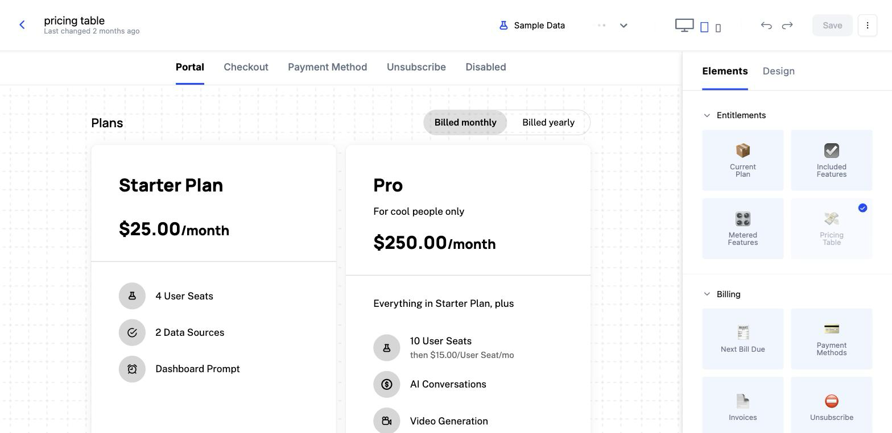

This is the dashboard track, where you stand up the plan your billing runs on. Everything here happens in the Schematic app, in your browser. You will not need a code editor, a terminal, or an engineer sitting next to you.

By the end you will have a plan that grants access to a feature, a second feature metered against a monthly allowance, and a customer-facing billing portal that your customers can use to upgrade themselves. Plan on about twenty minutes.

## The four steps

1. **[Create your account](/quickstart/account-setup)** — sign up, generate the API keys your engineers will need, and load sample plans and customers so you have something to work with.
2. **[Add your first feature](/quickstart/entitling-a-feature)** — create a feature, then entitle it to a plan so every company on that plan gets access.
3. **[Meter usage](/quickstart/tracking-usage)** — create a feature that counts each use, give a plan a monthly allowance, and watch the usage land.
4. **[Publish a billing portal](/quickstart/create-a-component)** — build a Customer Portal from a template so customers can see their plan, see their usage, and upgrade on their own.

## A note on what your engineers do

Nothing you do in these four steps requires a deploy. The plans, features, and allowances you configure take effect as soon as you save them.

Your application does need to be connected to Schematic once, so it knows which company is signed in, can report what that company uses, and can ask Schematic what that company is allowed to do. That connection is the other track, and it is a one-time job. Send an engineer to [Instrument your app](/quickstart/instrument-your-app).

## What's next

<CardGroup cols={2}>
  <Card title="Instrument your app" icon="fa-solid fa-code" href="/quickstart/instrument-your-app">
    The other track. Hand this to an engineer to connect your application to the plans you just built.
  </Card>
  <Card title="Concepts" icon="fa-solid fa-book" href="/concepts">
    Plain-language definitions of features, plans, entitlements, and companies.
  </Card>
</CardGroup>

Go deeper on the parts you touched:

- **[Build your catalog](/catalog/overview)** — plans, add-ons, trials, and how they fit together.
- **[Usage-based billing](/billing/usage-based-billing)** — charge by consumption, on its own or alongside seats.
- **[Components](/components/overview)** — checkout, meters, and paywalls beyond the Customer Portal.
- **[Overrides](/feature-management/overrides)** — give one company different limits without changing the plan.
