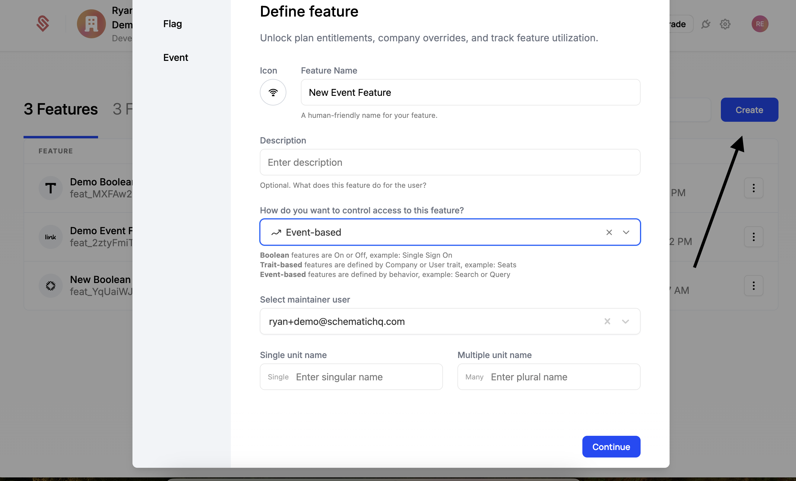
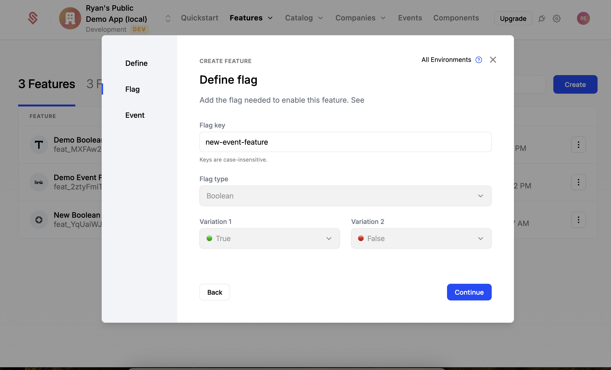
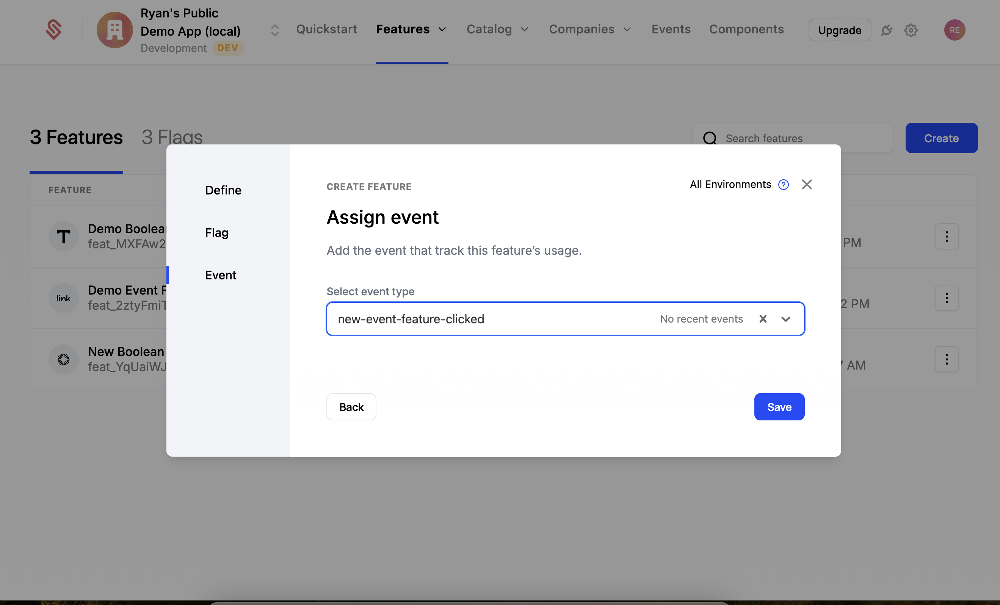
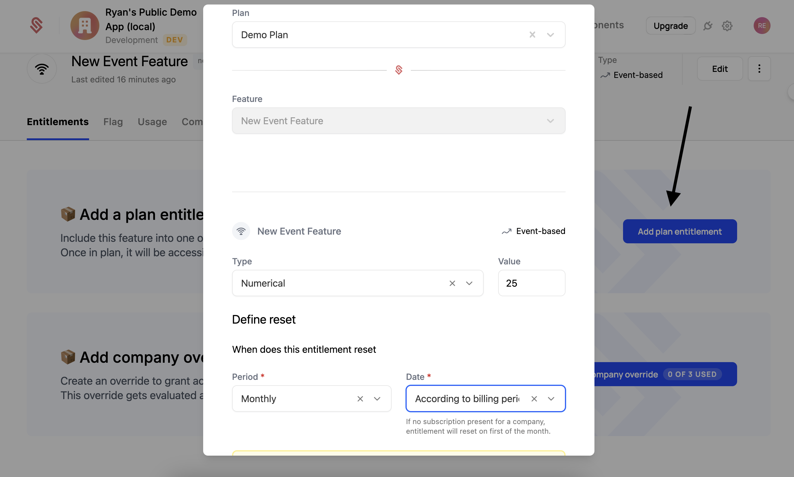
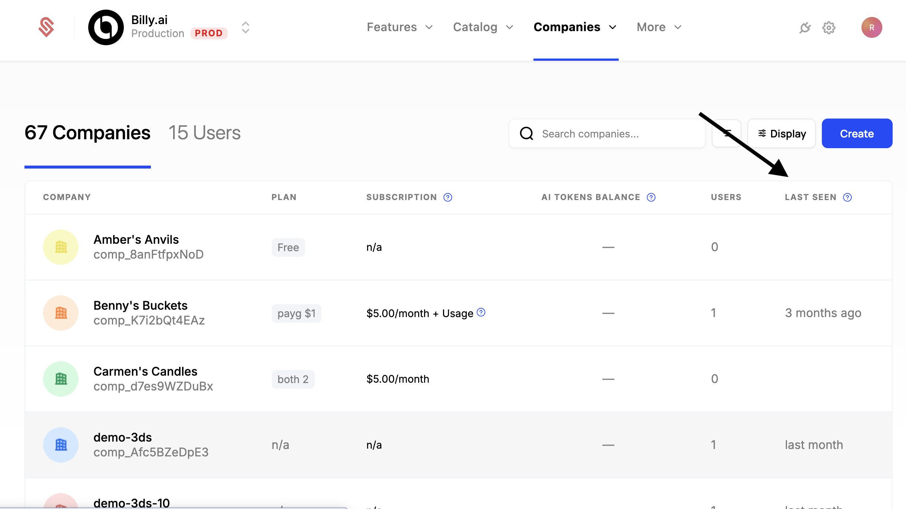

In the [quickstart app](https://github.com/schematichq/schematic-quickstart), the Tracking Usage page shows 2 buttons, one of which is disabled. Let's create an event-based feature in Schematic and entitle it to our plan so that this button will become clickable and track usage.

<iframe
  width="100%"
  height="450px"
  src="https://www.youtube.com/embed/yqIKz8lc7Zs?si=zOZZ332fPxkq8Rpv"
  frameborder="0"
  allow="accelerometer; autoplay; clipboard-write; encrypted-media; gyroscope; picture-in-picture; web-share"
  referrerpolicy="strict-origin-when-cross-origin"
  allowfullscreen
></iframe>

## Create an event-based feature

First, we'll need to create an event-based feature in Schematic.

1. Select "Features" from the top navigation
2. Click "Create" on the right side of the screen
3. Call the feature "New Event Feature"
4. Set the feature type to be "Event Based". This will make sure we can track events and enabled Usage Based billing when we entitle it to a plan.
5. Click "Continue" at the bottom
6. On the next screen, for the flag key, use "new-event-feature" -- this is the value the quickstart app is using.
7. Click "Continue".
8. Now, we'll need to associate an event with this feature. Call it `new-event-feature-clicked` -- this is the value the quickstart app is using.
9. Now click "Save".







## Entitle the feature to a plan

Now that we have a feature, we need to "entitle" it to the plan -- this is how we determine how much usage each plan provides and/or how much we'll charge for each use of this feature.

When you saved the feature, you should have dropped onto that feature's page. If not, then select "Features" from the top navigation and click on the feature you just created (New Event Feature).

1. Click "Add Plan Entitlement" to begin
2. Select the "Demo Plan" plan
3. Set a value for 25 -- this is how many of these events a user can use per period.
4. For Period, select "Monthly" and have the usage reset "According to Billing Period" (this is the most common setting). This means that the user will get 25 usages per month, and that the "month"" will be measured based on the day they signed up (i.e. if they signup on March 15th, then the "month" will be March 15th to April 14th).
4. Click "Save".




## Code example

Below is the code that controls the button we just enabled. Tracking users and plans and then determining what a user is entitled to happens within Schematic. Our APIs and SDKs expose an interface similar to a feature flag -- you just need to check if the user has access and respond accordingly.

```
const {
  value: isFeatureEnabled,
  featureUsage,
  featureAllocation,
  featureUsageExceeded,
} = useSchematicEntitlement("demo-event-feature");

const { track } = useSchematicEvents();

<button
  className="bg-blue-500 text-white px-4 py-2 rounded-md"
  disabled={!isFeatureEnabled}
  onClick={() => { track({ event: 'demo-event-feature-clicked' }); } }
>
  {featureUsageExceeded ? 'No more clicks allowed!' : 'Track Clicks!'}
</button>

<div>
  {featureUsage} / {featureAllocation}
</div>
```

## Setting Last Seen Timestamp

Schematic tracks the most recent `track` or `identify` (see [identifying users](/quickstart/identifying-users)) event for a company and user. This is helpful while getting started to make sure your events are being sent to Schematic. Once implemented, this is also helpful for understanding usage patterns and customer health. 



## We're done!

You just created a usage-based feature in Schematic and entitled it to a plan. Usage based features are a cornerstone of most modern billing plans. In this demo, we created a simple entitlement that allows user's on this plan to consume 25 events/month. There are [many more usage based billing setups](/billing/usage-based-billing) that Schematic supports.

## Next steps

We recommend you checkout the Components page in the quickstart app to see how to create a fully featured Billing Portal.
