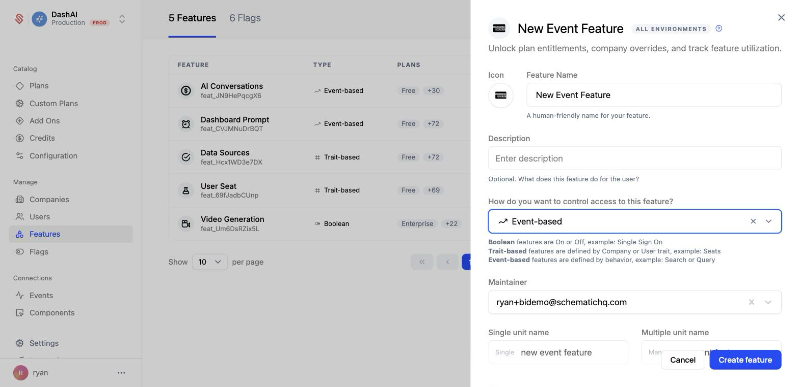
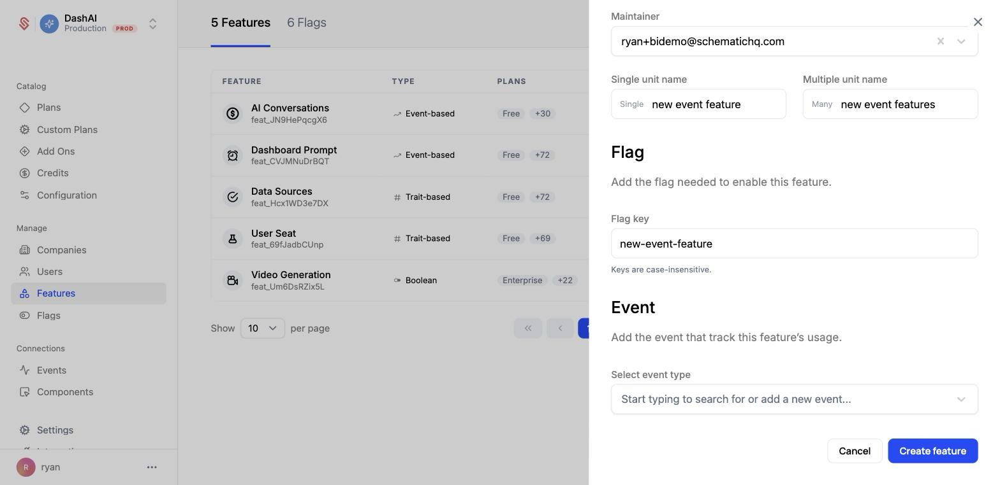
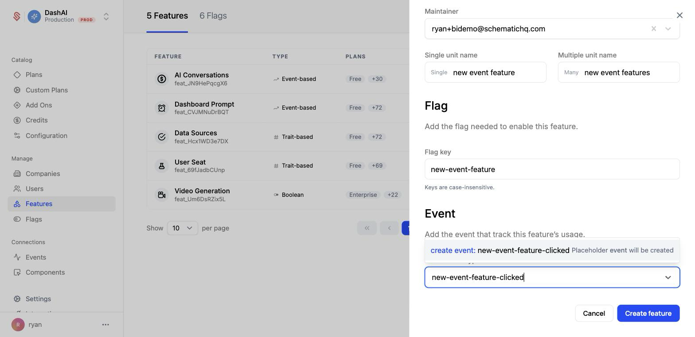
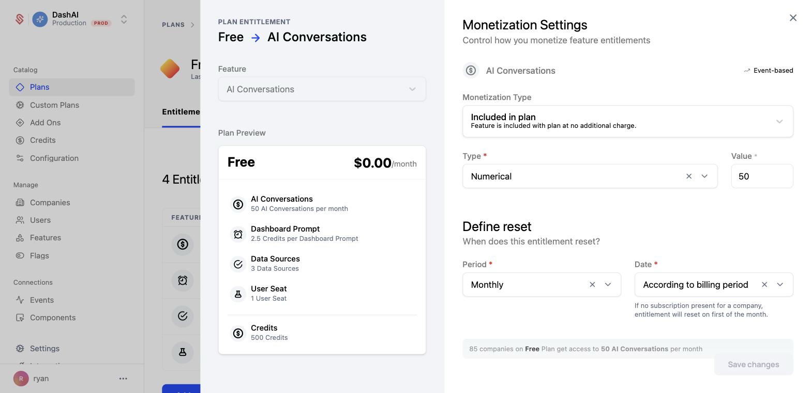
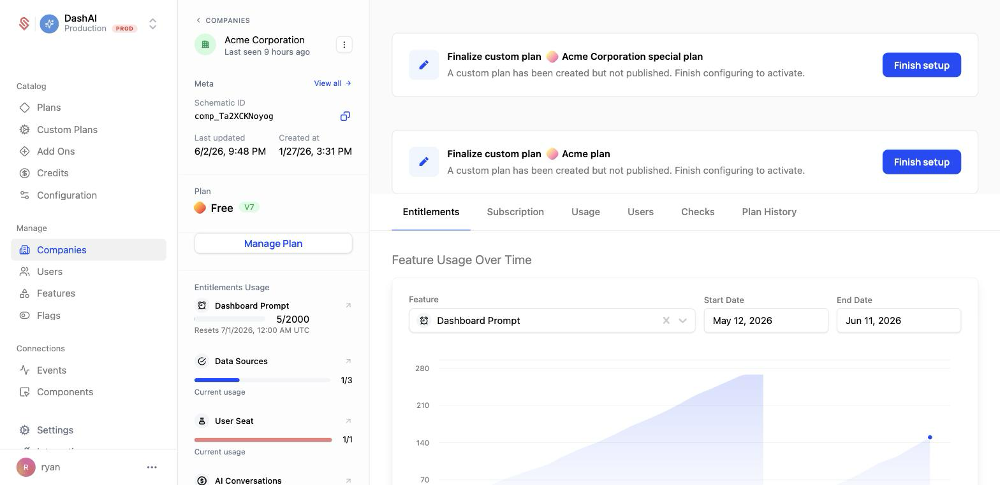

In the [quickstart app](https://github.com/schematichq/schematic-quickstart), the Tracking Usage page shows 2 buttons, one of which is disabled. Let's create an event-based feature in Schematic and entitle it to our plan so that this button will become clickable and track usage.

<iframe
  width="100%"
  height="450px"
  src="https://www.youtube.com/embed/yqIKz8lc7Zs?si=zOZZ332fPxkq8Rpv"
  frameborder="0"
  allow="accelerometer; autoplay; clipboard-write; encrypted-media; gyroscope; picture-in-picture; web-share"
  referrerpolicy="strict-origin-when-cross-origin"
  allowfullscreen
></iframe>

## Create an event-based feature

First, we'll need to create an event-based feature in Schematic.

1. Select **Features** from the left navigation.
2. Click "Create" in the top right of the screen.
3. Name the feature "New Event Feature" and set the type to **Event-based**. This lets us track events and power usage-based billing when we entitle it to a plan.



4. Scroll down to **Flag** and set the flag key to "new-event-feature" -- this is the value the quickstart app expects.



5. Under **Event**, select or create the event that meters this feature. Enter `new-event-feature-clicked` (the value the quickstart app sends) and choose "create event". Then click "Create feature".



## Entitle the feature to a plan

Now that we have a feature, we need to "entitle" it to a plan -- this is how we determine how much usage each plan provides and/or how much we charge for each use of the feature.

When you create the feature, you'll drop onto that feature's page. If not, select **Features** from the left navigation and click the feature you just created (New Event Feature).

1. On the **Entitlements** tab, click the plan you want to give access to, or click "Add plan entitlement" to choose one.
2. In the **Monetization Settings** panel, set the **Type** to **Numerical** and enter a **Value** -- this is how many events a company can use per period.
3. Under **Define reset**, set the **Period** to "Monthly" and have the usage reset "According to billing period" (the most common setting). This means the allowance resets each month, measured from the day the company signed up (e.g. if they sign up on March 15th, the "month" runs March 15th to April 14th).
4. Click "Save changes".

The example below shows an existing event-based feature, **AI Conversations**, entitled to the **Free** plan with a limit of 50 per month.




## Code example

Below is the code that controls the button we just enabled. Tracking users and plans and then determining what a user is entitled to happens within Schematic. Our APIs and SDKs expose an interface similar to a feature flag -- you just need to check if the user has access and respond accordingly.

```
const {
  value: isFeatureEnabled,
  featureUsage,
  featureAllocation,
  featureUsageExceeded,
} = useSchematicEntitlement("demo-event-feature");

const { track } = useSchematicEvents();

<button
  className="bg-blue-500 text-white px-4 py-2 rounded-md"
  disabled={!isFeatureEnabled}
  onClick={() => { track({ event: 'demo-event-feature-clicked' }); } }
>
  {featureUsageExceeded ? 'No more clicks allowed!' : 'Track Clicks!'}
</button>

<div>
  {featureUsage} / {featureAllocation}
</div>
```

## Setting Last Seen Timestamp

Schematic tracks the most recent `track` or `identify` (see [identifying users](/quickstart/identifying-users)) event for a company and user. This is helpful while getting started to make sure your events are being sent to Schematic. Once implemented, this is also helpful for understanding usage patterns and customer health. 



## We're done!

You just created a usage-based feature in Schematic and entitled it to a plan. Usage based features are a cornerstone of most modern billing plans. In this demo, we created a simple entitlement that gives companies on the plan a set number of usages each month. There are [many more usage based billing setups](/billing/usage-based-billing) that Schematic supports.

## Next steps

We recommend you checkout the Components page in the quickstart app to see how to create a fully featured Billing Portal.
