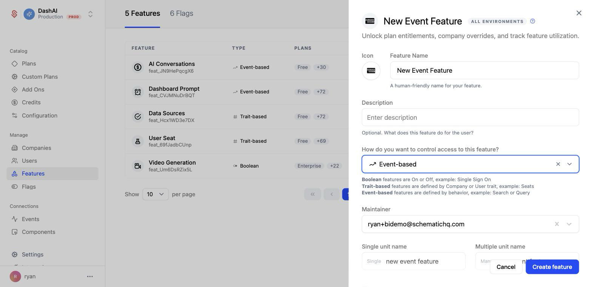
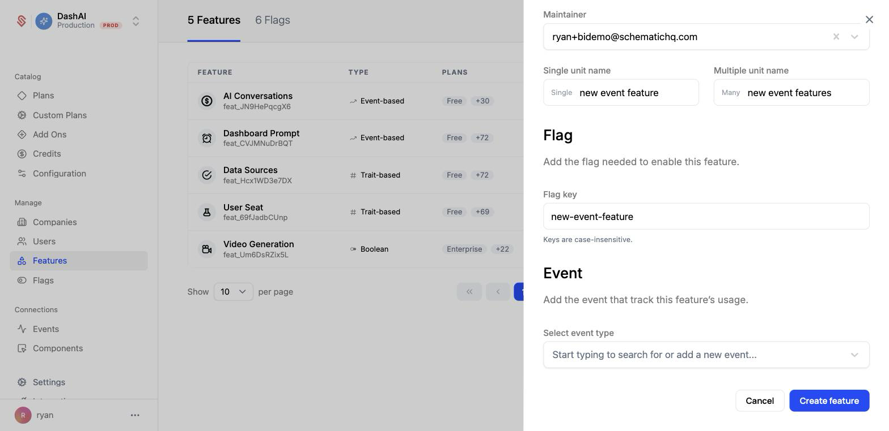
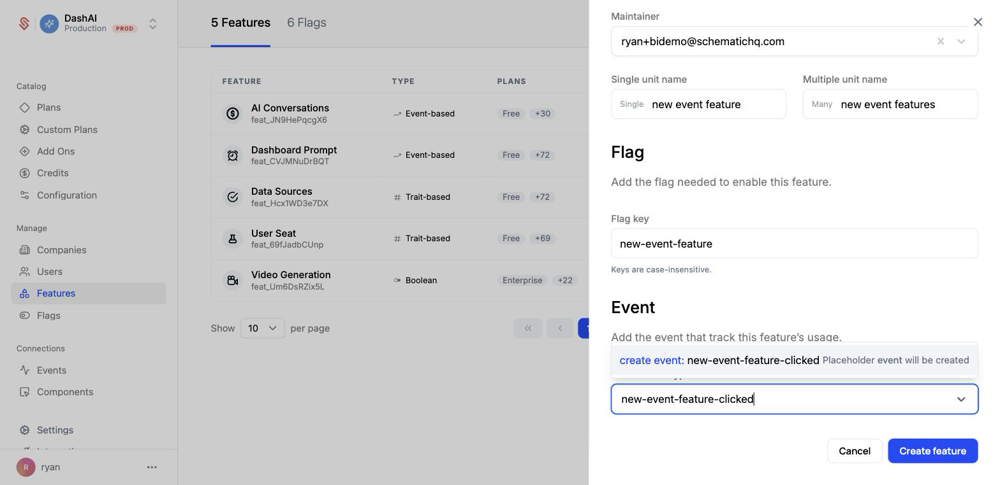
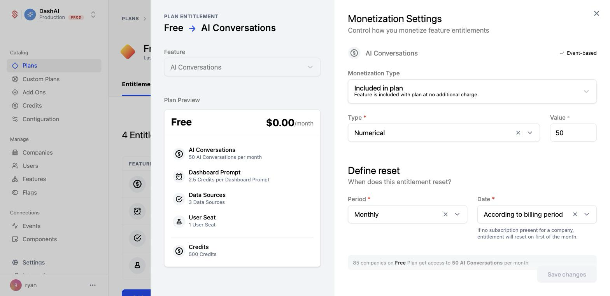
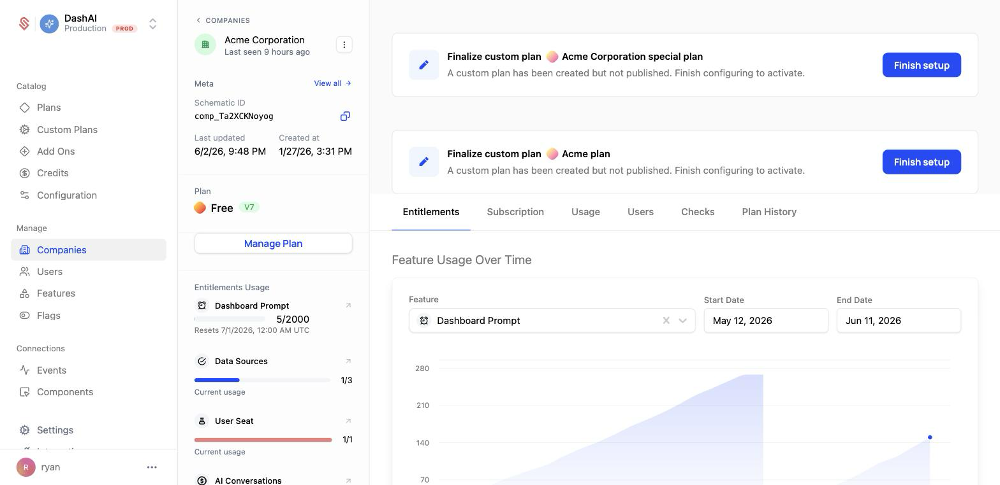

Some features are not on or off. They are worth measuring, and often worth charging for. An event-based feature counts each use and enforces an allowance per plan, which is the foundation of usage-based pricing. This is step three of [Set up your first plan](/quickstart/set-up-your-first-plan).

<iframe
  width="100%"
  height="450px"
  src="https://www.youtube.com/embed/yqIKz8lc7Zs?si=zOZZ332fPxkq8Rpv"
  frameborder="0"
  allow="accelerometer; autoplay; clipboard-write; encrypted-media; gyroscope; picture-in-picture; web-share"
  referrerpolicy="strict-origin-when-cross-origin"
  allowfullscreen
></iframe>

## Create an event-based feature

1. Select **Features** from the left navigation.
2. Click **Create** in the top right of the screen.
3. Name the feature "New Event Feature" and set the type to **Event-based**.

4. Scroll down to **Flag** and set the flag key to "new-event-feature". As with any feature, the flag key is the name your application uses to ask about it.

5. Under **Event**, select or create the event that meters this feature. Enter "new-event-feature-clicked" and choose **create event**. Then click **Create feature**. The event name is what your application reports every time a customer uses the feature, so agree on it with your engineers.

## Set the allowance on a plan

Entitling an event-based feature does two things at once. It decides how much usage the plan includes, and it decides what happens when a company runs out.

Creating the feature drops you onto that feature's page. If you navigated away, select **Features** from the left navigation and click **New Event Feature**.

1. On the **Entitlements** tab, click the plan you want to give access to, or click **Add plan entitlement** to choose one.
2. In the **Monetization Settings** panel, set the **Type** to **Numerical** and enter a **Value**. This is how many events a company on this plan can use per period.
3. Under **Define reset**, set the **Period** to "Monthly" and have the usage reset **According to billing period**, the most common setting. The allowance then resets each month measured from the day the company signed up. A company that signs up on March 15th gets a month running March 15th to April 14th. **Period** also offers Daily and Weekly, both measured from the day the company enrolled in the plan, and the **Date** setting applies only to a monthly period.
4. Click **Save changes**.

The example below shows an existing event-based feature, **AI Conversations**, entitled to the **Free** plan with a limit of 50 per month.

## Confirm the usage is arriving

Once your application is reporting the event, each company's record shows a last seen timestamp for the most recent activity Schematic received. While you are getting set up, this is the quickest way to confirm the connection is working. Later it becomes a useful health signal, because a paying account that has gone quiet is worth a conversation.

If the timestamp never updates, the event name in your application probably does not match the one you entered above. Check it with whoever did the integration.

## What you built

Companies on this plan now get a set number of uses each month, enforced automatically, with usage visible in the dashboard. That is the simplest usage-based setup. Schematic supports [many more](/billing/usage-based-billing), including overages, credit burndown, and charging per unit.

## Next step

Next, [publish a billing portal](/quickstart/create-a-component) so customers can see their plan and usage, and upgrade without emailing you.
