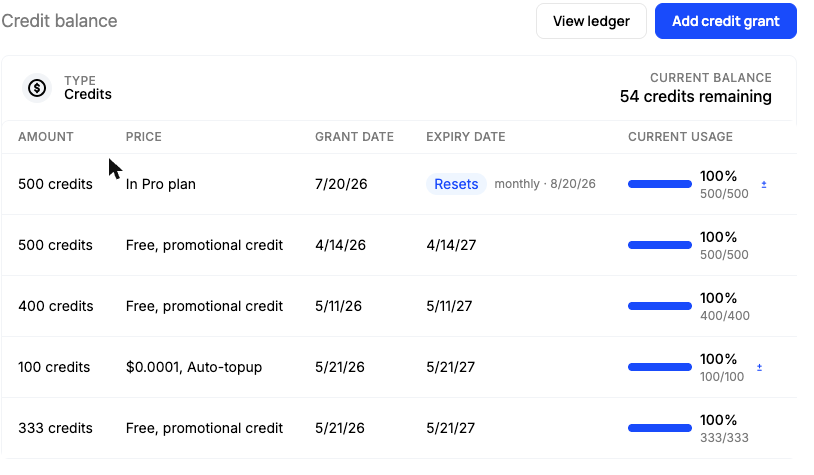

Credit models, where customers buy a balance that burns down as they use features, have become a popular way to price AI and consumption products. They unify many features under a single metric, let customers prepay without billing surprises, and make it easy to top up for more.

## Common approaches

Teams typically track a credit balance in their own database, decrement it on every billable action, and build purchase flows so customers can top up when they run low. The core loop, grant some credits, subtract as they're used, block when the balance hits zero, is straightforward to prototype.

The depth shows up in the details. Credits come from different sources, the monthly plan grant, purchased bundles, promotional credits, refunds, and each typically has its own expiration, which forces a decision about which credits burn first. On top of that you need per-feature consumption rates that can change over time, auto top-up so customers don't get cut off mid-task, refunds when an action fails, and a revenue-recognition story finance can trust. Building all of that, and keeping it correct as you add features, is a substantial project in its own right.

## How Schematic fits in

Create a credit type, grant credits on a plan each billing period, and set how many credits each feature consumes. Schematic burns down the balance as features are used, sells top-up bundles through checkout, supports auto top-up so customers don't get interrupted, and handles refunds via negative-quantity events. Customers see their balance in the customer portal, and the ledger records every grant, draw, and expiry with its price attached, which is the data finance needs to [recognize revenue](/billing/revenue-recognition) on what has been delivered.

## What it looks like

One balance, 54 credits remaining, and every credit grant that makes it up listed separately: the monthly in-plan grant that resets on the billing date, promotional credits, and an auto top-up purchase, each with its own price, expiry date, and burndown. Find it on the company profile under **Credit balance**.

## Configure it

- [Credit Burndown Billing Model](/billing/credit-burndown) — set up credit types, grants, consumption rates, and bundles.
- [Usage Based Billing Models](/billing/usage-based-billing) — how credit burndown relates to the other usage models.

## Implement it

- [Accessing credit information via API](/billing/credit-burndown#accessing-credit-information-via-api) — read balances and grant credits programmatically.
- [Meter on a real-time credit ledger](/use-cases/credit-ledger) — the ledger, holds, and exactly-once semantics underneath credits.
