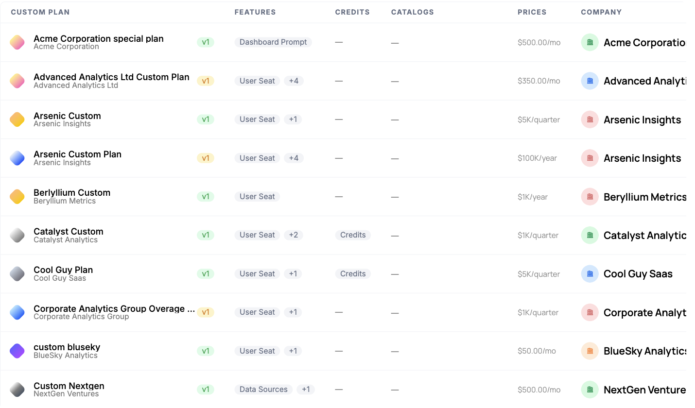

Sales-led deals rarely fit neatly into the good-better-best plans on your pricing page. Negotiated contracts come with their own pricing and their own mix of entitlements, and you need to honor them without forking your application for every customer.

## Common approaches

When a deal closes on non-standard terms, the fastest path is usually to add a one-off flag or a special-case config in application code for that account, hard-coding the extra seats, the custom limit, or the feature that isn't in any standard plan. For the first few enterprise deals this feels reasonable and ships quickly.

But each bespoke account adds another branch of logic that only applies to one customer, and there's no single place to see what a given company was actually sold. The terms live in code rather than in your catalog, so auditing what's been promised is hard, changing it at renewal is risky, and the person who negotiated the deal can't adjust it without an engineer. Multiply that across a growing book of custom contracts and it becomes a real maintenance and compliance burden.

## How Schematic fits in

Build a [custom plan](/catalog/custom-plans) with the negotiated entitlements and pricing and assign it to a single company, then finalize it to bill the customer by invoice. The company activates on the plan once the invoice is paid, which fits the sales-led, invoiced motion these deals usually follow. For smaller exceptions, you can instead layer per-company overrides on top of a standard plan. Either way, the entitlements, the pricing, and the assignment are managed from Schematic rather than in code.

## What it looks like

Negotiated plans in the catalog, each tied to exactly one company and carrying its own entitlements and contract price, from $5K per quarter to $100K per year. Every deal you have signed is readable in one list rather than scattered through application code.

The lighter-weight option for a smaller concession: one entitlement raised for one company, here 15 Dashboard Prompts per month, with an optional expiry date, while the rest of the plan stays standard. Find it on the company profile.

## The motion end to end

A sales-led deal runs the same five steps every time, and each one has a destination in these docs. The point of doing it this way is that only the first step needs a human after the terms are agreed.

**1. Close the deal.** The order form is signed outside Schematic. What matters here is that the terms it names, entitlements, limits, and price, are the ones you are about to configure.

**2. Turn it into a custom plan.** Build a [custom plan](/catalog/custom-plans) from the company's profile with the negotiated entitlements and pricing, duplicating a standard plan as a starting point if the deal is close to one. No code, and no branch in your application for this account. The [step-by-step guide](/catalog/guides/custom-plans) walks the whole thing.

**3. Invoice them.** Finalizing the plan generates the invoice through Stripe and lets you choose whether Stripe emails it. The invoice has a hosted page the customer pays on. See [Getting the invoice to the customer](/catalog/custom-plans#getting-the-invoice-to-the-customer).

**4. They pay, and the account switches itself on.** With the **On payment** activation strategy, the company activates on the custom plan when the invoice is paid, and entitlements follow from the plan immediately. Nobody assigns anything. Subscription-driven deals provision the same way through [Stripe](/playbooks/provisioning), by mapping the Stripe product to a plan.

**5. Run the account, then renew it.** Usage meters against the plan's entitlements from day one, exceptions are handled with [overrides](/feature-management/overrides) rather than new plans, and expansion is sold with [add-ons](/use-cases/expand-accounts). At renewal, [usage signals](/use-cases/usage-signals) tell you what the customer actually consumed, which is the difference between renegotiating from evidence and renegotiating from a guess. See [Stay ahead of renewals](/use-cases/renewals).

Editing a finalized custom plan creates a new draft version, so a mid-term change follows the same review-then-publish path rather than editing live terms in place.

## Configure it

- [Custom Plans](/catalog/custom-plans) covers creating a per-company plan for a negotiated, invoiced deal.
- [Configuring the Catalog](/catalog/configuration) — display custom plans and control where they appear.
- [Company Overrides](/feature-management/overrides) — adjust individual entitlements on top of a plan.

## Implement it

- [Managing Company Plans](/catalog/managing-company-plans) — assign a plan to a specific company.
- [Manage Plan API](/developer_resources/manage-plan-api) — set a company's plan, add-ons, and entitlements programmatically.
