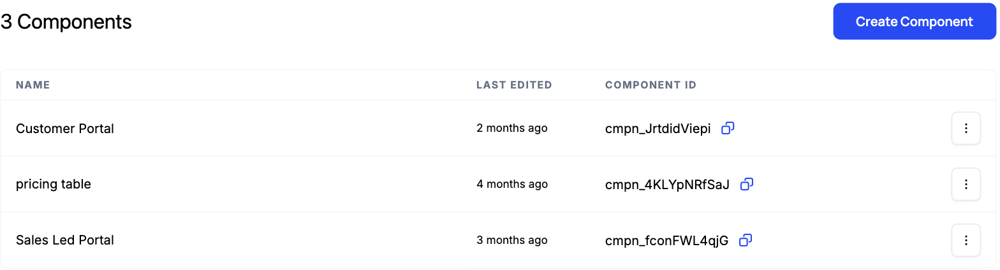
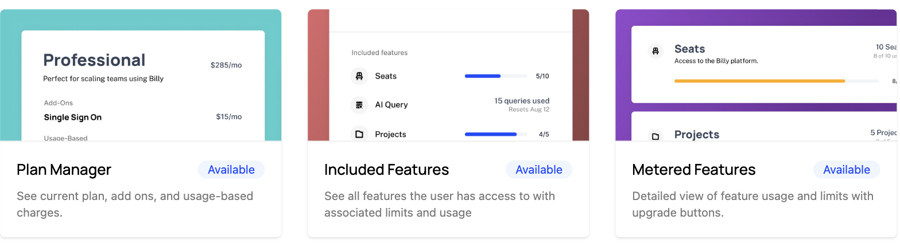
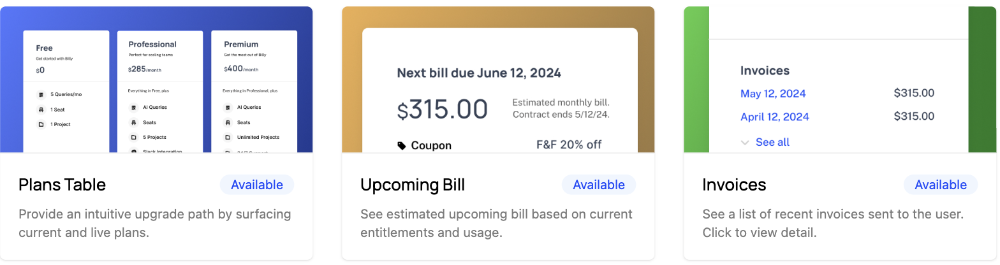
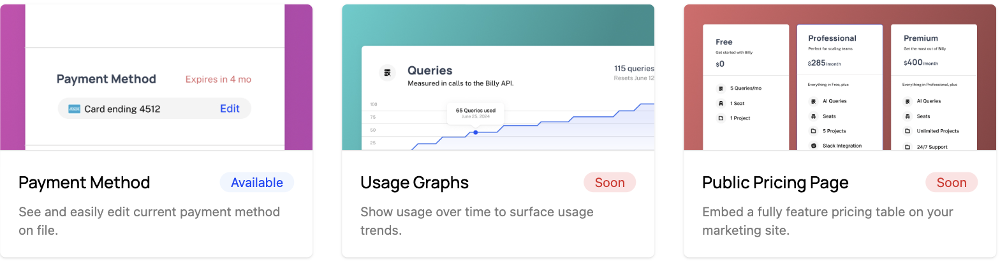

Once customers are paying, they still need to manage their subscription: change plans, update a card, pull an invoice, or check how much of their plan they've used. Every one of those that turns into a support ticket is cost for you and friction for them.

## Common approaches

A common setup sends customers to Stripe's billing portal for invoices and payment methods, then builds separate in-app screens for the things Stripe doesn't know about, like plan changes, add-ons, and usage against limits. Each surface handles part of the job, so the customer bounces between your product and a Stripe-branded page to manage one subscription.

That split is also a maintenance burden. The in-app screens have to be kept consistent with billing, so a plan change made in your UI and a payment-method update made in Stripe's portal can momentarily disagree, and usage shown in-app may not match what's actually being invoiced. As you add plans, add-ons, and usage-based features, every one of these home-grown screens needs to keep up.

## How Schematic fits in

Schematic's customer portal gives customers one branded place to upgrade, downgrade, cancel, manage add-ons, view invoices and payment methods, and watch usage against their limits. Changes sync to Stripe and update entitlements immediately, so access always matches billing. You control which elements appear and how the portal looks in the component builder, no code deploy required.

## What it looks like

The portal is a component you create and configure in Schematic, alongside any others you need, such as a public pricing table or a separate portal for sales-led accounts. Each one has an ID you drop into your app. Find it under **Components**.

Inside the builder you assemble the portal from elements. The subscription and usage elements cover what a customer's plan gives them and how much of it they have used:

Plan Manager carries the current plan, add-ons, and usage-based charges. Included Features and Metered Features show what the plan grants and how far the customer is into each limit, with upgrade buttons where more capacity is for sale.

The billing elements cover the things customers would otherwise leave your product to do:

Plans Table gives an upgrade path from the current plan, Upcoming Bill estimates the next invoice from current entitlements and usage, and Invoices lists what has already been billed.

Payment Method lets a customer see and edit the card on file without a trip to a separate billing portal. Usage Graphs and Public Pricing Page are marked Soon and are not available yet.

## Configure it

- [Customer Portal and Checkout Flow](/components/customer-portal) — what the portal covers and how it works with Stripe.
- [Create a Component](/components/create-component) — build and configure the portal in the component builder.
- [Element Library](/components/element-library) — every element you can add and what each needs.

## Implement it

- [Add to Your App](/components/set-up) — embed the portal in React, Vue, or plain JS.
- [Building Your Own Portal](/components/headless-customer-portal) — go headless when you need full control of the UI.
