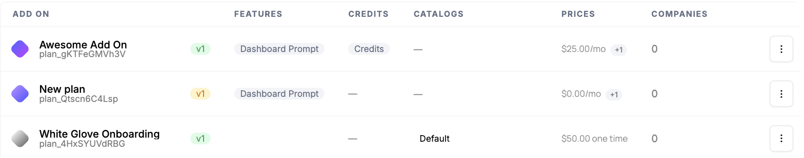
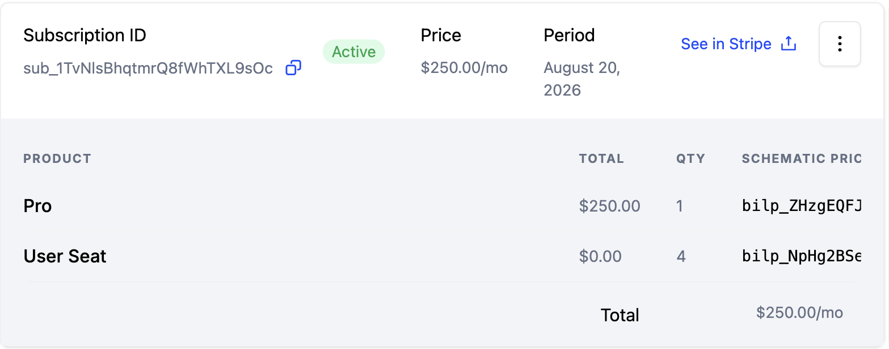

Some of your best revenue comes from accounts you already have. Growing them means adding seats, selling add-ons, or moving a customer up a tier, ideally as a smooth motion rather than a custom project each time.

## Common approaches

Teams often handle expansion as a series of one-off changes: editing a subscription directly in Stripe, manually bumping a seat count, or adding a line item when a customer asks. For a handful of accounts this is perfectly workable, usually a quick task for sales or support.

Handled by hand, though, expansion neither scales nor compounds. There's no consistent place for customers to add what they want themselves, changes made straight in billing can fall out of sync with the access your product actually grants, and every add-on or seat upgrade needs its own manual provisioning. The motion that should be your easiest revenue ends up gated on someone remembering to make the same change in two systems.

## How Schematic fits in

Model add-ons and seat-based entitlements in your catalog once, then let customers add them through the customer portal or have your team assign them to a company directly. Add-ons and seat counts map to Stripe products, so an expansion updates billing and entitlements together and the new access takes effect immediately. Pay-in-advance pricing lets customers buy seats or capacity in defined chunks as they grow.

## What it looks like

Add ons are defined once, next to your plans, each with the features and credits it grants and its own price. They can be recurring, like the $25 per month bundle here, or one-time, like a $50 onboarding package. Find them under **Add Ons**.

An expansion lands here. The subscription carries a line item per thing sold, the Pro plan plus a quantity of four user seats, and **See in Stripe** jumps straight to the matching record in billing. Find it on the company profile, on the **Subscription** tab.

## Configure it

- [Add Ons](/catalog/add-ons) — package extra features or capacity on top of a plan.
- [Usage Based Billing Models](/billing/usage-based-billing) — sell seats and capacity with pay-in-advance pricing.
- [Managing Company Plans](/catalog/managing-company-plans) — assign add-ons and plan changes to a specific company.

## Implement it

- [Customer Portal and Checkout Flow](/components/customer-portal) — let customers add seats and add-ons themselves.
- [Manage Plan API](/developer_resources/manage-plan-api) — add or change add-ons and pay-in-advance quantities from code.
