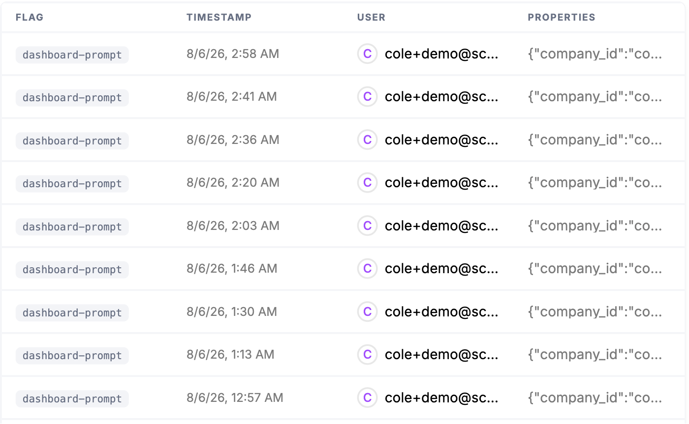

In usage-based and AI products, a few heavy users can quietly turn a profitable plan into a loss. Protecting your margins means enforcing the limits you priced for at runtime, the moment usage reaches them, rather than discovering the overage after the model and compute spend is already gone.

## Common approaches

Without runtime enforcement, limits are effectively on the honor system: usage is tracked in analytics and reviewed after the billing period closes. By the time a report surfaces a runaway account, the cost has already been incurred, and the best you can do is have an awkward conversation or eat the loss.

The homegrown alternative is to scatter cap checks through application code, but those checks drift from your pricing configuration, miss edge cases, and turn every pricing change into an engineering change. Hard caps that are supposed to protect the business become one more brittle thing to maintain, and the gap between "what we priced" and "what we actually enforce" is where margin leaks out.

## How Schematic fits in

Schematic enforces entitlements and usage limits at runtime, soft limits, hard caps, and overage thresholds, so a heavy user is held to what their plan allows the instant they reach it, not at the end of the month. The caps are configured from the UI alongside the rest of your pricing, so the guardrails that protect your margins move with your pricing instead of lagging a deploy behind it, and the business team can tune them without pulling in engineering.

## What it looks like

What the account is entitled to and how much of it is gone: 693 dashboard prompts used with 54 remaining before the period resets, 4 of 10 user seats taken, and data sources already at 1 against a limit of 0. Find it on the company profile, under **Entitlements Usage**.

Each check your application makes, with the flag, the timestamp, the user, and the company it was evaluated for. This is enforcement actually happening, one decision per request, rather than a report assembled after the period closes.

## Configure it

- [Usage Based Billing Models](/billing/usage-based-billing) — configure soft limits, hard caps, and overage.
- [Company Overrides](/feature-management/overrides) — set per-customer limits where a deal requires it.

## Implement it

- [Flags](/feature-management/flags) — the checks your application makes to enforce a limit at runtime.
- [Entitlement & Credit Trigger Webhooks](/integrations/webhooks/entitlement-triggers) — alert internally when an account runs hot.
