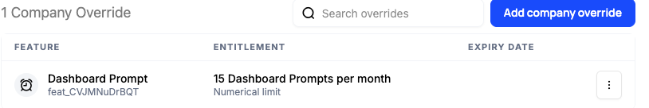

Individual customers routinely need access that differs from their plan: a goodwill bump after an outage, a temporary trial of a premium feature, or an exception while a deal closes, all without changing the underlying plan.

## Common approaches

The usual fix is to special-case the customer in application code, or to quietly move them onto a different plan that happens to include what they need. Either one resolves the immediate request, so it's tempting to reach for them whenever a one-off comes up.

Both approaches hide the reason the exception exists. A flag buried in code or an off-catalog plan assignment doesn't record that this was a 30-day goodwill grant or a trial tied to an open opportunity, so there's nothing to reverse it when the time is up and nothing to point to when someone asks why this account has access it shouldn't. Customer success can't see or adjust these exceptions without engineering, and over time the accumulated special cases make it genuinely hard to know who has what.

## How Schematic fits in

Apply a company override from the Schematic UI or API to grant or adjust a single company's access to a feature. Overrides can carry an expiration date for time-limited trials, are visible and auditable right on the company, and follow a most-generous policy, so an override never accidentally reduces what a customer's plan already grants. Customer success can manage exceptions without an engineering ticket.

## What it looks like

Every exception on an account, listed in one place with the feature it applies to, the entitlement it grants, here 15 Dashboard Prompts per month as a numerical limit, and an expiry date if the grant is time-limited. Anyone looking at the company can see what was granted and when it lapses. Find it on the company profile.

## Configure it

- [Company Overrides](/feature-management/overrides) — apply and manage overrides in the UI.
- [Time-limited overrides](/feature-management/overrides#time-limited-overrides) — set an expiration date so a grant reverses itself.

## Implement it

- [Applying an override programmatically](/feature-management/overrides#applying-an-override-programmatically) — use the `/company-overrides` endpoint from your admin layer or CRM.
- [Handling customer exceptions and feature trials](/playbooks/exceptions) — a step-by-step playbook, including time-limited overrides.
