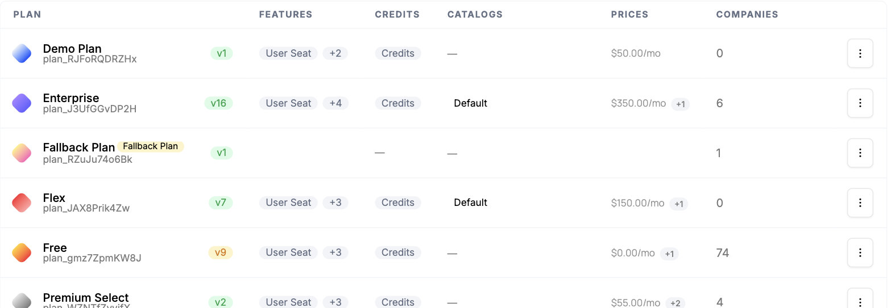
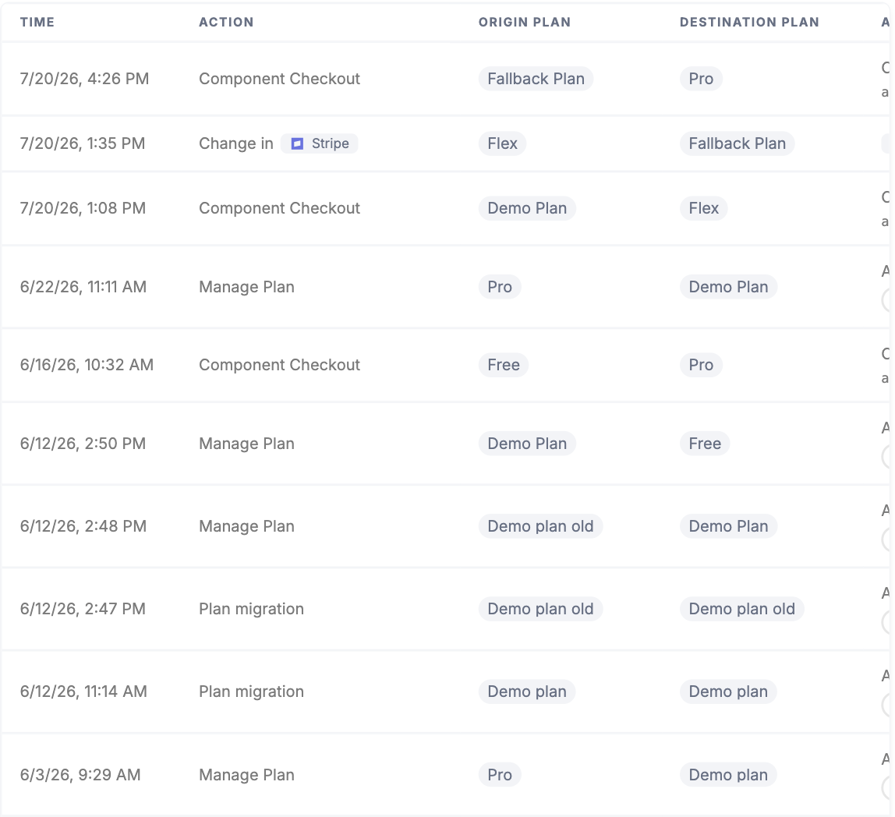

Pricing and packaging change as your product grows. The hard part isn't deciding on the new structure, it's rolling it out without disrupting existing customers or losing track of who is on which version.

## Common approaches

One approach is to edit the plan in place, changing its price or entitlements directly and hoping nothing breaks for the customers currently on it. The other is to leave the old plan alone, create a new "v2" alongside it, and move accounts over by hand. Both are common, and both seem reasonable until you're partway through.

Editing in place means a change intended for new customers can silently alter what existing subscribers already pay for or have access to. Maintaining parallel plans avoids that but creates a different mess: a growing list of near-duplicate plans, manual migrations that are easy to start and easy to abandon, and no clear record of who is grandfathered on what. In either case it's hard to answer a basic question, which customers are on which version, and even harder to roll a change out gradually with confidence.

## How Schematic fits in

Every edit to a plan becomes a new draft version that you publish when you're ready. At publish time, you decide how current subscribers are handled: migrate all of them, choose specific companies, or keep them on their existing version. You can track migration progress per plan, so you always know exactly who is on which version and nobody moves until you say so.

## What it looks like

One row per plan, each showing its published version and how many companies are on it. Enterprise is on v16 with 6 companies, Free is on v9 with 74. Repricing does not fork the list into near-duplicate plans; it advances the version number on the plan that is already there. Find it under **Plans**.

The audit trail for one account, showing every move between plans, the origin and destination, and what caused it. Migrations you run appear here as **Plan migration** rows alongside self-serve checkouts and changes made by your team. Find it on the company profile.

## Configure it

- [Rolling Out New Plan Versions](/catalog/guides/plan-versions) — the full publish-and-migrate flow.
- [Plans](/catalog/plans) — how plan versions and drafts work.

## Implement it

- [Managing Company Plans](/catalog/managing-company-plans) — move a specific company between plans and versions.
- [Plan Changed Webhook](/integrations/webhooks/plan-changed) — react in your application when a company's plan version changes.
