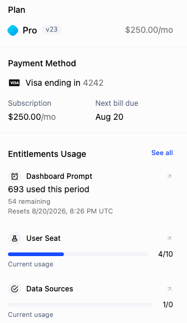

AI features carry variable, sometimes large per-action costs, and customers won't adopt what they can't predict. A research agent that might burn 15-20 credits is a gamble unless the customer can see the price before they commit to running it.

## Common approaches

Most products show the cost after the fact: a usage page that ticks up once the action finishes, or a monthly invoice that arrives weeks later. The customer learns what something cost only after they've already spent it, which is precisely the uncertainty that stalls adoption of the most valuable, most expensive features.

That uncertainty has become a procurement issue, not just a UX one. When Microsoft burned through a year of AI credits in four months, every buyer started asking "do you have limit management?" before signing. Without a way to preview cost, customers either avoid your premium features or wrap them in their own guardrails, and "how much will this cost me?" turns into a recurring sales and support question.

## How Schematic fits in

Schematic exposes a pre-flight cost endpoint that returns a cost estimate, the customer's current balance, and their plan state for a given action. You can render "this will cost about 15-20 credits, you have 312 remaining" right in your product before the customer runs it, so they act with confidence instead of fear. The same check is a natural upsell moment: when a customer is short, you can offer credits or an upgrade in the flow rather than failing the action.

## What it looks like

The balance a pre-flight check reads against, 54 credits remaining across the grants that make it up. Rendering that number next to an action's estimated cost is what turns "run it and find out" into a decision the customer can make. Find it on the company profile under **Credit balance**.

The plan state a pre-flight response carries alongside the estimate: which plan the company is on, what it costs, and how much of each entitlement is left before the period resets. When the balance will not cover the action, this is the context you use to offer the right top-up or upgrade instead of failing the request.

## Configure it

- [Credit Burndown Billing Model](/billing/credit-burndown) — the credit balance and consumption rates a pre-flight check reads against.
- [Customer Portal and Checkout Flow](/components/customer-portal) — surface balance and add-credit paths in-product.

## Implement it

- [Accessing credit information via API](/billing/credit-burndown#accessing-credit-information-via-api) — read balances and grants before an action runs.
- [Entitlement & Credit Trigger Webhooks](/integrations/webhooks/entitlement-triggers) — react as customers approach their balance.
