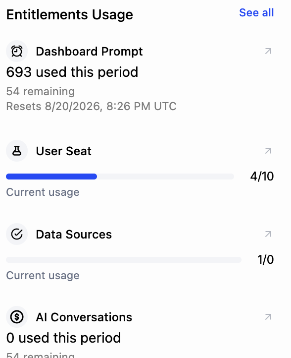

Enterprise deals often hinge on a proof of concept: a defined window where a prospect gets access to evaluate the product against their own use case. The eval needs to start quickly, match what sales scoped, and wind down cleanly when it ends.

## Common approaches

Under deal pressure, the usual move is for sales to ask engineering to "just turn it on" for the prospect, which in practice means a hard-coded flag or a temporary plan bump applied to that one account. It unblocks the evaluation immediately, so it tends to be the path of least resistance.

The problem is that these grants are invisible and easy to forget. Nothing records that this access is a 30-day POC tied to a specific opportunity, so when the eval ends someone has to remember to undo it, and if they don't, the prospect keeps premium access for free. Scoping the trial to only the features under evaluation, or extending it when the deal slips a couple of weeks, means yet another round of manual code or config changes.

## How Schematic fits in

Grant the evaluation with a company override or a trial, scoped to exactly the features in play and set to expire at the end of the window. The grant is visible and auditable right on the company, customer-facing teams can set it up or extend it without engineering, and when it expires access reverts on its own. If the deal closes, you convert the prospect onto their negotiated plan rather than unwinding a pile of one-off flags.

## What it looks like

The POC grant as a record rather than a flag in code: one feature, the limit it was scoped to, and an expiry date that ends the evaluation on schedule. Sales and customer success can read it, extend it when a deal slips, and see exactly what the prospect was given. Find it on the company profile.

During the window, usage against each entitlement tells you whether the eval is going anywhere. An account that has burned 693 of its prompts is engaged; one that has not touched the feature under evaluation needs a call before the window closes. Find it on the company profile, under **Entitlements Usage**.

## Configure it

- [Company Overrides](/feature-management/overrides) — grant scoped, time-limited access to a single company.
- [Trials](/catalog/trials) — plan-level trials with defined end dates and conversion behavior.

## Implement it

- [Handling customer exceptions and feature trials](/playbooks/exceptions) — a playbook for time-limited grants.
- [Applying an override programmatically](/feature-management/overrides#applying-an-override-programatically) — create the grant from your CRM or admin tooling.
