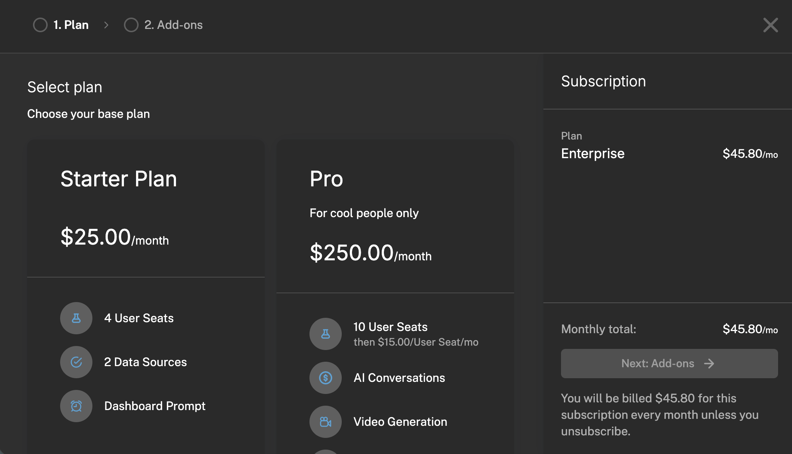

Plenty of buyers would rather pick a plan, pay, and start using your product than sit through a sales call. Capturing that revenue means showing the right plans, taking payment, and unlocking access the moment a customer pays, for first purchases and for every upgrade after.

## Common approaches

Most teams start by standing up a Stripe Checkout link or a static pricing page and wiring it to a few webhook handlers that translate Stripe events back into in-app access. For a single, first-time purchase that gets the job done: the customer pays, a webhook fires, and you flip on the features they bought.

The trouble starts after that first sale. Upgrades, downgrades, add-ons, and mid-cycle proration each introduce new Stripe events and new edge cases, so the handler code grows and the access logic gets harder to reason about. Meanwhile the pricing page is maintained separately from what you actually sell, so every packaging change means touching the page, the checkout, and the entitlement mapping in lockstep, and any one of them drifting out of sync shows up as a customer who paid but can't access what they bought.

## How Schematic fits in

Drop in Schematic's pricing table and checkout components. They render your live plans straight from the catalog, run the full purchase, upgrade, downgrade, and add-on flow on top of Stripe, and provision entitlements the instant checkout completes, with no webhook mapping to maintain. When you change pricing or restructure plans in Schematic, the checkout UI updates without a deploy.

## What it looks like

The plans, prices, and entitlements the checkout renders from. Anything marked as part of a catalog appears to customers, so restructuring what you sell happens here rather than in the pricing page's markup. Find it under **Plans**.

The Plans Table element turns that catalog into the customer-facing pricing and upgrade UI, showing the current plan next to the ones available. Upcoming Bill and Invoices cover what a customer owes and what they have already paid, so an upgrade does not send them elsewhere to check.

## Configure it

- [Pricing Table](/components/pricing-table) — the public-facing plan and pricing component.
- [Configuring the Catalog](/catalog/configuration) — control which plans appear in checkout and where.
- [Customer Portal and Checkout Flow](/components/customer-portal) — the full checkout and subscription-management experience.

## Implement it

- [Add to Your App](/components/set-up) — embed the pricing table and checkout in React, Vue, or plain JS.
- [Standalone Components](/components/standalone-components) — lightweight components for public pricing pages.
- [Quickstart](/quickstart/overview) — set up your account, plans, and SDK first.
