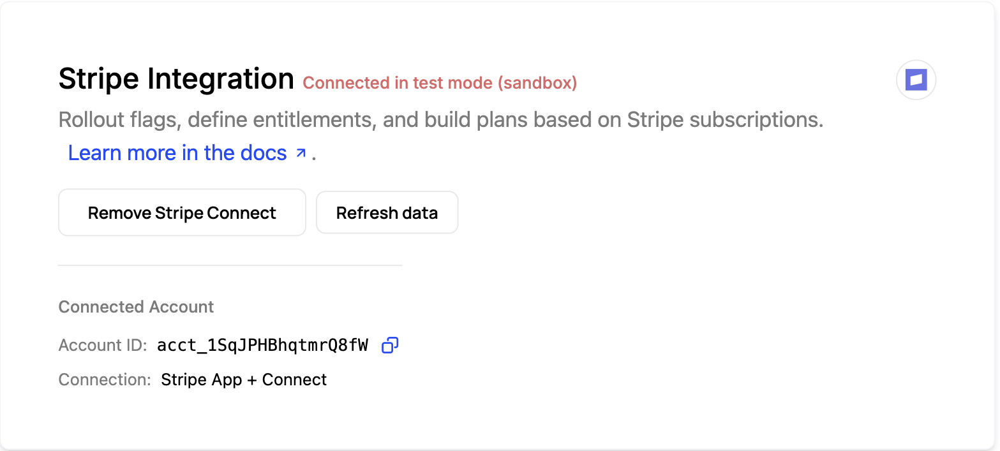
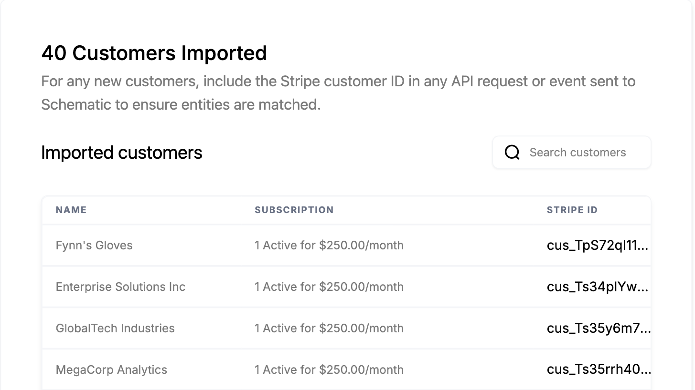

Schematic runs your plans, prices, and entitlements, and your billing system, Stripe or Metronome, issues the invoices and collects the money. When a subscription, plan, add-on, or quantity changes, both sides have to reflect it, without anyone updating records by hand or migrating off the platform you already run on.

## Common approaches

The do-it-yourself version is a two-way integration. In one direction you listen for billing webhooks, subscription created, updated, canceled, payment failed, and translate each into the right entitlement changes in your app. In the other, you push changes made in your product, an upgrade, an added seat, a cancellation, back to the billing system so invoicing reflects them.

Getting that integration correct is a real project, and keeping it correct is the harder part. Every new plan, add-on, or usage-based product is another mapping to maintain, and subscription lifecycle states like past-due, paused, or incomplete each need a deliberate decision about whether access should continue. Miss one of those edge cases and the two systems quietly disagree, so a customer keeps access after canceling, or loses it after a payment that actually succeeded.

## How Schematic fits in

Schematic runs a native, two-way sync with your billing system, so you keep Stripe or Metronome rather than migrating off it. Map plans and add-ons to billing products and usage features to metered products; changes made through Schematic checkout and the customer portal write straight to billing, while subscription changes in the billing system provision or revoke entitlements automatically. Subscription status drives access, so cancellations and failed payments move customers to the right state without custom code.

## What it looks like

The connection itself, with the connected account ID and how it was connected. This is a first-class integration you turn on, not a set of webhook handlers you maintain. Find it under **Integrations**.

Connecting pulls your existing customers across with their subscriptions and their Stripe IDs, so companies in Schematic are matched to the records that already bill them. New customers stay matched by passing the Stripe customer ID on API requests and events.

The subscription as Schematic sees it: status, price, period, and a line item per product sold, with **See in Stripe** to open the same record on the billing side. This is the view that shows the two systems agreeing. Find it on the company profile, on the **Subscription** tab.

Both directions of the sync in one list. **Component Checkout** rows are changes that started in your product and were written out to billing; the **Change in Stripe** row is a subscription edited on the billing side that moved the company's plan and entitlements in Schematic. Find it on the company profile.

## Configure it

- [Stripe Integration](/integrations/stripe) — how the bidirectional sync works end to end.
- [Stripe Integration Guide](/integrations/stripe-integration-guide) — mapping companies, plans, and prices correctly.
- [Stripe App](/integrations/stripe-app) — manage Schematic from inside the Stripe dashboard.

## Implement it

- [Automatically provision customers using Stripe](/playbooks/provisioning) — a playbook for provisioning from subscriptions.
- [Stripe Advanced Use Cases](/integrations/stripe-advanced-use-cases) — trials, proration, and other lifecycle edge cases.
