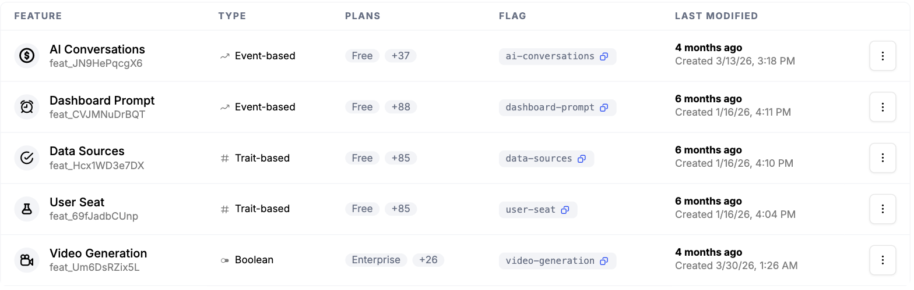
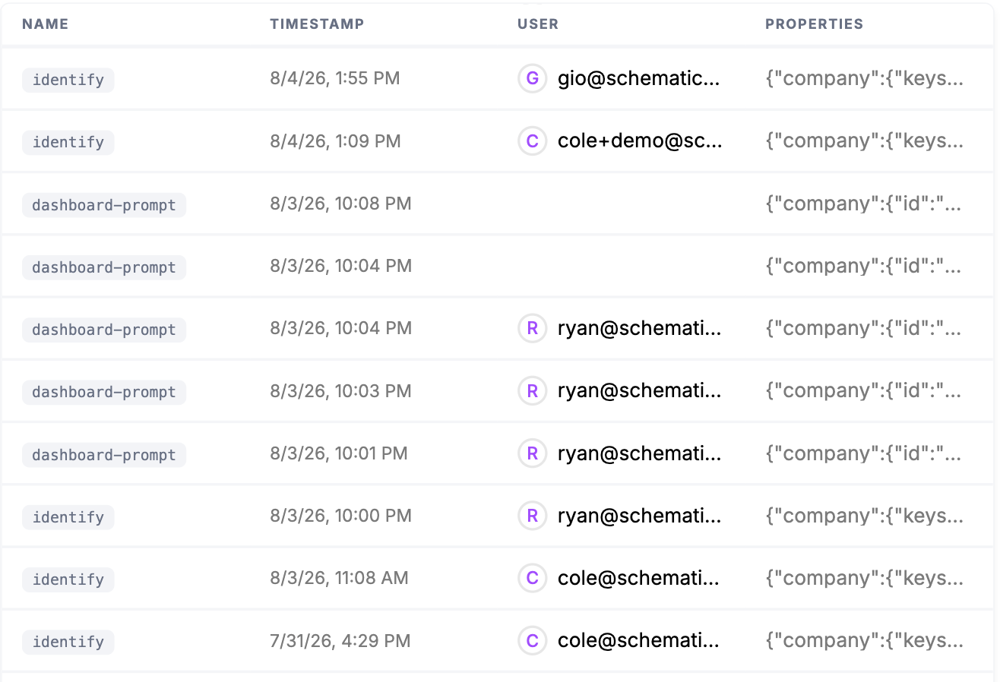

Some products get more valuable the more they're used, and AI products especially, where a single agent run or batch of tokens carries real cost. Pricing that way means metering consumption accurately, enforcing limits as customers reach them, and turning that usage into upgrades and expansion revenue.

## Common approaches

Teams usually start by logging usage to their own database, running scheduled jobs to tally it up, and scattering limit checks throughout the application code. For a single metered feature with one global limit, that's manageable, and many products ship their first usage-based feature exactly this way.

It stops scaling as soon as the pricing gets real. Limits that vary by plan or by customer, periods that reset on each customer's billing date, soft limits with overage, and the need to show usage-versus-limit in the UI all turn the homegrown meter into its own system to build and maintain. And tallying usage for your own enforcement is only half the work, getting those same numbers onto an accurate invoice means reconciling your counts against the billing system, which is where the home-grown approach tends to break down.

## How Schematic fits in

Define a metered feature (event-based for things like API calls, tokens, or agent runs, trait-based for things like seats), set entitlement limits per plan, and report usage. Schematic enforces access at runtime as customers approach their limits and supports a range of models, pay-as-you-go, pay-in-advance, fixed fee with overage, volume, and graduated pricing, so you can match how you want to charge without rebuilding metering each time.

## What it looks like

Each feature you meter, with its type and the plans it is entitled on. Dashboard Prompt and AI Conversations are event-based, counted from events you send. User Seat and Data Sources are trait-based, read from a value on the company. Video Generation is boolean, on or off. Every one carries a flag your application checks. Find them under **Features**.

The events themselves as they land, each attributed to a company and a user with its full properties payload. This is the trail behind every number in the UI and on an invoice. Find it under **Events**.

Those events resolved against what the plan allows: 693 prompts used with 54 remaining before the period resets, and 4 of 10 seats taken. This is the same state your application evaluates against at runtime, not a nightly rollup. Find it on the company profile, under **Entitlements Usage**.

## Configure it

- [Usage Based Billing Models](/billing/usage-based-billing) — the supported pricing models and how to configure each.
- [Feature Types](/feature-management/feature-types) — event-based, trait-based, and boolean features.

## Implement it

- [Creating a metered feature](/playbooks/metering) — step-by-step setup for event- and trait-based features.
- [Tracking Feature Usage](/feature-management/feature-analytics) — recording the events and traits that power metering.
