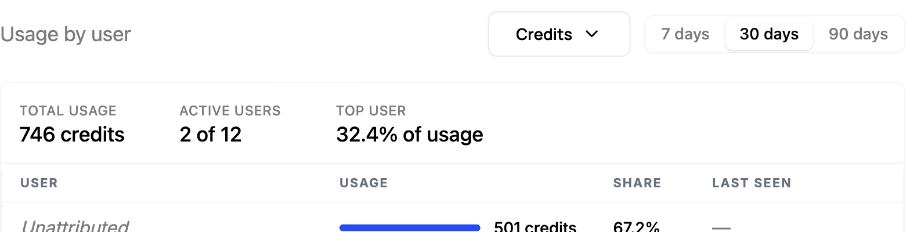
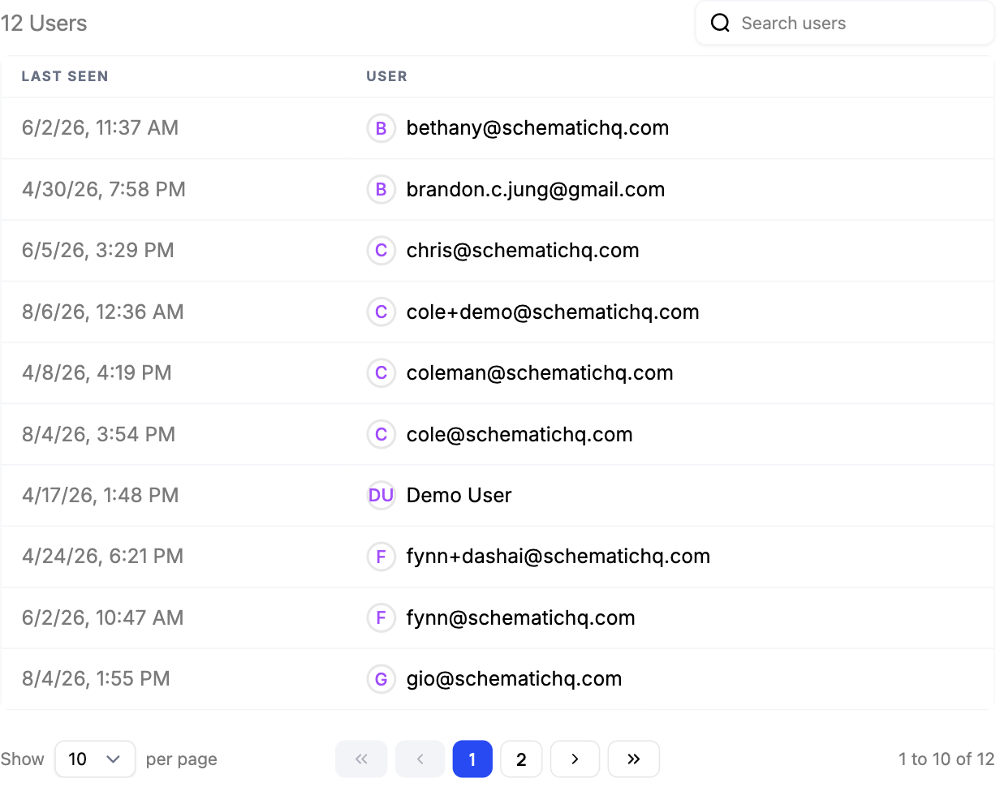

How much a customer uses your product is the clearest early signal of whether they'll churn or expand. Acting on it means seeing each account's usage against what they're entitled to, and catching the accounts trending the wrong way, or pressing against their limits, before a renewal comes up.

## Common approaches

Teams usually piece this together from a few sources: a BI dashboard built on raw product events, exports pulled together for quarterly reviews, or a gut feel from the last handful of support tickets. When someone goes looking for a specific answer, this can provide it.

Disconnected from entitlements, though, raw usage only tells half the story. A usage number is a churn or expansion signal only relative to what the customer is entitled to and paying for, and stitching usage data back to plan limits in a separate tool is manual and goes stale fast. By the time a report surfaces an at-risk account or one consistently hitting its ceiling, the renewal or upsell window may already have closed.

## How Schematic fits in

Schematic tracks each company's usage against its entitlements in one place, so customer success can see who's underusing, a churn risk, and who's pressing against their limits, an expansion opportunity. Entitlement and credit trigger webhooks let you fire alerts or in-app prompts the moment an account crosses a threshold, so the signal reaches the right person while there's still time to act on it.

## What it looks like

Usage next to the limit it counts against, which is what makes it a signal. 693 prompts with 54 left is an account about to need more; 4 of 10 seats is an account with room it is not using. The same number means opposite things depending on the entitlement behind it. Find it on the company profile, under **Entitlements Usage**.

How that usage is distributed inside the account. 746 credits spent, but only 2 of 12 users active and one of them responsible for a third of it. Concentrated usage on a healthy-looking account is a churn risk that a company-level total hides.

Who is actually showing up, and when each of them was last seen. An account where most users went quiet months ago is worth a call regardless of what its plan says. Find it on the company profile.

## Configure it

- [Tracking Feature Usage](/feature-management/feature-analytics) — view usage against entitlements per company.
- [Usage Based Billing Models](/billing/usage-based-billing) — the limits that turn a usage number into a signal.

## Implement it

- [Entitlement & Credit Trigger Webhooks](/integrations/webhooks/entitlement-triggers) — fire on usage and limit thresholds.
- [Webhooks](/integrations/webhooks) — route those signals to Slack, your CRM, or any endpoint.
